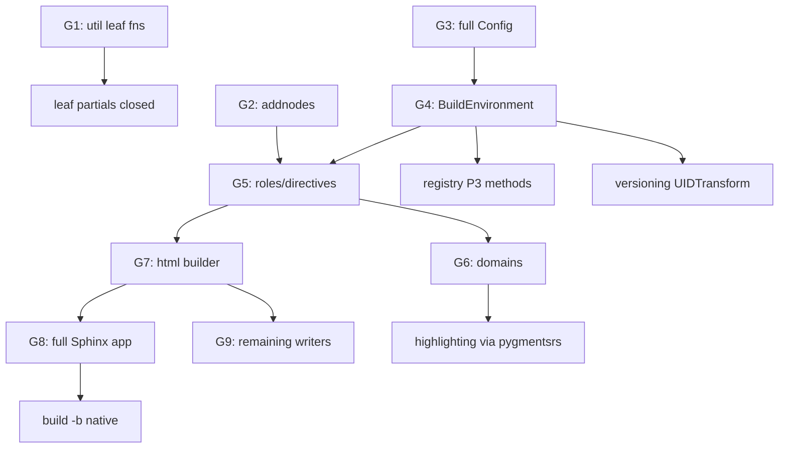

# sphinx port inventory (Phase 4)

Generated from `src/sphinx/tests/` and `src/sphinx/sphinx/` to plan the
incremental Rust port (`sphinxdocrs`). Each row tags a test or
subsystem with its phase priority. **P1** = port now (small, pure
Python, few deps). **P2** = port after extension/event scaffolding.
**P3** = depends on a builder, environment, or domain pipeline that is
not yet ported — keep as parity probes only.

## Subsystem priorities

| subsystem (sphinx) | sphinxdocrs target | priority | notes |
| --- | --- | --- | --- |
| `errors.py` | `sphinxdocrs::errors` | **P1** | pure exception hierarchy; `pyo3::create_exception!` |
| `events.py` | `sphinxdocrs::events` | **P1** | `EventManager`: connect/disconnect/emit/emit_firstresult + priority sort + `allowed_exceptions` + `pdb` re-raise + `ExtensionError` wrapping |
| `project.py` | `sphinxdocrs::project` | **P1** | **mirrored** — `path2doc`/`doc2path`/`discover` landed in `src/sphinxdocrs/src/project.rs`; `discover()` uses Rust `util_matching` for glob exclusion (`EXCLUDE_PATHS` parity) |
| `addnodes.py` | n/a (Python re-export) | **P1** | extends docutils.nodes — keep as Python shim that imports vendored `sphinx.addnodes` until our doctree gains Sphinx-specific node types |
| `extension.py` | `sphinxdocrs::extension` | **P2** | **mirrored** — `Extension` wrapper + `verify_needs_extensions` landed in `src/sphinxdocrs/src/extension.rs`; gated by `tests/test_sphinxdocrs_extension.py` |
| `registry.py` | `sphinxdocrs::registry` | **P2** | **partial** — P2 subset ported: `SphinxComponentRegistry` struct with source-suffix/parser, transforms/post-transforms, CSS/JS/static assets, LaTeX packages, HTML themes; 32 unit tests + 32 integration tests; P3-dependent builder/domain/translator/math-renderer methods deferred |
| `versioning.py` | `sphinxdocrs::versioning` | **P2** | **partial** — pure algorithms ported: `VERSIONING_RATIO`, `levenshtein_distance`, `get_ratio`, `add_uids`, `merge_doctrees`; `VersionableNode` trait; 26 inline unit tests + 29 integration tests in `tests/versioning.rs`; `UIDTransform` (needs Sphinx env) deferred to P3 |
| `config.py` | `sphinxdocrs::config` | **P2** | depends on `util.typing`, complex value coercion; port `Config` after util |
| `cmd/quickstart.py` | `sphinxdocrs::quickstart` | **C1** | **mirrored** — all 7 validators, `ask_user`, `generate`, `valid_dir`, full clap parser in `src/sphinxdocrs/src/quickstart/`; 50 Rust-side integration tests; `sphinx-quickstart-rs` binary native by default |
| `cmd/build.py` + `cmd/make_mode.py` | `sphinxdocrs::build` | **C2** | **partial** — arg parser, all `_parse_*` helpers, `jobs_argument`, `MakeMode` (`build_clean`, `build_help`, `run_generic_build`, full `BUILDERS` table, target dispatch) ported in `src/sphinxdocrs/src/build/`; 35 Rust-side integration tests; `sphinx-build -M` runs natively; `sphinx-build -b` delegates to Python until builders land |
| `ext/apidoc.py` | `sphinxdocrs::apidoc` | **C3** | **done** — `ApidocOptions`, `recurse_tree`, `create_{module,package,modules_toc}_file`, `remove_old_files`, full clap parser; `--full` wired to `quickstart::generate`; 24 Rust-side integration tests; parity vs Python 9.1.0 verified |
| `ext/autosummary/generate.py` | `sphinxdocrs::autogen` | **C4** | **done** — RST scan, full clap parser, `underline`+`_` identity filters + 3 vendored stub templates + `generate_stub`/`generate_stubs` (heuristic type detection, empty member lists, autodoc fills at build time) in `src/sphinxdocrs/src/autogen/`; 32 Rust-side tests; `sphinx-autogen-rs` fully native |
| `roles.py` / `directives/` | `sphinxdocrs::roles` etc | **P3** | needs the doctree converter (already in `docutilsrs::python`) and the directive/role registry |
| `domains/` | `sphinxdocrs::domains` | **P3** | each domain is a substantial subsystem (`py`, `c`, `cpp`, `js`, `rst`, `std`) |
| `environment/` | `sphinxdocrs::environment` | **P3** | the build environment, large and stateful |
| `builders/` | `sphinxdocrs::builders` | **P3** | one builder at a time (`html`, `latex`, `epub`, ...) |
| `ext/*` | n/a (Python plugins) | **P3** | keep as Python; loaded via `Extension` registry |
| `util/*` | `sphinxdocrs::util::*` | **P2** | **mirrored (matching + console + rst + osutil + uri + lines + docstrings)** — `util_matching.rs` (glob), `util_console.rs` (22 ANSI codes), `util_rst.rs` (`escape`/`textwidth`/`heading`), `util_osutil.rs` (`SEP`/`canon_path`/`relative_uri`/`ensuredir`/`make_filename`/`FileAvoidWrite`), `util_uri.rs` (`encode_uri`/`is_url`), `util_lines.rs` (`parse_line_num_spec`), `util_docstrings.rs` (`prepare_docstring`/`prepare_commentdoc`/`separate_metadata`); `_prepend_prologue`/`_append_epilogue`/`default_role`/`copyfile` deferred (docutils dep) |
| `theming.py` | n/a | **P3** | jinja2-bound; keep Python until templating story decided |
| `search/` | n/a | **P3** | indexer + JS bridge; keep Python |

## Test triage

Tagged from `src/sphinx/tests/`. Status legend: **mirrored** = a
parity-checked Rust-side test exists; **stub** = test file scaffolded
without a Rust impl; **deferred** = remains pure Python until the
underlying subsystem is ported.

| test file | subsystem | tier | status this phase |
| --- | --- | --- | --- |
| `test_errors.py` | errors | P1 | mirrored — `tests/test_sphinxdocrs_errors.py` |
| `test_events.py` | events | P1 | mirrored — `tests/test_sphinxdocrs_events.py` |
| `test_project.py` | project | P1 | mirrored — `tests/test_sphinxdocrs_project.py` + `tests/test_sphinxdocrs_project_discover.py` (basic discovery, exclude patterns, multi-suffix, recorded `doc2path`, default `EXCLUDE_PATHS`) |
| `test_addnodes.py` | addnodes | P1 | deferred (no Sphinx-specific nodes in Rust doctree yet) |
| (no upstream test_extension.py) | extension | P2 | mirrored — `tests/test_sphinxdocrs_extension.py` (8 cases: defaults, kwargs-pop semantics, explicit-None preservation, `verify_needs_extensions` parity) |
| `test_application.py` | application | P3 | deferred |
| `test_command_line.py`, `test__cli/` | cli | P3 | **partial** — arg-parsing layer ported natively (`build::parser`, `build::args`, `build::logging`, `build::make_mode`); full `Sphinx()` invocation deferred |
| `test_config/` | config | P2 | deferred |
| `test_directives/` | directives | P3 | deferred |
| `test_domains/` | domains | P3 | deferred |
| `test_environment/` | environment | P3 | deferred |
| `test_ext_*` | extensions | P3 | deferred (run as-is against vendored sphinx) |
| `test_extensions/` | extension loader | P2 | **partial** — `SphinxComponentRegistry` P2 surface (source-suffix/parser, transforms, assets, LaTeX, HTML themes) mirrored; 32 integration tests in `tests/registry.rs`; `load_extension` and builder/domain registration deferred to P3 |
| `test_highlighting.py` | highlighting | P3 | depends on Pygments port (`pygmentsrs`) |
| `test_intl/` | intl | P3 | deferred |
| `test_markup/` | markup | P3 | depends on docutils converter |
| `test_pycode/` | pycode | P3 | deferred |
| `test_quickstart.py` | quickstart | **C1** | **mirrored** — `quickstart::validate` (all 7 validators), `quickstart::parser` (full clap flag grammar), `quickstart::generate`, `quickstart::ask_user`, `quickstart::valid_dir` ported; 50 Rust-side tests in `tests/quickstart.rs` (11 validator `#[case]` tables, 8 parser flag tests, 4 `valid_dir` tests, 4 tree-layout insta snapshots, `conf_py_snapshot`, newline-mode assertions, `ask_user` scripted-terminal test, help-text snapshot); `sphinx-quickstart-rs` binary now runs natively, falling back to Python only on `--use-python-impl` / `SPHINXDOCRS_PY_FALLBACK=1` |
| `test_roles.py` | roles | P3 | deferred |
| `test_search.py` | search | P3 | deferred |
| `test_theming/` | theming | P3 | deferred |
| `test_transforms/` | transforms | P3 | deferred (per-transform port) |
| `test_util/` | util | P2 | **partial** — matching + console in Python tests; `test_util_rst.py` + `test_util.py` (osutil) in `tests/util_rst_osutil.rs` (52 tests); `test_util_uri.py` + `test_util_lines.py` + `test_util_docstrings.py` in `tests/util_extra.rs` (35 tests); `_prepend_prologue`/`_append_epilogue`/`default_role`/`copyfile` deferred (docutils/SphinxApp dep) |
| `test_versioning.py` | versioning | P2 | **partial** — pure algorithm tests (`get_ratio`, `add_uids`, `merge_doctrees` for modified/added/deleted/deleted_end/insert/insert_beginning/insert_similar) mirrored in `tests/versioning.rs`; 29 integration tests; `SphinxTestApp` fixture tests deferred (builder dep) |
| `test_writers/` | writers | P3 | deferred (one writer at a time) |
| `test_builders/` | builders | P3 | deferred (one builder at a time) |
| `test_ext_autodoc/`, `test_ext_autosummary/`, `test_ext_imgconverter/`, `test_ext_intersphinx/`, `test_ext_napoleon/` | extensions | P3 | deferred — these run against vendored Python sphinx |
| `test_ext_apidoc/` | apidoc | **C3** | **mirrored** — `recurse_tree` + file generators ported; 24 Rust-side tests in `tests/apidoc.rs`; `--full` now wired to `quickstart::generate` |
| `test_ext_autosummary/` | autosummary/autogen | **C4** | **done** — RST scan + native stub generation ported; 32 Rust-side tests in `tests/autogen.rs` |
| `js/` | search JS | n/a | external |

## Exit criteria for Phase 4 (incremental)

1. P1 modules (`errors`, `events`, `project`) land in Rust with PyO3
   bindings.
2. Mirrored tests for each P1 module pass and are gated on `pytest -q`.
3. A `sphinxdocrs_hybrid` Python wrapper exists that exposes the Rust
   `EventManager` and falls back to `sphinx.events.EventManager` if the
   Rust extension is missing — so existing extensions can keep
   working.
4. Inventory (this file) is updated whenever a row's status changes.

## CLI porting milestone (C-phase) — current status

| step | target | status |
| --- | --- | --- |
| **C1** `sphinx-quickstart` | `sphinxdocrs::quickstart` | **done** — 50 tests green; native binary default; Python fallback on `--use-python-impl` |
| **C2a** `sphinx-build` parser + `_parse_*` | `sphinxdocrs::build::args` | **done** — 35 tests green (all `jobs_argument`, `parse_confdir`, `parse_doctreedir`, `validate_filenames`, `parse_confoverrides`, `parse_color` param tables) |
| **C2b** `sphinx-build -M` make-mode | `sphinxdocrs::build::make_mode` | **done** — `build_clean` safety checks, `build_help`, `run_generic_build`, `BUILDERS` table, target dispatch all ported and tested via `CapturingRunner` |
| **C2c** `sphinx-build -b` direct mode | delegates to Python `Sphinx` | pending builders |
| **C2.3** parity harness scaffold | `tests/parity.rs` | **done** — `quickstart_parity_flat` and `apidoc_parity_basic` both pass vs Python 9.1.0; snapshots committed |
| **C3** `sphinx-apidoc` | `sphinxdocrs::apidoc` | **done** — 50 tests green (24 apidoc + 2 parity); native binary default; `--full` wired to `quickstart::generate`; parity test passes vs Python 9.1.0 |
| **C4** `sphinx-autogen` | `sphinxdocrs::autogen` | **done** — 32 tests green; RST scan + native stub generation + full parser native; `sphinx-autogen-rs` default fully native |

### New modules landed (C-phase)

| crate path | mirrors | notes |
| --- | --- | --- |
| `src/sphinxdocrs/src/cli/io.rs` | — | `Terminal`, `Fs`, `Clock`, `Runner` traits + `RealTerminal`, `RealFs`, `SystemClock`, `ProcessRunner` impls; `FixedClock`, `CapturingRunner`, `ScriptedTerminal` test helpers |
| `src/sphinxdocrs/src/quickstart/validate.rs` | `sphinx.cmd.quickstart` validators | 7 functions: `is_path`, `is_path_or_empty`, `allow_empty`, `nonempty`, `choice`, `boolean`, `suffix`, `ok` |
| `src/sphinxdocrs/src/quickstart/settings.rs` | `d: dict` in quickstart | `QuickstartSettings`, `EXTENSIONS` table |
| `src/sphinxdocrs/src/quickstart/templates.rs` | `QuickstartRenderer` | wraps `jinja2rs::Environment`; vendored templates in `assets/quickstart/`; registers `repr` filter (Jinja2 built-in missing from minijinja) |
| `src/sphinxdocrs/src/quickstart/generate.rs` | `ask_user`, `generate`, `valid_dir` | |
| `src/sphinxdocrs/src/quickstart/parser.rs` | `get_parser` / `main` | full clap flag grammar; `--ext-*` per-extension flags; `--use-python-impl` escape hatch |
| `src/sphinxdocrs/src/build/parser.rs` | `sphinx.cmd.build.get_parser` | |
| `src/sphinxdocrs/src/build/args.rs` | `_parse_confdir`, `_parse_doctreedir`, `_validate_filenames`, `_parse_confoverrides`, `jobs_argument`, `parse_color` | `BuildArgs`, `ConfValue` |
| `src/sphinxdocrs/src/build/logging.rs` | `_parse_logging` | `LoggingConfig` |
| `src/sphinxdocrs/src/build/make_mode.rs` | `sphinx.cmd.make_mode.Make` | `MakeMode`, `BUILDERS`, `run_make_mode` |
| `src/sphinxdocrs/src/apidoc/settings.rs` | `ApidocOptions` dataclass | 20 fields; `effective_automodule_options()`; `DEFAULT_AUTOMODULE_OPTIONS` |
| `src/sphinxdocrs/src/apidoc/templates.rs` | `ReSTRenderer` in apidoc | `heading`/`heading2`/`repr` filters; 3 vendored templates in `assets/apidoc/` |
| `src/sphinxdocrs/src/apidoc/generate.rs` | `sphinx.ext.apidoc._generate` | `is_initpy`, `module_join`, `is_excluded`, `is_skipped_package/module`, `walk`, `recurse_tree`, `create_module_file`, `create_package_file`, `create_modules_toc_file`, `remove_old_files` |
| `src/sphinxdocrs/src/apidoc/parser.rs` | `sphinx.ext.apidoc._cli.get_parser` | full clap grammar; `--ext-*` flags; `SPHINX_APIDOC_OPTIONS` env |
| `src/sphinxdocrs/src/autogen/scan.rs` | `sphinx.ext.autosummary.generate.find_autosummary_in_lines` | `AutosummaryEntry`, `find_autosummary_in_lines`, `find_autosummary_in_files` |
| `src/sphinxdocrs/src/autogen/templates.rs` | `AutosummaryRenderer` | `underline` + `_` identity filters; 3 vendored stub templates in `assets/autosummary/` |
| `src/sphinxdocrs/src/autogen/parser.rs` | `sphinx.ext.autosummary.generate.get_parser` | `AutogenArgs`; all 6 flags including `--respect-module-all`, `--imported-members` |
| `src/sphinxdocrs/src/autogen/generate.rs` | `generate_autosummary_docs` (stub writing) | `ObjType`, `infer_obj_type`, `split_fqn`, `StubContext`, `generate_stub`, `generate_stubs`; heuristic type detection; `--remove-old` support |
| `src/sphinxdocrs/src/registry.rs` | `sphinx.registry.SphinxComponentRegistry` | P2 subset: `source_suffix`, `source_parsers`, `transforms`, `post_transforms`, `css_files`, `js_files`, `static_dirs`, `latex_packages`, `html_themes`; `RegistryError`; `add_source_suffix`, `add_source_parser`, `get_source_parser`, `add_transform`, `get_transforms`, `add_post_transform`, `get_post_transforms`, `add_css_file`, `add_js_file`, `add_static_dir`, `add_latex_package`, `has_latex_package`, `add_html_theme` |
| `src/sphinxdocrs/src/versioning.rs` | `sphinx.versioning` | `VERSIONING_RATIO`, `VersionableNode` trait, `levenshtein_distance`, `get_ratio`, `add_uids`, `merge_doctrees`; `UIDTransform` deferred |
| `src/sphinxdocrs/src/util_rst.rs` | `sphinx.util.rst` | `SECTIONING_CHARS`, `WIDECHARS_DEFAULT`, `WIDECHARS_JA`, `escape`, `textwidth`, `heading`; `_prepend_prologue`/`_append_epilogue`/`default_role` deferred |
| `src/sphinxdocrs/src/util_osutil.rs` | `sphinx.util.osutil` | `SEP`, `os_path`, `canon_path`, `path_stabilize`, `relative_uri`, `ensuredir`, `make_filename`, `make_filename_from_project`, `FileAvoidWrite`; `copyfile`/`relpath`/`rmtree` deferred |
| `src/sphinxdocrs/src/util_uri.rs` | `sphinx.util._uri` | `is_url`, `encode_uri` (percent-encode path + decode-then-reencode query + IDNA netloc) |
| `src/sphinxdocrs/src/util_lines.rs` | `sphinx.util._lines` | `parse_line_num_spec` — half-open ranges, comma lists, error messages matching upstream |
| `src/sphinxdocrs/src/util_docstrings.rs` | `sphinx.util.docstrings` | `prepare_docstring` (strip common indent, leading blanks), `prepare_commentdoc` (`#:` extraction), `separate_metadata` (`:meta …:` field list split) |
| `src/sphinxdocrs/assets/quickstart/` | `sphinx/templates/quickstart/` | 4 vendored Jinja templates embedded via `include_str!` |
| `src/sphinxdocrs/assets/apidoc/` | `sphinx/templates/apidoc/` | 3 vendored Jinja templates; `package.rst.jinja` patched: `heading(2)` → `heading2` filter |
| `src/sphinxdocrs/assets/autosummary/` | `sphinx/ext/autosummary/templates/autosummary/` | 3 vendored RST stub templates embedded via `include_str!` |
| `src/sphinxdocrs/tests/parity.rs` | — | Cross-language parity harness; `#[cfg(feature="parity")]`; skips without Python |

## Completion plan for `partial` / `deferred` items

This section sequences the remaining work to flip every **partial** and
**deferred** row above to **mirrored** / **done**. Order is by dependency
depth, not by table row: three leaf tasks close most `partial` rows
immediately, then the rest unlock in a strict chain
(**full `Config` → `BuildEnvironment` → roles/directives → one builder →
domains/writers**).

Grounding facts that shape the order:

- `docutilsrs` already provides a doctree, parser, transforms, a Python
  bridge (`python.rs`), and writers (`html5_writer`, `latex_writer`,
  `manpage_writer`, `odt_writer`, `zip_writer`). The doctree foundation
  most P3 items need **already exists**.
- `src/sphinxdocrs/src/config.rs` exists but covers only the **math-options
  subset**, not the full `Config`. The `deferred` status for `config.py`
  is therefore accurate.
- The remaining work splits into **leaf items** (finishable now) and
  **subsystem items** gated behind `config` → `environment` → `builders`.

### Dependency graph

### Tier 0 — leaf items (no new subsystem required)

| id | task | file(s) | closes row | gate |
| --- | --- | --- | --- | --- |
| **G1** | Port remaining `util/*` fns: `copyfile` (pure FS → `util_osutil`), `_prepend_prologue` / `_append_epilogue` (operate on a line-list shim). `default_role` stays deferred to **G5** (needs role registry) and becomes the only remaining util gap. | `util_osutil.rs`, `util_rst.rs` | `test_util/` → mirrored | extend `tests/util_rst_osutil.rs`, `tests/util_extra.rs` with upstream `test_util.py` cases |
| **G2** | Port `addnodes.py` natively: add Sphinx-specific node types (`toctree`, `pending_xref`, `desc`, `index`, `seealso`, …) as `sphinxdocrs::addnodes` extending `docutilsrs::doctree`. Prerequisite for roles/directives/domains. | new `src/addnodes.rs` | `test_addnodes.py` → mirrored | mirror `test_addnodes.py` |

### Tier 1 — full `Config` (unblocks the whole chain)

| id | task | closes row | gate |
| --- | --- | --- | --- |
| **G3** | Promote `config.rs` from the math subset to the full `sphinx.config.Config`: `ConfigValue` registry, `add()`, default/`rebuild` metadata, `setup()` hook, `init_values`, `convert_overrides`, `pre_init_values`, env-var overrides, value coercion (`bool`/`int`/`list`/`Any`). Keep PyO3 `exec()` of `conf.py`, but read **all** values. | `config.py` → mirrored | mirror `test_config/` parametrized suites |

### Tier 2 — environment + role/directive registry

| id | task | closes row | gate |
| --- | --- | --- | --- |
| **G4** | `BuildEnvironment` skeleton: docname tracking, `temp_data`, `metadata`, `titles`, `toc_num_entries`, `dependencies`, domain-data dict, `found_docs`. Depends on **G3** + `Project` (done). | `environment/` → in progress | env unit tests |
| **G4a** | registry P3 methods now unblocked: `add_builder` / `add_domain` / `add_translator` / math-renderer registration. | `registry.py` partial → done; `test_extensions/` partial → done | `tests/registry.rs` + `load_extension` cases |
| **G4b** | versioning `UIDTransform` (needs env). | `versioning.py` partial → done | `test_versioning.py` `SphinxTestApp` cases |
| **G5** | Port `roles.py` + `directives/` against `docutilsrs` role/directive registry + `addnodes` (G2). Completes `util::default_role` from G1. | `test_roles.py`, `test_directives/` → mirrored | `test_roles.py`, `test_directives/` |

### Tier 3 — first builder + full app

| id | task | closes row | gate |
| --- | --- | --- | --- |
| **G7** | `html` builder minimal path: read env, run `docutilsrs::html5_writer`, emit pages + assets via registry CSS/JS plumbing (already present). | `builders/` (html) → in progress | slice of `test_builders/test_build_html.py` |
| **G8** | Full `Sphinx` application wiring `Config` (G3) + `EventManager` (done) + `registry` (G4a) + `environment` (G4) + html builder (G7). Closes **C2c** native `sphinx-build -b html`. | `test_application.py`, `test_command_line.py`, `test__cli/` → mirrored; **C2c** → done | `test_command_line.py`, `test__cli/` |
| **G9** | Remaining writers/builders one at a time (`latex`, `manpage`, `epub`, `text`); several `docutilsrs` writers already exist. | `builders/`, `writers/` → incremental | per-builder `test_builders/` + `test_writers/` slice |

### Tier 4 — domains, highlighting, long tail

| id | task | closes row | gate |
| --- | --- | --- | --- |
| **G6** | Port `domains/` by payoff: `std` → `py` → `rst` → `js` → `c` → `cpp`. | `domains/` → incremental | `test_domains/` per domain |
| **G10** | Wire `sphinx.highlighting` to `pygmentsrs` once lexer coverage is sufficient (see `port-pygments-lexer` skill). | `test_highlighting.py` → mirrored | `test_highlighting.py` |

### Keep-as-Python (parity probes only, no Rust port)

`ext/*`, `theming.py` (jinja2-bound), `search/`, `test_intl/`,
`test_pycode/`, `test_markup/` remain on the Python bridge and are
revisited only after Tier 3, if at all.

### Suggested execution order

| step | items | rationale |
| --- | --- | --- |
| 1 | G1, G2 | leaf wins; G2 unblocks roles/domains |
| 2 | G3 | single highest-leverage task; unblocks everything |
| 3 | G4, G4a, G4b | env + close registry/versioning partials |
| 4 | G5 | roles/directives; finishes `default_role` |
| 5 | G7 | first builder |
| 6 | G8 | full app + native `build -b` + cli rows |
| 7 | G9, G6, G10 | writers, domains, highlighting |

Each step keeps the existing parity discipline: port the upstream test →
implement → gate on `pytest -q` and `cargo test` → flip the row status in
this inventory from *partial* / *deferred* to *mirrored* / *done*.
