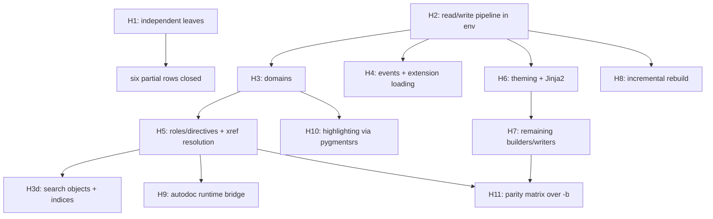

# sphinxdocrs port plan & inventory

Single source of truth for the Sphinx → Rust port (`src/sphinxdocrs`).
This document merges the former `docs/sphinx-port-inventory.md`
(*sphinx port inventory, Phase 4*) and `docs/sphinxdocrs-cli-port-plan.md`
(*sphinxdocrs CLI port & test plan*); both are superseded by this file.

Contents:

1. [Status legend & phases](#1-status-legend--phases)
2. [Porting principles](#2-porting-principles)
3. [Subsystem inventory](#3-subsystem-inventory)
4. [CLI binary status](#4-cli-binary-status)
5. [Crate module map](#5-crate-module-map)
6. [Upstream test triage](#6-upstream-test-triage)
7. [Rust-side test suites](#7-rust-side-test-suites)
8. [Completed milestones](#8-completed-milestones-c--g--p-phases)
9. [**H-phase: plan to close the remaining deferred work**](#9-h-phase--plan-to-close-the-remaining-deferred-work)

---

## 1. Status legend & phases

**Priority tiers** (assigned when a subsystem is first inventoried):

| tier | meaning |
| --- | --- |
| **P1** | small, pure Python, few deps — port immediately |
| **P2** | port after extension/event scaffolding exists |
| **P3** | depends on builder / environment / domain pipeline |
| **C*n*** | CLI entry-point milestone (`sphinx-quickstart`, `sphinx-build`, …) |
| **G*n*** | subsystem-unblocking milestone (config → env → builders) |
| **H*n*** | remaining-deferred milestone (§9 of this document) |

**Row status**:

| status | meaning |
| --- | --- |
| **done** | full upstream surface ported, parity-tested |
| **mirrored** | ported subset with a parity-checked Rust-side test |
| **partial** | usable subset landed; named gaps remain |
| **stub** | scaffolded without an implementation |
| **deferred** | still pure Python; revisit after its blocker lands |
| **keep-python** | intentionally not ported |

**Per-item tagging**: every ported function is tagged *exact parity*,
*accepted deviation*, or *pending*. Accepted deviations must be recorded
in the notes column of the relevant row.

---

## 2. Porting principles

- **Drop-in CLI contract first.** Argument grammar, exit codes,
  stdout/stderr text, and on-disk artifacts must match upstream
  byte-for-byte where observable. The argparse surface is the spec:
  mirror flag names, defaults, `dest`, and help strings.
- **Three-layer architecture per command**, so logic is unit-testable
  without a process boundary:
  1. **parse layer** — pure `argv: &[String] -> Result<Args, CliError>`;
     no I/O. Mirrors each `get_parser()` / `_parse_*` helper.
  2. **core layer** — pure-ish functions over injected filesystem, clock,
     and terminal traits; returns planned actions or rendered strings.
     Mirrors `generate()`, `ask_user()`, `build_main()` bodies.
  3. **shell layer** — `main()` wiring real stdio, real FS, real exit.
- **Dependency injection at boundaries only** (FS, time, terminal,
  subprocess). Everything else stays concrete — this is what keeps
  `mockall` + `rstest` fixtures cheap.
- **Reuse already-ported subsystems** (`config`, `util_console`,
  `util_matching`, `project`, `errors`, `events`, `extension`, and the
  sister crates `docutilsrs`, `pygmentsrs`, `jinja2rs`). Do not
  re-implement.
- **Templating** uses the vendored `minijinja` / `jinja2rs` crates rather
  than shelling to Python. Upstream template files are vendored as crate
  assets under `src/sphinxdocrs/assets/`.
- **Fallback ladder**: every command keeps a `--use-python-impl` escape
  hatch plus `SPHINXDOCRS_PY_FALLBACK=1`. A command defaults to the
  Python path until its native path passes the parity harness.
- **Test-near development**: port the upstream test → implement → gate on
  `pytest -q` *and* `cargo test` → flip the row status in this file.

### Rust test tooling

| need | tool | notes |
| --- | --- | --- |
| fixtures | `rstest` `#[fixture]` | `#[once]` for session-scoped setup |
| parametrization | `rstest` `#[case]` | one table per pure function |
| trait mocking | `mockall` `#[automock]` | inline `#[cfg(test)]` only — external test crates use the concrete `FixedClock` / `CapturingRunner` / `ScriptedTerminal` helpers instead |
| snapshots | `insta` | rendered strings + generated tree manifests |
| HTTP mock / replay | `wiremock`, `rvcr` | for `assets`, `intersphinx`, `linkcheck` |

---

## 3. Subsystem inventory

| subsystem (sphinx) | sphinxdocrs target | tier | status | notes |
| --- | --- | --- | --- | --- |
| `errors.py` | `errors` | P1 | **done** | exception hierarchy via `pyo3::create_exception!` |
| `events.py` | `events` | P1 | **done** | `EventManager`: connect/disconnect/emit/emit_firstresult, priority sort, `allowed_exceptions`, `pdb` re-raise, `ExtensionError` wrapping. Wired into `SphinxApp` via the native `app_events::AppEventManager` + `app_facade::PyAppFacade` bridge (**H4a/H4c**, done) |
| `project.py` | `project` | P1 | **mirrored** | `path2doc` / `doc2path` / `discover`; `discover()` uses `util_matching` for glob exclusion (`EXCLUDE_PATHS` parity) |
| `addnodes.py` | `addnodes` | P1 | **mirrored** | all 50+ node structs; `toctree` (Translatable), `desc*` family, 9 `desc_sig_*` leaves + `SIG_ELEMENTS`, `pending_xref`(`_condition`), `index`, `only`, `hlist`, `glossary`, `productionlist`, `number_reference`, `download_reference`, `manpage`, … |
| `extension.py` | `extension` | P2 | **mirrored** | `Extension` wrapper + `verify_needs_extensions`. `load_extension` landed on `SphinxApp` (**H4b**, done) |
| `registry.py` | `registry` | P2 | **done** | source-suffix/parser, transforms/post-transforms, CSS/JS/static assets, LaTeX packages, HTML themes, `add_builder`/`add_domain`/`add_translator`/`add_html_math_renderer` |
| `versioning.py` | `versioning` | P2 | **done** | `VERSIONING_RATIO`, `levenshtein_distance`, `get_ratio`, `add_uids`, `merge_doctrees`, `VersionableNode`, `apply_uid_transform`, `UID_TRANSFORM_PRIORITY = 880`. **Gap:** not invoked from a read phase yet — `docutilsrs::doctree::Node` has no `uid`/`VersionableNode` impl (→ **H8**) |
| `config.py` | `config` | P2 | **mirrored** | `SphinxConfig`, 50+ built-in option registry, `ConfigVal`, `RebuildKind`, `ConfigOpt`, `convert_overrides`, alias sync (`master_doc`↔`root_doc`, `copyright`↔`project_copyright`), typed accessors, `py_read_conf_py` |
| `util/*` | `util_*` | P2 | **mirrored** | `util_matching`, `util_console` (22 ANSI codes), `util_rst` (incl. `default_role`, **H1d**), `util_osutil`, `util_uri`, `util_lines`, `util_docstrings` |
| `locale.py` | `locale` | P2 | **done** | `PoCatalog` (incl. `#, fuzzy` handling and header capture), `Translator`, `TranslatorRegistry`, `init`, `init_chain`, `init_console`, `get_translation`, `tr`, `tr_console`, `tr!`/`tr_c!`, `admonition_labels`. **Extension:** `CATALOG_LOOKUP_ORDER = ["sphinxdocrs", "sphinx"]` — `tr`/`tr_console` walk the chain, first hit wins |
| `util/i18n.py` | `intl` | P2 | **done** | `CatalogInfo` (incl. `write_mo`), `CatalogRepository`, `docname_to_domain`, `DATE_FORMAT_MAPPINGS`, `split_date_format`, `ustrftime_to_babel`, `babel_format_date`, `format_date`, `encode_mo` / `decode_mo`. **Accepted deviations:** CLDR data limited to `en`/`de`/`ja` (others fall back to `en`, as upstream does for unknown locales); MO output is singular-only with an empty hash table; `.po` files are decoded as UTF-8 |
| `roles.py` | `roles` | P3 | **partial** | pure-algorithm subset: `GENERIC_DOCROLES`, `SPECIFIC_DOCROLES`, `is_builtin_role`, `format_rfc_target`, `parse_emphasized_literal`, `XRefRoleConfig`, `DefaultRoleConfig`. **Gap:** role `run()` execution (→ **H5b**) |
| `directives/` | — | P3 | **deferred** | no Rust module yet (→ **H5a**) |
| `domains/` | — | P3 | **deferred** | only `registry.add_domain` name-registration exists; `env.domaindata` is never populated (→ **H3**) |
| `environment/` | `environment` | P3 | **mirrored** ✅ | `BuildEnvironment`: `find_files` (**H2a**), doctree store `parse_doc`/`store_doctree`/`get_doctree`/`has_stored_doctree` (**H2b**), `read_all` read phase (**H2c**), `get_and_resolve_doctree` (**H2e**), `check_consistency` (**H2f**). **Gap:** `resolve_references`, `domains` (→ **H3**) |
| `builders/` | `builders` | P3 | **partial** | `Builder` trait + `HtmlBuilder`, `LatexBuilder`, `ManpageBuilder`, `LinkcheckBuilder`, `JsonBuilder`, `TextBuilder`, `XmlBuilder`, `PseudoxmlBuilder` (**H7a**, done), `DirhtmlBuilder`, `SinglehtmlBuilder` (**H7b**, done), all dispatched by `SphinxApp`. **Gap:** no epub/texinfo/gettext (→ **H7c**–**H7d**) |
| `application.py` | `application` | P3 | **partial** | `SphinxApp`: path validation, config, registry, env, `read()` (**H2**: `find_files` + `read_all`), `build()` (`&mut self`, two-phase). **Gaps:** events, extension loading, parallel build, incremental rebuild, i18n (→ **H4**, **H8**) |
| `theming.py` | `theme`, `theme_static`, `theme_render` | P3 | **mirrored** ✅ | self-contained `sphinxdocrs_basic` theme + real third-party theme inheritance (`alabaster`/`basic`) rendered through `jinja2rs`; full per-page context (`pathto`/`hasdoc`/`toctree()`/`toc`/relbar/sidebars/`html_context`/`html-page-context`) (**H6**, done). **Accepted deviation:** `theme.conf`/`theme.toml` inheritance-chain parsing still goes through an embedded PyO3 bootstrap rather than pure Rust (**H6a**) |
| `search/` | `search` | P3 | **done** | `SearchIndex`, `split_words`, `feed`, `to_json`, Snowball stemming for all 15 `sphinx.search` languages (**H1f**, via `stemmer.rs`). **Accepted deviation:** `rust_stemmers`' Dutch algorithm is the legacy `dutch_porter` Snowball revision, not the one `snowballstemmer.stemmer('dutch')` resolves to — patched via built-in `ParityOverrides` for Sphinx's own Dutch stopword vocabulary; broader vocabularies may need project-supplied overrides. `objects`/`objtypes`/`objnames`/`indexentries` now populated from domain data (**H3d**) — see the accepted deviations noted on that row in §3 |
| `ext/autodoc/` | `autodoc` | P3 | **partial** | static extraction via `ruff_python_parser`: `document_module`, `render_function`, `render_class`. **Gaps:** runtime import, `:members:` filtering, inherited members, type hints, overloads, decorators, `__all__` ordering (→ **H9**) |
| `ext/intersphinx/` | `intersphinx` | P3 | **partial** | `fetch_inventories`, `InvCache`, `Inventory` / `InventoryItem` / `InventoryError` (v1 + v2 `loads`, `load_file`), `dumps`. **Gap:** xref fallback — the parsed inventories are not consulted during reference resolution (→ **H5c**) |
| `highlighting.py` | — | P3 | **deferred** | blocked on `pygmentsrs` lexer coverage (→ **H10**) |
| `pycode/` | — | P3 | **keep-python** | superseded by `autodoc.rs` + `ruff_python_ast` |
| `ext/*` (other) | — | P3 | **keep-python** | loaded through the `Extension` registry |
| *(new, no upstream analogue)* | `scan` | — | **done** | `scan_requirements`, `collect_packages`, stdlib detection — probes `conf.py` extension imports |
| *(new)* | `assets` | — | **done** | `SriAlgo`, SRI hashing, `fetch_and_cache`, `fetch_with_integrity` |

---

## 4. CLI binary status

| upstream script | Rust binary | upstream module | milestone | status |
| --- | --- | --- | --- | --- |
| `sphinx-quickstart` | `sphinx-quickstart-rs` | `sphinx.cmd.quickstart` | **C1** | **done** — fully native |
| `sphinx-build` | `sphinx-build-rs` | `sphinx.cmd.build` + `sphinx.cmd.make_mode` | **C2** | **partial** — `-M` make-mode native; `-b` native for `html`/`latex`/`man`/`linkcheck`; other builders delegate to Python |
| `sphinx-apidoc` | `sphinx-apidoc-rs` | `sphinx.ext.apidoc` | **C3** | **done** — module/package/TOC generation + `--full`; parity verified vs Python 9.1.0 |
| `sphinx-autogen` | `sphinx-autogen-rs` | `sphinx.ext.autosummary.generate` | **C4** | **done** — RST scan, arg-parse, native stub generation |

Every binary honours `--use-python-impl` and `SPHINXDOCRS_PY_FALLBACK=1`.

```rust
// src/sphinxdocrs/src/application.rs
pub const NATIVE_BUILDERS: &[&str] = &[
    "html", "json", "latex", "man", "linkcheck", "text", "xml", "pseudoxml",
    "dirhtml", "singlehtml",
];
```

### 4.1 `sphinx-quickstart` (C1) — surface

| upstream symbol | Rust target | notes |
| --- | --- | --- |
| validators (`is_path`, `nonempty`, `choice`, `boolean`, `suffix`, `ok`, `allow_empty`) | `quickstart::validate` | pure `fn(&str) -> Result<_, ValidationError>`; table-tested |
| `do_prompt` / `term_input` | `quickstart` over the `Terminal` trait | readline behaviour is out of scope |
| `ask_user(d)` | `quickstart::generate::ask_user` | imgmath+mathjax conflict rule and existing-`conf.py` / existing-master guards match upstream |
| `QuickstartRenderer` | `quickstart::templates` | `_has_custom_template` + `templatedir` override semantics |
| `generate(d, …)` | `quickstart::generate` | `sep`/`dot` layout, `exclude_patterns`, `copyright`, `now`, `project_underline` (column width), newline modes |
| `valid_dir(d)` | `quickstart::valid_dir` | reserved-name collision check |
| `get_parser()` / `main()` | `quickstart::parser` | flag parity incl. `--ext-*` append_const, `--no-sep`, `--no-makefile` |

Parity-critical details: `project_underline` uses `unicode-width`
(east-Asian width parity with docutils); `copyright` / `now` come from the
injected `Clock` (`FixedClock::snapshot()` for deterministic snapshots);
the `EXTENSIONS` table fixes extension ordering; `Makefile` is written LF
and `make.bat` CRLF; "Creating file %s." / "File %s already exists,
skipping." honour `quiet`; the `| repr` Jinja2 filter is registered
manually because minijinja lacks it.

### 4.2 `sphinx-build` (C2) — surface

| upstream symbol | Rust target | notes |
| --- | --- | --- |
| `get_parser()` | `build::parser` | full flag grammar (builder, jobs, `-a`/`-E`, path opts, `-D`/`-A`/`-t`/`-n`, console/warning opts) |
| `jobs_argument` | `build::args` | `'auto'` → cpu count; positive-int validation + error text |
| `_parse_confdir`, `_parse_doctreedir`, `_validate_filenames`, `_validate_colour_support`, `_parse_confoverrides` | `build::args` | pure; parametrized tests |
| `_parse_logging` | `build::logging` | colour disable via `util_console`. **Gap:** coloured status stream (→ **H8c**) |
| `make_mode.Make` | `build::make_mode` | `build_clean` (security-relevant safety checks — ported faithfully), `build_help`, `run_generic_build`, `BUILDERS` table, target dispatch; subprocesses go through the injected `Runner` |
| `build_main` → `Sphinx(...)` | `application::SphinxApp` + `build::native_runner` | native for `NATIVE_BUILDERS`; `NativeMakeRunner` falls back to Python otherwise |

### 4.3 `sphinx-apidoc` (C3) / `sphinx-autogen` (C4) — surface

| upstream symbol | Rust target | status |
| --- | --- | --- |
| `ApidocOptions` dataclass | `apidoc::settings` | all 20 fields; `effective_automodule_options()` |
| `_generate.py` helpers | `apidoc::generate` | `is_initpy`, `module_join`, `is_excluded`, `is_skipped_package/module`, `walk`, `recurse_tree`, `create_module_file`, `create_package_file`, `create_modules_toc_file`, `remove_old_files` |
| apidoc RST templates | `assets/apidoc/*.jinja` | 3 vendored; `heading(2)` patched to a `heading2` filter |
| `_cli.get_parser()` | `apidoc::parser` | full clap grammar, `--ext-*`, `SPHINX_APIDOC_OPTIONS` |
| `--full` mode | `run_full_quickstart` | wired to `quickstart::generate` |
| `find_autosummary_in_lines` / `_in_files` | `autogen::scan` | regex parser matching upstream |
| autosummary stub templates | `assets/autosummary/*.rst` | `base`, `class`, `module`; `underline` + `_` identity filters |
| `generate_autosummary_docs` (stub writing) | `autogen::generate` | `infer_obj_type` (CamelCase→class, else→module), `StubContext`, `generate_stub(s)`, `--remove-old`. **Accepted deviation:** member lists emitted empty; autodoc fills them at build time (→ **H9d**) |

---

## 5. Crate module map

| crate path | mirrors | notes |
| --- | --- | --- |
| `src/cli/io.rs` | — | `Terminal`, `Fs`, `Clock`, `Runner` traits + `Real*` impls; `FixedClock`, `CapturingRunner`, `ScriptedTerminal` test helpers; `py_fallback_requested`, `run_python_impl` |
| `src/quickstart/{validate,settings,templates,generate,parser}.rs` | `sphinx.cmd.quickstart` | see §4.1 |
| `src/build/{parser,args,logging,make_mode,native_runner}.rs` | `sphinx.cmd.build`, `sphinx.cmd.make_mode` | see §4.2 |
| `src/apidoc/{settings,templates,generate,parser}.rs` | `sphinx.ext.apidoc` | see §4.3 |
| `src/autogen/{scan,templates,parser,generate}.rs` | `sphinx.ext.autosummary.generate` | see §4.3 |
| `src/addnodes.rs` | `sphinx.addnodes` | all node structs; `Translatable`, `NotSmartquotable`, `SIG_ELEMENTS` |
| `src/application.rs` | `sphinx.application.Sphinx` | `SphinxApp`, `AppError`, `NATIVE_BUILDERS`, `is_native_builder`, `SphinxApp::load_extension`/`verify_needs_extensions` (**H4b** — `new` auto-loads `conf.py`'s `extensions` list, consulting the `docutilsrs_plugins` ADR 0005 resolver before falling back to plain Python `setup()`; the resolver module itself isn't part of the installed `docutilsrs` wheel yet, see the `python-source` note below) |
| `src/app_events.rs` | `sphinx.events.EventManager` (native subset) | `AppEventManager`, `EventArg`, `SharedEvents` (`Rc<RefCell<_>>`) \u2014 PyO3-free event bus wired into `SphinxApp`/`BuildEnvironment` (**H4a**) |
| `src/app_facade.rs` | \u2014 (no direct upstream analogue; bridges to `Sphinx`) | `PyAppFacade`, the `app`-shaped object passed to a loaded extension's `setup(app)` (**H4c**) |
| `src/environment.rs` | `sphinx.environment.BuildEnvironment` | state skeleton (`all_docs`, `dependencies`, `included`, `reread_always`, `metadata`, `titles`/`longtitles`, `toc_num_entries`/`toc_secnumbers`, `toctree_includes`, `files_to_rebuild`, `glob_toctrees`, `numbered_toctrees`, `domaindata`, `temp_data`, `ref_context`, config-status constants) + `EnvProject` + `default_settings()`; `read_all_with_events` (**H4a**) |
| `src/registry.rs` | `sphinx.registry.SphinxComponentRegistry` | full P2 + P3 registration surface; `RegistryError` |
| `src/config.rs` | `sphinx.config.Config` | `SphinxConfig`, `ConfigVal`, `MathRenderer`, `py_read_conf_py`; `SphinxConfig::needs_extensions()` (**H4b**) parses `conf.py`'s `needs_extensions = {...}` dict |
| `src/versioning.rs` | `sphinx.versioning` | + `apply_uid_transform`, `UID_TRANSFORM_PRIORITY` |
| `src/roles.rs` | `sphinx.roles` | tables + pure helpers |
| `src/locale.rs` | `sphinx.locale` | `.po` parser, `TRANSLATORS` registry, `CATALOG_LOOKUP_ORDER` chain, `tr!` / `tr_c!`; `locale/` symlink → `../../sphinx/sphinx/locale` |
| `src/intl.rs` | `sphinx.util.i18n` | catalogs, `write_mo` / MO codec, `docname_to_domain`, strftime→babel mapping, `format_date` |
| `src/util_rst.rs` | `sphinx.util.rst` | `SECTIONING_CHARS`, `WIDECHARS_*`, `escape`, `textwidth`, `heading`, `prepend_prologue`, `append_epilogue` |
| `src/util_osutil.rs` | `sphinx.util.osutil` | `SEP`, `os_path`, `canon_path`, `path_stabilize`, `relative_uri`, `ensuredir`, `make_filename(_from_project)`, `FileAvoidWrite`, `copyfile`, `relpath`, `rmtree` |
| `src/util_uri.rs` | `sphinx.util._uri` | `is_url`, `encode_uri` (percent-encode path, decode-then-reencode query, IDNA netloc) |
| `src/util_lines.rs` | `sphinx.util._lines` | `parse_line_num_spec` with upstream error strings |
| `src/util_docstrings.rs` | `sphinx.util.docstrings` | `prepare_docstring`, `prepare_commentdoc`, `separate_metadata` |
| `src/util_matching.rs` | `sphinx.util.matching` | glob → regex |
| `src/util_console.rs` | `sphinx.util.console` + `sphinx._cli.util.colour` | 22 ANSI codes |
| `src/builders/mod.rs` | `sphinx.builders.Builder` | `Builder` trait (`name`, `format`, `out_suffix`, `get_target_uri`, `build_doc`, `build_all`), `BuildError`, `BuildResult` |
| `src/builders/html.rs` | `sphinx.builders.html` | `HtmlBuilder` |
| `src/builders/json.rs` | `sphinx.builders.html.JSONHTMLBuilder` | `JsonBuilder` → `.fjson` |
| `src/builders/latex.rs` | `sphinx.builders.latex` | `LatexBuilder` |
| `src/builders/manpage.rs` | `sphinx.builders.manpage` | `ManpageBuilder` |
| `src/builders/text.rs` | `sphinx.builders.text.TextBuilder` | `TextBuilder` → `.txt`, over the new `docutilsrs::text` writer (**H7a**) |
| `src/builders/xml.rs` | `sphinx.builders.xml.XMLBuilder` | `XmlBuilder` → `.xml`, over the new `docutilsrs::to_xml` writer (**H7a**) |
| `src/builders/pseudoxml.rs` | `sphinx.builders.xml.PseudoXMLBuilder` | `PseudoxmlBuilder` → `.pseudoxml`, over the pre-existing `docutilsrs::pseudo_xml` writer (**H7a**) |
| `src/builders/dirhtml.rs` | `sphinx.builders.dirhtml.DirectoryHTMLBuilder` | `DirhtmlBuilder`, a thin delegating wrapper over `HtmlBuilder::new_dir_style()` (**H7b**) |
| `src/builders/singlehtml.rs` | `sphinx.builders.singlehtml.SingleFileHTMLBuilder` | `SinglehtmlBuilder`, concatenates every document's fragment into one `index.html` (**H7b**) |
| `src/builders/linkcheck.rs` | `sphinx.builders.linkcheck` | `LinkcheckBuilder` — `linkcheck_ignore` / `linkcheck_anchors` / `linkcheck_anchors_ignore` / `linkcheck_allowed_redirects` / `linkcheck_timeout` / `linkcheck_retries` / `linkcheck_rate_limit_timeout` config (`LinkcheckConfig`), anchor (`#fragment`) existence checking, redirect classification (`working`/`redirected`/`broken`/`ignored`), HTTP 429 rate-limit backoff honoring `Retry-After`, via the shared `crate::http_client` backend (curl by default, optional in-process `reqwest`) |
| `src/theme.rs` | `sphinx.theming` | `ThemeRenderer` + embedded `sphinxdocrs_basic` theme (`LAYOUT_HTML`, `PAGE_HTML`, `THEME_CSS`) |
| `src/theme_static.rs` | `sphinx.builders.html` asset copy | `copy_theme_assets`, `render_templates` |
| `src/search.rs` | `sphinx.search` | `SearchIndex`, `split_words`, `feed`, `to_json` |
| `src/autodoc.rs` | `sphinx.ext.autodoc` | static extraction over `ruff_python_ast`; `AutodocError` |
| `src/intersphinx.rs` | `sphinx.ext.intersphinx`, `sphinx.util.inventory` | `fetch_inventories`, `InvCache`, `Inventory::loads` / `load_file`, `dumps` |
| `src/scan.rs` | — | `scan_requirements`, `collect_packages` |
| `src/assets.rs` | — | SRI hashing + fetch/cache |
| `assets/quickstart/` | `sphinx/templates/quickstart/` | 4 vendored Jinja templates (`include_str!`) |
| `assets/apidoc/` | `sphinx/templates/apidoc/` | 3 vendored Jinja templates |
| `assets/autosummary/` | `sphinx/ext/autosummary/templates/autosummary/` | 3 vendored RST stub templates |

**Known packaging gap (`docutilsrs_plugins`):** the ADR 0005 resolver
module lives at `src/docutilsrs/python/docutilsrs_plugins.py` as a loose
file alongside `docutilsrs_hybrid.py`/`docutilsrs_pygments.py`, but
`docutilsrs`'s `[tool.maturin]` config has no `python-source`, so
`pip install`/`maturin develop` only installs the compiled extension
module — none of the three are importable from a real (non-monorepo)
install. Adding `python-source = "python"` was tried and rejected by
maturin: `maturin develop` fails with *"the python module at
`python/docutilsrs` does not exist"* — maturin's mixed-layout convention
requires `python-source` to contain a package directory named after
`module-name` (i.e. `python/docutilsrs/__init__.py`), not loose top-level
`.py` files. A real fix means restructuring these three modules into a
`docutilsrs` sub-package (e.g. `docutilsrs.plugins`, `docutilsrs.hybrid`,
`docutilsrs.pygments`) and updating every `import docutilsrs_plugins` /
`import docutilsrs_hybrid` call site (~10 files under `src/tests/` and
`src/sphinxdocrs/python/sphinxdocrs_hybrid.py`) — deferred as a separate,
explicitly-scoped task rather than attempted piecemeal here. Until then,
callers (native Rust code and tests alike) must put
`src/docutilsrs/python` on `sys.path` manually before importing these
modules, exactly as `src/tests/test_hybrid.py`'s `HYBRID_DIR` pattern
already does.

### Cargo features

| feature | purpose |
| --- | --- |
| `extension-module` | build as a PyO3 extension module (propagates to `docutilsrs`) |
| `syntax-highlighting` | syntax highlighting via `docutilsrs` (default) |
| `test-parity` | cross-language parity tests (requires Python + upstream sphinx) |
| `test-parity-jsonbuilder` | full `sphinx-build -b json` parity (memory-intensive) |
| `test-build-extdocs` | build real external documentation trees |

---

## 6. Upstream test triage

Tagged from `src/sphinx/tests/`.

| test file | subsystem | tier | status |
| --- | --- | --- | --- |
| `test_errors.py` | errors | P1 | **mirrored** — `tests/test_sphinxdocrs_errors.py` |
| `test_events.py` | events | P1 | **mirrored** — `tests/test_sphinxdocrs_events.py` |
| `test_project.py` | project | P1 | **mirrored** — `tests/test_sphinxdocrs_project{,_discover}.py` |
| `test_addnodes.py` | addnodes | P1 | **mirrored** — `tests/addnodes.rs` |
| *(no upstream file)* | extension | P2 | **mirrored** — `tests/test_sphinxdocrs_extension.py` |
| `test_config/` | config | P2 | **mirrored** — `tests/config.rs` |
| `test_extensions/` | registry | P2 | **done** — `tests/registry.rs`; `load_extension` landed on `SphinxApp` (**H4b**), covered by `tests/events_app.rs` |
| `test_versioning.py` | versioning | P2 | **done** — `tests/versioning.rs` |
| `test_util/` | util | P2 | **done** — `tests/util_rst_osutil.rs`, `tests/util_extra.rs`; `default_role` closed (**H1d**) |
| `test_intl/` | intl / locale | P3 | **mirrored** — `tests/locale.rs`, `tests/intl.rs`, plus `test_util_i18n.py`'s `test_catalog_write_mo` / `test_format_date` cases as `intl` unit tests |
| `test_quickstart.py` | quickstart | C1 | **mirrored** — `tests/quickstart.rs`, `tests/quickstart_cli.rs` |
| `test_ext_apidoc/` | apidoc | C3 | **mirrored** — `tests/apidoc.rs` |
| `test_ext_autosummary/` | autogen | C4 | **done** — `tests/autogen.rs` |
| `test_command_line.py`, `test__cli/` | cli | P3 | **partial** — arg layer native; full `Sphinx()` invocation deferred |
| `test_application.py` | application | P3 | **partial** — `tests/application.rs` |
| `test_builders/` | builders | P3 | **partial** — `tests/builders.rs` (now includes **H2d** two-phase parity tests), `tests/builders_json.rs`, `tests/builders_text.rs`/`builders_xml.rs`/`builders_pseudoxml.rs` (**H7a**, done), `tests/builders_dirhtml.rs`/`builders_singlehtml.rs` (**H7b**, done) |
| `test_environment/` | environment | P3 | **mirrored** ✅ — `tests/environment.rs` gained the **H2** read-phase group (`find_files`, doctree store round trip, `read_all`, `check_consistency`); `tests/toctree.rs` (**H5d**) and `tests/genindex.rs` (**H5e**) cover toctree resolution/secnumbers and genindex/modindex generation |
| `test_roles.py` | roles | P3 | **partial** — `tests/roles.rs`; `std`/`rst`/`py`/`js` xref recovery+resolution now covered by `tests/domains_std.rs`/`tests/domains_rst.rs`/`tests/domains_py.rs`/`tests/domains_js.rs` (**H5b**/**H5c**); other role classes' node execution still deferred (→ **H5a**) |
| `test_directives/` | directives | P3 | **deferred** (→ **H5a**) |
| `test_domains/` | domains | P3 | **partial** — `std` (**H3a**), `rst` (**H3c**), `py` (**H3b**), `js` (**H3e**) done; `c`/`cpp` **keep-python** (**H3f**) |
| `test_transforms/` | transforms | P3 | **deferred** — per-transform port |
| `test_writers/` | writers | P3 | **partial** — `docutilsrs::text`/`to_xml` (new, backing **H7a**) have inline unit tests; `docutilsrs::pseudo_xml` was already covered. Sphinx-specific writers (`html5`, `latex2e`) covered elsewhere; one remaining writer at a time (→ **H7**) |
| `test_theming/` | theming | P3 | **mirrored** — no dedicated `tests/theming.rs`; covered by inline `theme_render.rs`/`theme_static.rs` unit tests plus `tests/otherdocs.rs` real-theme builds (**H6**, done) |
| `test_search.py` | search | P3 | **partial** — `tests/stemmer_parity.rs` (**H1f** closed); `objects`/`objtypes`/`objnames`/`indexentries` now populated from domain data (**H3d**, `tests/search_objects.rs`) |
| `test_highlighting.py` | highlighting | P3 | **deferred** — blocked on `pygmentsrs` (→ **H10**) |
| `test_markup/` | markup | P3 | **deferred** — depends on the docutils converter |
| `test_pycode/` | pycode | P3 | **keep-python** |
| `test_ext_autodoc/` | autodoc | P3 | **partial** (→ **H9**) |
| `test_ext_intersphinx/`, `test_util_inventory.py` | intersphinx | P3 | **partial** — `tests/intersphinx.rs` covers `InventoryFile` parsing with an upstream-generated fixture (exact parity); xref-resolution cases still pending (→ **H5c**) |
| `test_ext_imgconverter/`, `test_ext_napoleon/`, other `test_ext_*` | extensions | P3 | **keep-python** — run against vendored sphinx |
| `js/` | search JS | — | external |

---

## 7. Rust-side test suites

| suite | scope |
| --- | --- |
| lib (inline `#[cfg(test)]`) | ~41 source files carry inline unit tests (validators, arg parsing, generators, builders, registry, versioning, util modules) |
| `tests/quickstart.rs`, `tests/quickstart_cli.rs` | validators (`#[case]` tables), parser flags, `valid_dir`, tree-layout snapshots, `conf.py` snapshot, LF/CRLF assertions, scripted-terminal `ask_user`, help-text snapshot |
| `tests/build.rs` | `jobs_argument`, `parse_confdir`, `parse_doctreedir`, `validate_filenames`, `parse_confoverrides`, `parse_color`, `build_clean` safety, `run_generic_build`, dispatch, `BUILDERS` completeness, help snapshot |
| `tests/apidoc.rs` | parser flags, `is_initpy`, `module_join`, `is_excluded`, `recurse_tree` variants, module/TOC/help snapshots |
| `tests/autogen.rs` | parser flags, `find_autosummary_in_lines` / `_in_files`, `infer_obj_type`, `split_fqn`, `generate_stub(s)`, stub-content snapshots |
| `tests/registry.rs` | source suffix/parser, transforms, CSS/JS/static, LaTeX packages, HTML themes, builder/domain/translator/math-renderer registration |
| `tests/versioning.rs` | `levenshtein_distance`, `get_ratio`, `add_uids`, all 7 `merge_doctrees` upstream fixtures |
| `tests/config.rs` | defaults, raw + CLI overrides, `add`/`set`/`contains`/`iter`/`filter`, alias sync, coercion |
| `tests/addnodes.rs` | `SIG_ELEMENTS` exact set, `desc_sig_*` classes, `Translatable`, `astext` behaviours |
| `tests/environment.rs` | construction, `default_settings`, config-status labels, doc-read / title / dependency tracking |
| `tests/domains_std.rs` | **H3a**/**H5b**/**H5c**: label registration (w/wo attached section), `:ref:` (named + explicit-title + undefined-label warning), `:doc:` (relative/absolute/unknown), glossary `:term:` (case-insensitive + missing-term warning), stale-entry clearing on re-read, virtual `genindex`/`modindex`/`search` label seeding |
| `tests/domains_rst.rs` | **H3c**: `rst:directive`/`rst:role` object registration and `:rst:dir:`/`:rst:role:` xref resolution across documents, unresolved-target warning |
| `tests/domains_py.rs` | **H3b**: `py:module`/`function`/`class`/`method` registration with nesting, `:py:func:`/`:py:meth:` xref resolution incl. `~`-shortening, unresolved-target warning, stale-entry clearing on re-read |
| `tests/domains_js.rs` | **H3e**: `js:module`/`function`/`class`/`method` registration with nesting, `:js:func:` xref resolution, unresolved-target warning |
| `tests/toctree.rs` | **H5d**: nested toctree resolution via `read_all`, docname-not-in-any-toctree cross-check against `check_consistency`, `:numbered:` chapter-number assignment order |
| `tests/genindex.rs` | **H5e**: `.. index::`-driven genindex grouping/sorting, `py-modindex` module grouping, stale-entry clearing on re-read |
| `tests/search_objects.rs` | **H3d**: `domain_objects()` aggregation across all four domains, `SearchIndex`'s `objects`/`objtypes`/`objnames`/`indexentries` populated end-to-end from `BuildEnvironment` |
| `tests/builders.rs`, `tests/builders_json.rs` | `Builder` trait contract, `get_target_uri`, `build_doc` HTML5 structure, `build_all` variants, `.fjson` output |
| `tests/builders_text.rs`, `tests/builders_xml.rs`, `tests/builders_pseudoxml.rs` | **H7a**: multi-doc/subdirectory `build_all` for each builder, XML well-formedness (stack-based tag-balance check) + entity-escaping for `xml`, byte-identical parity with calling `docutilsrs::pseudo_xml` directly for `pseudoxml`, `get_target_uri` parity with upstream for all three |
| `tests/builders_dirhtml.rs`, `tests/builders_singlehtml.rs` | **H7b**: `dirhtml` vs. flat `HtmlBuilder` byte-level pipeline-reuse comparison (same search index/static assets, different physical layout), `SphinxApp::build()` dispatch for both, `singlehtml`'s multi-document/subdirectory merge into one `index.html` with `index` rendered first |
| `tests/application.rs` | `NATIVE_BUILDERS`, path validation, constructor fields, `build()` HTML output, config defaults/overrides |
| `tests/events_app.rs` | **H4**: core event emission order across a full `build()`, per-document `source-read`/`doctree-read` pairing, auto-loading extensions from `conf.py` before `config-inited` fires, unknown-module error path, an ADR-0005 round trip proving a registered Rust equivalent is called instead of the Python extension's `setup()`, an ADR-0005 version-guard-rejection fallback + warning, and `needs_extensions` (missing-extension warning + version-mismatch error) |
| `tests/roles.rs` | docrole table completeness, `format_rfc_target`, `parse_emphasized_literal` |
| `tests/locale.rs`, `tests/intl.rs` | `.po` parsing, translator registry, catalog discovery, `docname_to_domain`, date-format mapping |
| `tests/util_rst_osutil.rs`, `tests/util_extra.rs` | full `sphinx.util` mirrors |
| `tests/assets.rs` | SRI hashing + fetch/cache |
| `tests/scan_requirements.rs` | `conf.py` extension → package scanning |
| `tests/snapshot.rs` | misc rendered-string snapshots |
| `tests/parity.rs` | cross-language harness, gated by `--features test-parity`; skips gracefully without Python |
| `tests/otherdocs.rs` | real external doc-tree builds, gated by `--features test-build-extdocs` |

Snapshot conventions: rendered strings (`conf_py_snapshot`,
`*_help_snapshot`) and generated trees
(`quickstart_tree_snapshot@<case>.snap`, via
`insta::with_settings!({snapshot_suffix => …})`). Tree manifests store
sorted relative paths, not hashes, to avoid template-timestamp churn;
newline correctness is asserted separately at byte level.

Run the parity suite with:

```
cargo test -p sphinxdocrs --features test-parity --test parity
```

---

## 8. Completed milestones (C / G / P phases)

| id | milestone | outcome |
| --- | --- | --- |
| **C1.0–C1.2** | quickstart | `cli::io` traits + vendored templates; validators, `do_prompt`, parser; `generate` / `ask_user` / `valid_dir`; native by default |
| **C2.1–C2.2** | build args + make mode | full parser, `_parse_*`, `jobs_argument`; `build_clean` / `build_help` / `run_generic_build` / `BUILDERS` via the injected `Runner` |
| **C2.3 / C3.3 / C4.3** | parity harness | `tests/parity.rs`; `quickstart_parity_flat` + `apidoc_parity_basic` green vs Python 9.1.0 |
| **C2c** | native `-b` | `SphinxApp` wires config + registry + env + builders; `html`, `latex`, `man`, `linkcheck` native |
| **C3.1–C3.2** | apidoc | settings / templates / generate / parser; `--full` → `quickstart::generate` |
| **C4.1–C4.2** | autogen | scan, templates, parser, native stub generation |
| **G1** | util leaf fns | `copyfile`, `relpath`, `rmtree`, `prepend_prologue`, `append_epilogue` |
| **G2** | addnodes | full Sphinx node set |
| **G3** | full `Config` | promoted from the math-options subset to the full option registry |
| **G4 / G4a / G4b** | env + registry + versioning | `BuildEnvironment` skeleton, P3 registry methods, `apply_uid_transform` |
| **G5** (partial) | roles | pure-algorithm subset |
| **G7 / G8 / G9** | builders + app | html builder, `SphinxApp`, latex + man builders |
| **P2.1–P2.4** | registry, versioning, util | see §5 |

---

## 9. H-phase — plan to close the remaining deferred work

Everything still marked **partial** or **deferred** in §3 and §6 is
sequenced here. Ordering is by *dependency depth*, not by table row.

### 9.1 What actually blocks what

The single structural blocker is that `BuildEnvironment` has **no doctree
store**. Today `HtmlBuilder::build_doc` parses RST and writes HTML in one
pass, so nothing can look across documents. Every cross-document feature
— toctrees, xrefs, domains, indices, search objects, incremental
rebuilds, `resolve_references` — needs a two-phase *read → write*
pipeline first. **H2 is therefore the gate for most of the remaining
work**, and **H1** collects everything that does *not* depend on it.



### Tier H1 — independent leaves (start immediately, parallelizable)

No new subsystem needed; each item closes a named gap on its own.

| id | task | files | closes | gate |
| --- | --- | --- | --- | --- |
| **H1a** | ✅ Parse `objects.inv` payloads: zlib-inflate the body, decode `name domain:role priority uri dispname` lines, expose an `Inventory` lookup type plus a `dumps` writer. (Cross-ref *resolution* is **H5c**; this landed the data structure + codec only.) | `intersphinx.rs` | `intersphinx` parsing → **mirrored** | `tests/intersphinx.rs`: v1/v2 payloads, malformed-header errors, `$`-anchor expansion, case-only `std:label` ambiguities, dump→load round trip, and a byte-identical parity check against `InventoryFile.loads` |
| **H1b** | ✅ Complete `LinkcheckBuilder`: `linkcheck_ignore` / `linkcheck_anchors` / `linkcheck_allowed_redirects` config, anchor (`#fragment`) checking, redirect classification (`working` / `redirected` / `broken` / `ignored`), rate-limit backoff, `output.json` + `output.txt` emission. Also introduced `crate::http_client`, a shared HTTP backend (curl by default; optional in-process `reqwest` behind the `http-reqwest` Cargo feature, selected at runtime via `SPHINXDOCRS_HTTP_CLIENT=reqwest`) used by both `linkcheck` and `intersphinx` | `builders/linkcheck.rs`, `http_client.rs`, `intersphinx.rs`, `config.rs` | linkcheck → **done** | `tests/linkcheck_wiremock.rs`: `wiremock`-backed case per status class (working/broken/redirected/ignored/anchor-found/anchor-missing/rate-limited), run against both backends |
| **H1c** | ✅ `write_mo` + `encode_mo` / `decode_mo` (GNU MO codec, empty hash table) and `babel_format_date` / `format_date` (CLDR subset over `DATE_FORMAT_MAPPINGS`, `SOURCE_DATE_EPOCH` aware); `tr` / `tr_console` now walk `CATALOG_LOOKUP_ORDER` | `intl.rs`, `locale.rs` | `intl` → **done** | round-trip `.po` → `.mo` → read-back; `today_fmt` cases from `test_util_i18n.py` |
| **H1d** | ✅ `util.rst.default_role` — RAII guard over the docutils role registry exposed by `docutilsrs` (`roles.rs`), wired into the parser's `default-role` directive | `util_rst.rs`, `docutilsrs/roles.rs`, `docutilsrs/parser.rs` | `test_util/` → **done** (last gap closed) | `tests/util_rst_osutil.rs` |
| **H1e** | ✅ Dispatch `JsonBuilder` from `SphinxApp`: `NATIVE_BUILDER_CLASSES` pair table + `build()` match arm | `application.rs` | builders json → **done** | extend `tests/application.rs` + `tests/builders_json.rs`; enable `test-parity-jsonbuilder` in CI |
| **H1f** | ✅ Snowball stemming for all 15 `sphinx.search` languages via the `rust_stemmers` crate behind a `search-stemming` feature (default-on), plus a `ParityOverrides` config mechanism (`search_stemming_overrides`) to pin any word where `rust_stemmers` and `snowballstemmer` diverge | `stemmer.rs`, `search.rs` | removes the search stemming gap | `tests/stemmer_parity.rs` (fixture + `test-parity`-gated live diff vs `snowballstemmer`) |

**Exit:** the `intl`, linkcheck, json and `util_*` rows in §3 flip to
**done**; `intersphinx` parsing becomes testable standalone.

### Tier H2 — read/write pipeline (the unblocking milestone) ✅

| id | task | detail |
| --- | --- | --- |
| **H2a** ✅ | `BuildEnvironment::find_files(config)` | folds `Project::discover` into `BuildEnvironment::find_files`; populates `project.docnames` + `project.docname_to_path`; honours `exclude_patterns` / `include_patterns` (new `SphinxConfig::include_patterns()` accessor, default `["**"]`) plus `PROJECT_EXCLUDE_PATHS` |
| **H2b** ✅ | Doctree store | `BuildEnvironment::parse_doc(docname) -> Doctree` via `docutilsrs::parse_rst_with_source`; `store_doctree` / `get_doctree` / `has_stored_doctree` persist to `doctreedir/<docname>.doctree` using a new `Doctree::to_bytes`/`from_bytes` serde-json codec (`docutilsrs::doctree`) |
| **H2c** ✅ | Read phase | `BuildEnvironment::read_all()`: for every discovered doc — parse, extract + record the promoted title, scan `.. toctree::` / `.. include::` directives and call `note_toctree` / `note_dependency`, `store_doctree`, `record_doc_read`. **Accepted deviation:** toctree/include scanning uses a text-level heuristic (`scan_toctree_entries` / `scan_include_entries`) since `docutilsrs`'s parser has no structural toctree node yet — real AST-based scanning deferred to **H3a** (domains). **Accepted deviation:** `apply_uid_transform` is not yet invoked here (`docutilsrs::doctree::Node` has no `uid` field / `VersionableNode` impl) — deferred to **H8** (incremental rebuild) to avoid a wide blast radius across `doctree.rs`/`parser.rs`/`html5.rs` |
| **H2d** ✅ | Write phase | `Builder` trait gained `write_doc(docname, doctree, outdir)` (default: not-implemented error); `HtmlBuilder` overrides it via `build_doc_themed_from_tree` and `build_all` now prefers `env.get_and_resolve_doctree(docname)` when available, falling back to parsing from source otherwise (byte-identical output either way, confirmed by `build_all_two_phase_matches_single_phase_output` and `build_all_prefers_stored_doctree_over_reparsing_source`). `SphinxApp::build` is now `&mut self` and calls a new `SphinxApp::read()` (→ `env.find_files()` + `env.read_all()`) at the top |
| **H2e** ✅ | `get_and_resolve_doctree` | currently delegates to `get_doctree` (no stored doctree is mutated). **Accepted deviation:** post-read transforms (references resolution, UID versioning) deferred to **H3**/**H5**/**H8** |
| **H2f** ✅ | `check_consistency` | returns `"{docname}: document isn't included in any toctree"` for every discovered doc outside `root_doc` and the union of `toctree_includes`, mirroring upstream message text |

**Gate:** ✅ met — `tests/environment.rs` grew a new H2 read-phase test
group (`find_files`, `doc2path`, doctree store round trip,
`get_and_resolve_doctree`, `read_all`, `note_toctree`/dependencies,
`check_consistency`); `tests/builders.rs` gained two-phase parity tests
that run `find_files()` + `read_all()` before `build_all()` and assert
**byte-identical HTML** vs. the legacy single-phase path, plus a test
proving `build_all` renders the stored doctree rather than re-parsing.
The full existing `sphinxdocrs`/`docutilsrs` suites (`cargo test`) and
`cargo clippy --all-targets -- -D warnings` are clean.

**Closes:** `environment/` → **mirrored** except `resolve_references` and
`domains`. **Unblocks:** H3, H4, H6, H7, H8.

### Tier H3 — domains


Port in payoff order. Each domain is a `Domain` impl plus its object
types, directives, roles, and index.

| id | domain | notes |
| --- | --- | --- |
| **H3a** | ✅ `std` | labels/anonlabels (`:ref:`/`:numref:`/`:keyword:`), `:doc:`, glossary terms (`:term:`) — the three virtual `genindex`/`modindex`/`search` labels are seeded but their pages aren't generated yet. **Deferred**: `:option:`/`progoptions` (needs `.. program::` context), `:token:`/`productionlist`, citations, `numfig`-aware `:numref:` titles (→ **H5d**) |
| **H3b** | ✅ `py` | `py:module`/`currentmodule`/`currentclass`/`function`/`class`/`method`/`classmethod`/`staticmethod`/`attribute`/`property`/`data`/`exception` object registration with indentation-tracked module/class nesting; `:py:func:`/`class`/`meth`/`classmethod`/`staticmethod`/`attr`/`data`/`exc`/`mod`/`obj` xref resolution incl. `~`-shortening and a leading-`.` relative-suffix lookup. Signatures are parsed with `ruff_python_parser` (`domains/py_sig.rs`), not hand-rolled paren splitting. **Deferred**: overload sets, type-hint cross-linking, multi-module index merge semantics |
| **H3c** | ✅ `rst` | `rst:directive` / `rst:role` object descriptions + xref resolution — small, and validated the trait shape as planned. **Deferred**: `rst:directive:option` sub-objects |
| **H3d** | ✅ search objects | `BuildEnvironment::domain_objects()` aggregates every domain's `get_objects()`; `search.rs`'s `objects`/`objtypes`/`objnames` now mirror `IndexBuilder.get_objects`'s schema (prefix-grouped `[docindex, typeindex, priority, shortanchor, name]` tuples), and `indexentries` is populated from a new `.. index::` scanner (`domains/scan.rs::scan_index_entries`, `env.indexentries`). **Accepted deviation**: every object is treated as default priority (`0`) since `ObjectEntry` doesn't carry per-object priority, and `objnames`' human-readable type name is just the raw `objtype` string rather than a localized display name |
| **H3e** | ✅ `js` | `js:module`/`function`/`class`/`method`/`attribute`/`data`, reusing the same nesting scanner as `py` but with a manual (non-`ruff`) paren-balance signature splitter (`domains/js_domain.rs`) since JS isn't Python; `:js:func:`/`class`/`meth`/`attr`/`data`/`mod` xref resolution. No `currentclass`-equivalent directive, matching upstream's smaller `js` domain surface |
| **H3f** | ❌ `c` / `cpp` — **keep-python decision** | Upstream `sphinx.domains.{c,cpp}` are real declaration-grammar parsers (thousands of combined lines: template arguments, operator overloads, `noexcept`/`constexpr` qualifiers, overload sets, ...) with no "one directive line → one signature" shortcut the text-scan pattern the other domains use relies on. Porting cost is disproportionate without a concrete downstream project needing C/C++ domain support. **Decision**: stay on the Python bridge indefinitely; reopen as its own dedicated H-tier item if a real doc tree requires it |

Design note: define
`trait Domain { fn name(); fn resolve_xref(..); fn get_objects(..); fn merge_domaindata(..); }`
in a new `src/domains/mod.rs`, hold instances on `BuildEnvironment`, and
back persistence with the existing `domaindata` map so incremental
rebuild (H8b) needs no second serialization path.

**Landed as:** `src/domains/mod.rs` (the `Domain` trait, `XrefTarget`,
`PendingXref`, `XrefResolution`, `ObjectEntry`, `IndexEntry`/`IndexEntryKind`,
`docname_join`, `normalize_id`, `dangling_warning`), `src/domains/std_domain.rs`
(`StdDomain`), `src/domains/rst_domain.rs` (`RstDomain`),
`src/domains/py_domain.rs` (`PyDomain`) + `src/domains/py_sig.rs`
(`ruff_python_parser`-backed signature parsing, reusing
`crate::autodoc::{format_signature, render_expr}`), `src/domains/js_domain.rs`
(`JsDomain`). `BuildEnvironment` holds all four as concrete
`std_domain`/`rst_domain`/`py_domain`/`js_domain` fields rather than a
`dyn Domain` registry keyed by name (an intentional simplification over
the design note above — still no multi-domain dispatch need with a
fixed, small domain set). `domaindata` (the generic string map) is left
unused by all four domains, which prefer typed storage; it remains
available for domains that want it.

**Accepted deviation:** `docutilsrs`'s parser has no structural
directive registry (`glossary`, `rst:directive`, `py:function`, ...) and
doesn't emit a `pending_xref` node for cross-reference roles, so domain
data is recovered with a text-level scan of the RST source
(`src/domains/scan.rs`: `scan_labels`, `scan_glossary_terms`,
`scan_rst_domain_objects`, `scan_xref_roles`, `scan_index_entries`, and
the generalized `scan_domain_objects` indentation-nesting scanner shared
by `py`/`js`), mirroring the precedent `environment::scan_toctree_entries`
set for **H2c**. `BuildEnvironment` runs these scanners for every
document during `read_all` (via `note_domain_data`, which also calls
`Domain::clear_doc` first so re-reading a changed document doesn't
accumulate stale entries). Real AST-based directive/role nodes are
deferred until `docutilsrs` grows a structural registry — tracked as the
outstanding half of **H5a**/**H5b**.

**Gate:** `tests/domains_std.rs`, `tests/domains_rst.rs`,
`tests/domains_py.rs`, `tests/domains_js.rs`, and `tests/search_objects.rs`
— labels w/wo an attached section title, `:ref:` (named +
explicit-title), `:doc:` (relative + absolute + unknown), `:term:`
(case-insensitive + missing), `rst:dir`/`rst:role` xrefs, `py`/`js`
module/class/method nesting + xref resolution (incl. `~`-shortening and
relative-suffix lookup), `domain_objects()`/search-index
objects+objtypes+objnames+indexentries population, virtual-label
seeding, and re-reading a document clearing its stale
labels/terms/objects/index-entries.

### Tier H4 — events + extension loading ✅

| id | task | detail |
| --- | --- | --- |
| **H4a** ✅ | Own an `EventManager` on `SphinxApp` and emit the core events in upstream order | New `app_events::AppEventManager` (pure Rust, `Rc<RefCell<_>>`-shared as `SharedEvents` — not the PyO3-facing `events::EventManager`, which stays Python-callable-only for the hybrid bridge). `SphinxApp::build` emits `config-inited` → `builder-inited`, then `read()` emits `env-get-outdated` → `env-before-read-docs` → (per doc) `source-read`/`doctree-read` via `BuildEnvironment::read_all_with_events` → `env-updated` → `env-check-consistency`, then `build()` emits `build-finished` after the builder runs. **Accepted deviation:** `doctree-resolved`/`html-page-context` are known event names but not yet emitted (no per-document write-phase hook exists until **H5**/**H6**); `env-get-outdated` always reports empty added/changed/removed (real diffing is **H8a**); listener dispatch has no `allowed_exceptions`/`ExtensionError` wrapping (**H8c**) |
| **H4b** ✅ | `load_extension`: import a Python extension module through PyO3, call `setup(app)`, capture the returned metadata into `Extension`, honour `needs_extensions` | `SphinxApp::new` now auto-loads every entry in `conf.py`'s `extensions = [...]` list (via `SphinxConfig::extensions()`) before emitting `config-inited`/`builder-inited` — mirroring `Sphinx.__init__`'s real timing, so an extension's `setup(app)` can register a `config-inited` listener and see it fire. For each, `SphinxApp::load_extension(name)` first consults the [ADR 0005](adr/0005-plugin-discovery.md) plugin-discovery resolver (`docutilsrs_plugins.discover()`, entry-point group `docutilsrs.equivalents`, keyed by `name`): if a compatible Rust equivalent is registered (`upstream_compatible()` passes), its `factory()` result is called instead — the Python extension module is never imported and its `setup()` never runs. If an equivalent is registered but its version guard rejects it, a warning is pushed to `SphinxApp::warnings` and this falls back to the plain Python path (same fallback, silently, when no equivalent is registered at all or the resolver isn't importable). Either path calls the resolved callable with a fresh `PyAppFacade` and stores the returned metadata as a `Py<Extension>` in `SphinxApp::extensions`; `SphinxApp::extension_sources` records which path was taken (`"rust"`/`"python"`). After all configured extensions load, `SphinxApp::verify_needs_extensions` checks `SphinxConfig::needs_extensions()` (a new `conf.py` `needs_extensions = {...}` parser in `raw_config_from_conf_py`) against the loaded `Extension.version`s via `packaging.version.Version`, pushing a non-fatal warning for a required-but-unloaded extension and returning `AppError::Extension` (mirroring `VersionRequirementError`) for a version mismatch. **Accepted deviation:** dependency-ordered recursive loading (an extension's own `needs_extensions`/nested `setup_extension` calls) is not wired in — callers must list extensions in dependency order in `conf.py`; the Rust equivalent's `factory()` result stands in for the upstream `module` object passed to `Extension(name, module, **kwargs)` since there is no real Python module backing a Rust equivalent; the `docutilsrs_plugins` resolver module still isn't part of the installed `docutilsrs` wheel (see the packaging note in §5) so the Rust-equivalent path only activates when a caller manually puts `src/docutilsrs/python` on `sys.path`, same as the Python-side tests do |
| **H4c** ✅ | Expose an `app`-shaped PyO3 facade so existing Python extensions can call `app.add_directive` / `add_role` / `add_config_value` / `connect` against the Rust registry | New `app_facade::PyAppFacade` (`unsendable` pyclass sharing `SharedEvents` with `SphinxApp`): `connect`/`disconnect`/`add_event` are fully wired to the native event bus (a connected Python callback is re-invoked with a fresh facade as its `app` argument on every native `emit`); `add_config_value`/`add_directive`/`add_role`/`add_domain`/`add_html_theme`/`require_sphinx` are no-op stubs so a trivial `setup()` doesn't raise `AttributeError`. **Accepted deviation:** the stubs don't reach `SphinxComponentRegistry` yet — real directive/role/domain registration from Python extensions is deferred to **H5a**/**H5b** |

**Gate:** ✅ met — `tests/events_app.rs`: `core_event_emission_order`
asserts the upstream-relative event ordering across a full `build()`;
`source_read_and_doctree_read_fire_per_document` asserts one
`source-read`/`doctree-read` pair per discovered doc;
`load_extension_config_inited_round_trip` declares a trivial extension via
`conf.py`'s `extensions = [...]` and confirms `SphinxApp::new` auto-loads it
and its `config-inited` listener fires during `build()`;
`load_extension_unknown_module_errors` checks the `AppError::Extension`
error path; `load_extension_prefers_rust_equivalent_when_registered`
registers a Rust equivalent via `docutilsrs_plugins.register()` and
confirms `load_extension` calls it instead of ever invoking the real
Python extension's `setup()`; `load_extension_falls_back_when_version_guard_rejects`
registers an equivalent with an unsatisfiable `upstream_requires` and
confirms the fallback to the Python `setup()` plus a recorded warning;
`needs_extensions_warns_when_required_extension_not_loaded` and
`needs_extensions_errors_on_version_mismatch` cover
`SphinxApp::verify_needs_extensions`'s two outcomes. Full
`cargo test -p sphinxdocrs` and
`cargo clippy -p sphinxdocrs --all-targets -- -D warnings` are clean.

**Closes:** `events` → **done**, `extension` → **done**, and the
`load_extension` gap in `test_extensions/`.

### Tier H5 — roles, directives, reference resolution

| id | task |
| --- | --- |
| **H5a** | Directive execution: port `sphinx/directives/{__init__,code,other,patches}.py` — `toctree`, `code-block`, `literalinclude`, `include`, `only`, `seealso`, `versionadded` / `changed` / `deprecated`, `index`, `tabularcolumns`, `highlight` — registered into the `docutilsrs` directive registry. **Still deferred**: `docutilsrs`'s directive dispatch is a hardcoded match in `parser.rs` with no per-extension registry hook to add to, so real node-producing directive execution didn't move this round; `glossary`/`rst:directive`/`rst:role` bodies are recognized only well enough to *feed domain data* (see H3a/H3c's text-scan), not to render their real doctree nodes |
| **H5b** | ✅ (partial) Role execution: text-level recovery of `:ref:`/`:doc:`/`:term:`/`:numref:`/`:keyword:` and `:rst:dir:`/`:rst:role:` roles — including the `` `Title <target>` `` phrase form — via `domains::scan::scan_xref_roles`, called from `BuildEnvironment::read_all`/`note_domain_data` and stored per-docname in `env.pending_xrefs`. **Deferred**: a real `pending_xref` doctree node (needs `docutilsrs::doctree::NodeKind` to grow a variant — a cross-cutting change touching every writer, deliberately not attempted here); other domains' roles (`:py:func:`, `:c:...`, custom roles); `PEP`/`RFC`/`CVE`/`CWE`/`GUILabel`/`MenuSelection`/`EmphasizedLiteral`/`Abbreviation` node execution |
| **H5c** | ✅ (partial) `env.resolve_references(fromdocname)`: resolves every recovered `PendingXref` against `std_domain`/`rst_domain`, returning `XrefResolution::Resolved { target }` or `Unresolved { warning }` (warning text mirrors `StandardDomain.dangling_warnings`: `"undefined label: '...'"`, `"unknown document: '...'"`, `"term not in glossary: '...'"`). `env.resolve_all_references()` runs it over every document with recorded xrefs. **Deferred**: since there's no `pending_xref` node (see H5b), this returns a resolution list rather than rewriting the doctree in place; intersphinx inventory fallback (H1a's `Inventory` isn't consulted yet); the real `missing-reference` event hook |
| **H5d** | ✅ (partial) Toctree resolution: `src/toctree.rs`'s `resolve`/`get_toc_for`/`get_toctree_for`-equivalent `global_toctree_for_doc`/`secnumbers`, built entirely over data H2c already recovers (`env.toctree_includes`, `env.titles`/`env.longtitles`, `env.numbered_toctrees`). **Accepted deviation:** `TocEntry` is a plain Rust struct standing in for the `bullet_list`/`compact_paragraph` doctree nodes upstream builds (no such node kind exists here either); `secnumbers` assigns one chapter number per whole document, not per-section — `numfig`/multi-section numbering stays deferred; `:glob:` toctree expansion and `:hidden:`/`:includehidden:` filtering aren't implemented |
| **H5e** | ✅ (partial) Index generation: `src/genindex.rs`'s `build_genindex` (alphabetical buckets from `env.indexentries`, `pair`/`triple` subentry nesting, `see`/`seealso` cross-links) and `build_modindex` (the Python module index, from `env.py_domain.get_objects()`). **Accepted deviation:** anchors are page-level (no in-page id tracking, same as elsewhere in this port); collapsing of near-duplicate keys and `py`/`c`/`cpp`-specific index-entry quirks aren't replicated |

**Gate:** `tests/toctree.rs` and `tests/genindex.rs` (an execution group
in `tests/roles.rs` for the remaining role classes, and
`tests/directives.rs`, are still open — see H5a); mirroring
`test_environment/test_environment_toctree.py` for the toctree half.

**H5b/H5c landed as:** `tests/domains_std.rs`/`tests/domains_rst.rs`/
`tests/domains_py.rs`/`tests/domains_js.rs` (see H3 above) rather than a
separate `tests/roles.rs` execution group, since the xref-recovery/
resolution pair is domain-facing, not a standalone role-node feature yet.

**Closes:** `roles.py` → **mirrored** for the `std`/`rst`/`py`/`js` xref
subset (execution of the remaining role classes — `PEP`/`RFC`/`CVE`/
`CWE`/`GUILabel`/`MenuSelection`/`EmphasizedLiteral`/`Abbreviation` — is
still **deferred**), `directives/` → still **deferred** (see H5a above),
`environment/` → **done** for label/doc/term/toctree resolution and
genindex/modindex generation, still missing `numfig`/multi-section
numbering and real doctree-node rewriting.

### 9.1a H3/H5 completion sub-plan ✅

All six planned rows (**H3b**, **H3d**, **H3e**, **H3f**, **H5d**,
**H5e**) landed in one pass, in the order originally scoped: H3d
(search objects + `.. index::` scan) → H3b (`py` domain) → H5d
(toctree resolution) → H5e (genindex/modindex) → H3e (`js` domain) →
H3f (keep-python decision). See §3's H3/H5 tables above for the
per-item "Landed as"/"Accepted deviation" notes and §7 for the new test
files (`tests/domains_py.rs`, `tests/domains_js.rs`, `tests/toctree.rs`,
`tests/genindex.rs`, `tests/search_objects.rs`).

Two structural facts (checked directly in `docutilsrs` before writing
the original sub-plan) shaped every item: `docutilsrs::doctree::NodeKind`
is a fixed, closed enum, and `docutilsrs::parser::parse_directive`'s
dispatch is a hardcoded match whose only extension point
(`docutilsrs::plugins::{has_plugin, invoke_plugin}`) is a
**Python-callable** bridge with no pure-Rust registration path — this is
*why* every item here continued the H3a/H3c/H5b/H5c text-scan deviation
rather than reopening the "widen `NodeKind`" option, and *why* **H5a**
(real directive-node execution: `toctree`, `literalinclude`, `include`,
`only`, `seealso`, `versionadded`/`changed`/`deprecated`,
`tabularcolumns`, `highlight` rendering) remains explicitly **deferred**
— that class of work needs real doctree output, not just data recovery.
Two narrowly-scoped data-recovery deviations landed as side effects of
this round anyway (`.. index::` scanning for H3d/H5e, `py`/`js`
signature-directive scanning for H3b/H3e), following the same
precedent as `scan_toctree_entries`/`scan_labels`. A follow-up ADR
proposing a generic `NodeKind::Extension { name, data: Vec<(String,
String)> }`-shaped catch-all variant (with a sensible default-render
fallback in every writer) is recommended as the real unblock for H5a —
still out of scope here, since it would touch `docutilsrs`'s core enum
and every writer.

**Verification:** `cargo test -p sphinxdocrs` (611 lib + integration
tests, zero failures), `cargo clippy -p sphinxdocrs --all-targets -- -D
warnings` clean, `cargo fmt` applied.

### Tier H6 — theming ✅ (H6a accepted deviation)

| id | task |
| --- | --- |
| **H6a** | ⚠️ (accepted deviation) Theme resolution: `theme_static.rs`'s `resolve_theme_templates` reads `theme.toml` / `theme.conf`, resolves `inherit` chains (incl. `inherit = 'none'`/absent), and merges `[options]`, discovering themes from `html_theme_path` and installed distributions. **Deviation from the original scope:** this still goes through an embedded Python bootstrap (`_parse_conf`/`_resolve_chain`, called via PyO3) rather than a pure-Rust TOML/INI parser, because it must `import`-locate installed theme *distributions* (entry points), not just read local files — kept as a PyO3 bridge rather than reimplementing Python's theme-package discovery natively. Rendering itself (H6b/H6c) is fully native | `theme_static.rs` |
| **H6b** | ✅ Ported the `sphinxdocrs_basic` theme (`LAYOUT_HTML`/`PAGE_HTML`/`THEME_CSS` in `theme.rs`) and wired real theme trees (e.g. `alabaster`, which inherits `basic`) through `jinja2rs`/`minijinja` via `theme_render::ThemeRenderer` | `theme.rs`, `theme_render.rs`, vendored `minijinja` fork |
| **H6c** | ✅ Full per-page context in `theme_render.rs`: `pathto`/`hasdoc`/`toctree()` globals (`PathtoGlobal`/`HasdocGlobal`/`ToctreeGlobal`), a per-document `toc` (rooted at the current doc via `toctree::get_toc_for`, distinct from the global `toctree()`), `parents`/`next`/`prev`/`rellinks` (`collect_relations`), `html_context`/`html_theme_options` merging, per-page `html_sidebars` glob resolution (`resolve_sidebars`, exact-beats-wildcard precedence matching `_get_sidebars`), and the `html-page-context` event (H4a) emitted per page via `BuildEnvironment::events_handle` | `theme_render.rs` |

**Accepted deviations** (see also `theme_render.rs`'s own module doc and
the `build-environment.md` repo-memory notes for the debugging history):
`toc` is document-granularity, not heading-granularity (H5d has no
in-page section structure yet); `toctree()`'s `:hidden:`/`:includehidden:`
filtering isn't implemented (inherited from H5d). Two originally-planned
`jinja2rs`/`minijinja` engine gaps were found and fixed as part of this
tier rather than deferred: `` tags nested inside
``/`` bodies (needed by `basic/layout.html`'s
`relbar()`), and markup-safety propagation through the `+` string
operator (needed by `alabaster`'s `titlesuffix` concatenation) — both
fixed directly in the vendored `minijinja` fork.

**Gate:** no dedicated `tests/theming.rs` file exists — coverage instead
comes from inline `#[cfg(test)]` modules in `theme_render.rs` (17 cases:
`pathto`/`hasdoc`/`toctree` globals, sidebar glob precedence, local vs.
global `toc`, minijinja markup-safety propagation) and `theme_static.rs`
(5 cases: conf parsing, inheritance chains, absent-theme fallback), plus
end-to-end verification building a real `alabaster`-themed tree
(`tests/otherdocs.rs`, gated by `--features test-build-extdocs`) and a
manual scratch-directory build (see repo memory) confirming byte-level
HTML matches expectations for `relbar()`/`titlesuffix`. No dedicated
insta snapshot of a rendered `basic`-theme page exists yet — an
opportunistic follow-up, not a blocker.

**Closes:** `theming.py` → **mirrored** (H6a's Python-bridge deviation
recorded above); unblocks the html-family builders (H7b).

### Tier H7 — remaining builders and writers

Ordered by dependency on `docutilsrs` writers that already exist.

| id | builders |
| --- | --- |
| **H7a** | ✅ `text`, `xml`, `pseudoxml` — thin `Builder` wrappers (`builders/text.rs`, `builders/xml.rs`, `builders/pseudoxml.rs`) over two new `docutilsrs` writers (`docutilsrs::text`, `docutilsrs::to_xml`) plus the already-existing `docutilsrs::pseudo_xml`. All three are registered in `NATIVE_BUILDER_CLASSES`/`NATIVE_BUILDERS` and dispatched from `SphinxApp::build`. **Accepted deviations:** `docutilsrs::text` has no upstream analogue to mirror exactly (Sphinx's own `sphinx.writers.text.TextWriter` is a from-scratch line-wrapping/table-drawing engine, not a `docutils` writer) — it is a deliberately simplified renderer (no line wrapping, no visual table drawing, non-arabic `EnumeratedList` types still render as arabic digits); `docutilsrs::to_xml`'s pretty-printer always puts an element's open tag, children, and close tag on separate lines (even a childless leaf), rather than upstream's collapsed same-line/self-closing forms — still well-formed XML, verified by a stack-based tag-balance test |
| **H7b** | ✅ `dirhtml` — `DirhtmlBuilder` delegates every `Builder` method to an inner `HtmlBuilder` constructed via a new `HtmlBuilder::new_dir_style()` (a `PathStyle::{Flat,Dir}` field threaded through `get_target_uri` and the (now `&self`) `write_page`), reusing the *entire* H6 theming/search-index/static-asset pipeline unchanged — only the physical file layout (`<docname>/index.html`) and `get_target_uri` differ. **Accepted deviation:** in-page navigation chrome rendered through the real theme pipeline (`theme_render.rs`'s `pathto`/`toctree` helpers) still hardcodes a flat-style `HtmlBuilder::new().get_target_uri(..)` at several call sites, so a `dirhtml` build's *files* land correctly but themed cross-document navigation links may still point at the flat naming — recorded in `PathStyle`'s own doc comment. ✅ `singlehtml` — `SinglehtmlBuilder` renders every document's fragment via `HtmlBuilder::render_fragment_from_tree`/`render_embedded_or_wrap` (both promoted to `pub(crate)` for this) and concatenates them (each in an `id`-anchored `<div>`) into one `index.html`, root document first. **Accepted deviation:** no merged sidebar/TOC reflecting the concatenated structure (each fragment still renders independently); document order is a lexicographic sort with `index` pinned first, not a toctree-driven `assemble_doctree` order (H5d's toctree resolution has no "current root" concept this builder could consult) |
| **H7c** | `gettext` — depends on H1c (`write_mo`) plus a message-catalog extraction pass |
| **H7d** | `epub` (uses the existing `zip_writer`), `texinfo`, `changes` |
| **H7e** | `doctest`, `coverage`, `qthelp` / `devhelp` / `htmlhelp` / `applehelp` — decide port vs keep-python and record the decision in §3 |

Each builder added here must also be appended to `NATIVE_BUILDERS` and to
the `SphinxApp::build()` dispatch, and gain a `tests/builders_<name>.rs`.

### Tier H8 — incremental rebuild & logging polish

| id | task |
| --- | --- |
| **H8a** | `env.get_outdated(added, changed, removed)`: mtime + dependency-graph comparison against `all_docs`, honouring `config_status` (`CONFIG_CHANGED`, `CONFIG_EXTENSIONS_CHANGED`) and `-E` / `-a` |
| **H8b** | Env persistence: serialize `BuildEnvironment` (including `domaindata`) to the `doctreedir`. A versioned serde format instead of Python pickle is an **accepted deviation** — record it in §3 |
| **H8c** | Native status / warning streams: coloured progress via `util_console`, `-q` / `-Q` / `-v`, `-w warnfile`, `-W` / `--keep-going` semantics, `TeeStripANSI` |
| **H8d** | Parallel read/write (`-j`), chunked to match upstream so warning ordering stays deterministic |

**Gate:** `tests/incremental.rs` — build twice, assert only changed docs
are re-read; plus a logging group in `tests/build.rs` with snapshot stderr.

### Tier H9 — autodoc completeness

| id | task |
| --- | --- |
| **H9a** | Runtime-import bridge: import the target module through PyO3 and introspect, keeping the `ruff_python_ast` static path as the fallback when import fails |
| **H9b** | Option handling: `:members:`, `:undoc-members:`, `:private-members:`, `:special-members:`, `:inherited-members:`, `:exclude-members:`, `:member-order:` |
| **H9c** | Signature fidelity: type hints (`autodoc_typehints` modes), overloads, decorators, properties, `__all__` ordering, `autodoc_mock_imports` |
| **H9d** | Feed real member lists back into `autogen::generate`, retiring the current empty-member accepted deviation |

**Gate:** mirror the `test_ext_autodoc/` cases that do not require the
full Python extension pipeline.

### Tier H10 — highlighting

Wire `sphinx.highlighting` to `pygmentsrs` once lexer coverage suffices
(see the `port-pygments-lexer` skill). Blocked on lexer breadth, not on
this crate. **Gate:** a `test_highlighting.py` mirror plus byte-parity on
highlighted `code-block` output for the top ~20 languages.

### Tier H11 — parity matrix

Expand `tests/parity.rs` from 2 scenarios to a matrix over
`{builder} × {fixture doc set}` for every builder in `NATIVE_BUILDERS`,
diffing Rust vs Python output trees through a normalizer for accepted
deviations (timestamps, generator comments). Add a `make parity` target
and run it in CI behind `--features test-parity`.

### 9.2 Suggested execution order

| step | items | rationale |
| --- | --- | --- |
| 1 | H1a–H1f | independent and parallelizable; closes six rows without touching the pipeline |
| 2 | **H2** | the one structural blocker; an output-neutral refactor with the existing suite as the safety net |
| 3 | H4 | events / extensions become cheap once the app owns read + write phases |
| 4 | H3a (`std`) | the first domain proves the `Domain` trait shape |
| 5 | H5a–H5c | directives + xref resolution; the largest user-visible correctness jump |
| 6 | H5d, H5e, H3d | toctrees, secnumbers, indices, search objects |
| 7 | H6 | theming — makes output comparable to real Sphinx sites |
| 8 | H3b, H3c, H3e | `py`, `rst`, `js` domains |
| 9 | H7a–H7d, H8 | remaining builders + incremental rebuild |
| 10 | H9, H10, H3f, H7e, H11 | autodoc depth, highlighting, `c`/`cpp`, long-tail builders, parity matrix |

### 9.3 Definition of done for the H phase

- `NATIVE_BUILDERS` covers every builder in `build::make_mode::BUILDERS`
  that this project intends to own; the rest are explicitly marked
  **keep-python** in §3.
- No row in §3 or §6 is **partial** or **deferred** without either a
  linked H-item or a recorded **keep-python** decision.
- `cargo test -p sphinxdocrs --features test-parity` is green and the H11
  matrix passes for every native builder.
- `sphinx-build-rs` builds this repository's own `docs/` tree natively,
  with output equivalent to Python Sphinx modulo recorded deviations.
- Every accepted deviation appears in the §3 notes with a rationale.

### 9.4 Per-item working checklist

For each H-item:

1. Locate the upstream test(s) in `src/sphinx/tests/`.
2. Port them into the crate's Rust test module — or a mirrored
   `tests/test_sphinxdocrs_*.py` when the surface is PyO3-facing.
3. Implement the minimal code to pass.
4. Add interop checks whenever the Python boundary is touched.
5. Tag each ported function *exact parity* / *accepted deviation* /
   *pending*.
6. Flip the affected row(s) in §3 and §6, and note the change here.
