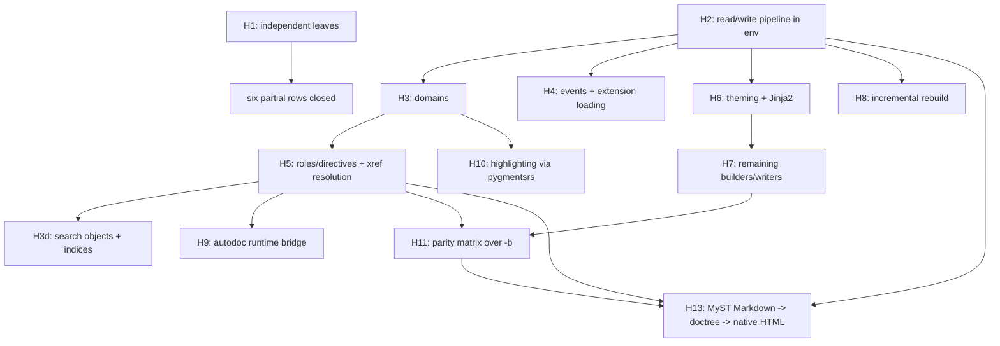

# sphinxdocrs port plan & inventory

Single source of truth for the Sphinx → Rust port (`src/sphinxdocrs`).
This document merges the former `docs/sphinx-port-inventory.md`
(*sphinx port inventory, Phase 4*) and `docs/sphinxdocrs-cli-port-plan.md`
(*sphinxdocrs CLI port & test plan*); both are superseded by this file.

## Current Verification (2026-08-28)

The H4-H7 implementation rows below reflect the current native code, not the
original phase-4 placeholders. The focused theme renderer suite passes 17/17,
the native builder parity matrix passes, and fresh Alabaster and Jinja/Pocoo
builds match Python viewport metadata. The real external-doc suite currently
passes 8/14 cases; the six remaining failures are tracked content/tree parity
gaps rather than build failures.

### Gap Clusters

The current `grep -i 'deviation|gap|partial'` inventory groups into six
workstreams. The counts include repeated references in status tables,
milestone notes, and accepted-deviation explanations, so they indicate where
the plan concentrates risk rather than counting unique defects.

| cluster | grep matches | current interpretation | primary work items |
| --- | ---: | --- | --- |
| HTML, builders, and themes | 31 | largest active parity surface: real-theme page/TOC serialization, search and inventory details, plus the open `epub`/`texinfo` builders; asset checksum/attribute tags now have focused coverage | H7d, H11.2, H11.4-H11.6 |
| parsing, Docutils, and MyST | 12 | native parser coverage is usable; structural directive/node fidelity and the H13.5 MyST fixture matrix remain open | H5a/H5b, H12, H13.5 |
| domains and roles | 8 | `std`/`rst`/`py`/`js` work, while richer role execution, pending-xref nodes, `numfig`, and C/C++ remain deferred or bridged | H5a-H5c, H3f |
| extensions and interop | 8 | extension loading and the PyO3 boundary work, but Python-only extensions and theme discovery remain explicit bridge/keep-Python boundaries | H4, H6a, H7e, H9 |
| CLI and tools | 3 | native argument layers are complete; builder dispatch still has an intentional Python fallback for unsupported builders | C2, H7e |
| cross-cutting pipeline, persistence, and metadata | 57 | mostly repeated status prose; substantive items are sequential-only `-j`, JSON environment persistence, source metadata, and writer-specific normalization | H8d, H11.1/H11.3, H11.6 |

The immediate executable coverage added during this clustering is in
`tests/builders.rs` (HTML artifacts, nested toctrees, HTML5 structure, and
asset checksum/attribute tags), `tests/toctree.rs` (max-depth and multiple
parents), and `tests/events_app.rs` (registered asset attributes). The asset
tag checks are regular black-box tests now; they cover local checksums,
registered HTML attributes, and JavaScript loading methods.

Contents:

1. [Status legend & phases](#1-status-legend--phases)
2. [Porting principles](#2-porting-principles)
3. [Subsystem inventory](#3-subsystem-inventory)
4. [CLI binary status](#4-cli-binary-status)
5. [Crate module map](#5-crate-module-map)
6. [Upstream test triage](#6-upstream-test-triage)
7. [Rust-side test suites](#7-rust-side-test-suites)
8. [Completed milestones](#8-completed-milestones-c--g--p-phases)
9. [**H-phase: plan to close the remaining deferred work**](#9-h-phase--plan-to-close-the-remaining-deferred-work)
10. [**H12: stack-safe docutilsrs renderers**](#h12-stack-safe-docutilsrs-renderers)
11. [**H13: MyST Markdown to doctree and native HTML**](#tier-h13--myst-markdown-to-doctree-and-native-html)
12. [**J-phase: source-encoding hardening follow-ups**](#10-j-phase--source-encoding-hardening-follow-ups)

---

## 1. Status legend & phases

**Priority tiers** (assigned when a subsystem is first inventoried):

| tier | meaning |
| --- | --- |
| **P1** | small, pure Python, few deps — port immediately |
| **P2** | port after extension/event scaffolding exists |
| **P3** | depends on builder / environment / domain pipeline |
| **C*n*** | CLI entry-point milestone (`sphinx-quickstart`, `sphinx-build`, …) |
| **G*n*** | subsystem-unblocking milestone (config → env → builders) |
| **H*n*** | remaining-deferred milestone (§9 of this document) |

**Row status**:

| status | meaning |
| --- | --- |
| **done** | full upstream surface ported, parity-tested |
| **mirrored** | ported subset with a parity-checked Rust-side test |
| **partial** | usable subset landed; named gaps remain |
| **stub** | scaffolded without an implementation |
| **deferred** | still pure Python; revisit after its blocker lands |
| **keep-python** | intentionally not ported |

**Per-item tagging**: every ported function is tagged *exact parity*,
*accepted deviation*, or *pending*. Accepted deviations must be recorded
in the notes column of the relevant row.

---

## 2. Porting principles

- **Drop-in CLI contract first.** Argument grammar, exit codes,
  stdout/stderr text, and on-disk artifacts must match upstream
  byte-for-byte where observable. The argparse surface is the spec:
  mirror flag names, defaults, `dest`, and help strings.
- **Three-layer architecture per command**, so logic is unit-testable
  without a process boundary:
  1. **parse layer** — pure `argv: &[String] -> Result<Args, CliError>`;
     no I/O. Mirrors each `get_parser()` / `_parse_*` helper.
  2. **core layer** — pure-ish functions over injected filesystem, clock,
     and terminal traits; returns planned actions or rendered strings.
     Mirrors `generate()`, `ask_user()`, `build_main()` bodies.
  3. **shell layer** — `main()` wiring real stdio, real FS, real exit.
- **Dependency injection at boundaries only** (FS, time, terminal,
  subprocess). Everything else stays concrete — this is what keeps
  `mockall` + `rstest` fixtures cheap.
- **Reuse already-ported subsystems** (`config`, `util_console`,
  `util_matching`, `project`, `errors`, `events`, `extension`, and the
  sister crates `docutilsrs`, `pygmentsrs`, `jinja2rs`). Do not
  re-implement.
- **Templating** uses the vendored `minijinja` / `jinja2rs` crates rather
  than shelling to Python. Upstream template files are vendored as crate
  assets under `src/sphinxdocrs/assets/`.
- **Fallback ladder**: every command keeps a `--use-python-impl` escape
  hatch plus `SPHINXDOCRS_PY_FALLBACK=1`. A command defaults to the
  Python path until its native path passes the parity harness.
- **Test-near development**: port the upstream test → implement → gate on
  `pytest -q` *and* `cargo test` → flip the row status in this file.

### Rust test tooling

| need | tool | notes |
| --- | --- | --- |
| fixtures | `rstest` `#[fixture]` | `#[once]` for session-scoped setup |
| parametrization | `rstest` `#[case]` | one table per pure function |
| trait mocking | `mockall` `#[automock]` | inline `#[cfg(test)]` only — external test crates use the concrete `FixedClock` / `CapturingRunner` / `ScriptedTerminal` helpers instead |
| snapshots | `insta` | rendered strings + generated tree manifests |
| HTTP mock / replay | `wiremock`, `rvcr` | for `assets`, `intersphinx`, `linkcheck` |

---

## 3. Subsystem inventory

| subsystem (sphinx) | sphinxdocrs target | tier | status | notes |
| --- | --- | --- | --- | --- |
| `errors.py` | `errors` | P1 | **done** | exception hierarchy via `pyo3::create_exception!` |
| `events.py` | `events` | P1 | **done** | `EventManager`: connect/disconnect/emit/emit_firstresult, priority sort, `allowed_exceptions`, `pdb` re-raise, `ExtensionError` wrapping. Wired into `SphinxApp` via the native `app_events::AppEventManager` + `app_facade::PyAppFacade` bridge (**H4a/H4c**, done) |
| `project.py` | `project` | P1 | **mirrored** | `path2doc` / `doc2path` / `discover`; `discover()` uses `util_matching` for glob exclusion (`EXCLUDE_PATHS` parity) |
| `addnodes.py` | `addnodes` | P1 | **mirrored** | all 50+ node structs; `toctree` (Translatable), `desc*` family, 9 `desc_sig_*` leaves + `SIG_ELEMENTS`, `pending_xref`(`_condition`), `index`, `only`, `hlist`, `glossary`, `productionlist`, `number_reference`, `download_reference`, `manpage`, … |
| `extension.py` | `extension` | P2 | **mirrored** | `Extension` wrapper + `verify_needs_extensions`. `load_extension` landed on `SphinxApp` (**H4b**, done) |
| `registry.py` | `registry` | P2 | **done** | source-suffix/parser, transforms/post-transforms, CSS/JS/static assets, LaTeX packages, HTML themes, `add_builder`/`add_domain`/`add_translator`/`add_html_math_renderer` |
| `versioning.py` | `versioning` | P2 | **done** | `VERSIONING_RATIO`, `levenshtein_distance`, `get_ratio`, `add_uids`, `merge_doctrees`, `VersionableNode`, `apply_uid_transform`, `UID_TRANSFORM_PRIORITY = 880`. **Gap:** not invoked from a read phase yet — `docutilsrs::doctree::Node` has no `uid`/`VersionableNode` impl (→ **H8**) |
| `config.py` | `config` | P2 | **mirrored** | `SphinxConfig`, 50+ built-in option registry, `ConfigVal`, `RebuildKind`, `ConfigOpt`, `convert_overrides`, alias sync (`master_doc`↔`root_doc`, `copyright`↔`project_copyright`), typed accessors, `py_read_conf_py` |
| `util/*` | `util_*` | P2 | **mirrored** | `util_matching`, `util_console` (22 ANSI codes), `util_rst` (incl. `default_role`, **H1d**), `util_osutil`, `util_uri`, `util_lines`, `util_docstrings` |
| `locale.py` | `locale` | P2 | **done** | `PoCatalog` (incl. `#, fuzzy` handling and header capture), `Translator`, `TranslatorRegistry`, `init`, `init_chain`, `init_console`, `get_translation`, `tr`, `tr_console`, `tr!`/`tr_c!`, `admonition_labels`. **Extension:** `CATALOG_LOOKUP_ORDER = ["sphinxdocrs", "sphinx"]` — `tr`/`tr_console` walk the chain, first hit wins |
| `util/i18n.py` | `intl` | P2 | **done** | `CatalogInfo` (incl. `write_mo`), `CatalogRepository`, `docname_to_domain`, `DATE_FORMAT_MAPPINGS`, `split_date_format`, `ustrftime_to_babel`, `babel_format_date`, `format_date`, `encode_mo` / `decode_mo`. **Accepted deviations:** CLDR data limited to `en`/`de`/`ja` (others fall back to `en`, as upstream does for unknown locales); MO output is singular-only with an empty hash table; `.po` files are decoded as UTF-8 |
| `roles.py` | `roles` | P3 | **partial** | pure-algorithm subset: `GENERIC_DOCROLES`, `SPECIFIC_DOCROLES`, `is_builtin_role`, `format_rfc_target`, `parse_emphasized_literal`, `XRefRoleConfig`, `DefaultRoleConfig`. **Gap:** role `run()` execution (→ **H5b**) |
| `directives/` | `docutilsrs::plugins` + parser dispatch | P3 | **partial** | native registry now runs before built-ins; callable `app.add_directive` handlers return replacement RST. Full docutils Directive class/options/node execution remains (→ **H5a**) |
| `domains/` | — | P3 | **deferred** | only `registry.add_domain` name-registration exists; `env.domaindata` is never populated (→ **H3**) |
| `environment/` | `environment` | P3 | **mirrored** ✅ | `BuildEnvironment`: `find_files` (**H2a**), doctree store `parse_doc`/`store_doctree`/`get_doctree`/`has_stored_doctree` (**H2b**), `read_all` read phase (**H2c**), `get_and_resolve_doctree` (**H2e**), `check_consistency` (**H2f**). **Gap:** `resolve_references`, `domains` (→ **H3**) |
| `builders/` | `builders` | P3 | **partial** | `Builder` trait + `HtmlBuilder`, `LatexBuilder`, `ManpageBuilder`, `LinkcheckBuilder`, `JsonBuilder`, `TextBuilder`, `XmlBuilder`, `PseudoxmlBuilder` (**H7a**, done), `DirhtmlBuilder`, `SinglehtmlBuilder` (**H7b**, done), `GettextBuilder` (**H7c**, done), `ChangesBuilder` (**H7d**, done), all dispatched by `SphinxApp`. **Gap:** no epub/texinfo (→ **H7d** remainder, see §9.5), plus real HTML body/navigation/content parity. `doctest`/`coverage`/`qthelp`/`devhelp`/`htmlhelp`/`applehelp` are **keep-python** (**H7e**, decided) |
| `application.py` | `application` | P3 | **partial** | `SphinxApp`: path validation, config, registry, env, extension loading, native events, `read()` (**H2**: `find_files` + `read_all`), and `build()` (`&mut self`, two-phase). **Gaps:** parallel build, incremental rebuild, and full i18n (→ **H4**, **H8**) |
| `theming.py` | `theme`, `theme_static`, `theme_render` | P3 | **mirrored** ✅ | self-contained `sphinxdocrs_basic` theme + real third-party theme inheritance (`alabaster`/`basic`) rendered through `jinja2rs`; full per-page context (`pathto`/`hasdoc`/`toctree()`/`toc`/relbar/sidebars/`html_context`/`html-page-context`) (**H6**, done). **Accepted deviation:** `theme.conf`/`theme.toml` inheritance-chain parsing still goes through an embedded PyO3 bootstrap rather than pure Rust (**H6a**) |
| `search/` | `search` | P3 | **done** | `SearchIndex`, `split_words`, `feed`, `to_json`, Snowball stemming for all 15 `sphinx.search` languages (**H1f**, via `stemmer.rs`). **Accepted deviation:** `rust_stemmers`' Dutch algorithm is the legacy `dutch_porter` Snowball revision, not the one `snowballstemmer.stemmer('dutch')` resolves to — patched via built-in `ParityOverrides` for Sphinx's own Dutch stopword vocabulary; broader vocabularies may need project-supplied overrides. `objects`/`objtypes`/`objnames`/`indexentries` now populated from domain data (**H3d**) — see the accepted deviations noted on that row in §3 |
| `ext/autodoc/` | `autodoc` | P3 | **mirrored** ✅ | `document_module`/`document_module_auto`/`render_function`/`render_class` with a PyO3 runtime-import bridge (`autodoc_runtime.rs`, falling back to `ruff_python_parser` static extraction when import fails), `:members:`/`:undoc-members:`/`:private-members:`/`:special-members:`/`:exclude-members:`/`:member-order:` option handling, type hints, decorators (`@property`/`@staticmethod`/`@classmethod`), `__all__` ordering, `autodoc_mock_imports` (**H9**, done). **Accepted deviations:** `:inherited-members:` parsed but not expanded; overload sets render only the last definition; `autodoc_typehints="description"` treated as `"signature"` — see the Tier H9 writeup in §9 |
| `ext/intersphinx/` | `intersphinx` | P3 | **partial** | `fetch_inventories`, `InvCache`, `Inventory` / `InventoryItem` / `InventoryError` (v1 + v2 `loads`, `load_file`), `dumps`. **Gap:** xref fallback — the parsed inventories are not consulted during reference resolution (→ **H5c**) |
| `highlighting.py` | — | P3 | **partial** | `docutilsrs` code/code-block/sourcecode paths use native `pygmentsrs` with Python fallback; `automodule` output now enters that path. Dedicated `sphinx.highlighting` parity remains (→ **H10**) |
| `pycode/` | — | P3 | **keep-python** | superseded by `autodoc.rs` + `ruff_python_ast` |
| `ext/*` (other) | — | P3 | **keep-python** | loaded through the `Extension` registry |
| *(new, no upstream analogue)* | `scan` | — | **done** | `scan_requirements`, `collect_packages`, stdlib detection — probes `conf.py` extension imports |
| *(new)* | `assets` | — | **done** | `SriAlgo`, SRI hashing, `fetch_and_cache`, `fetch_with_integrity` |

---

## 4. CLI binary status

| upstream script | Rust binary | upstream module | milestone | status |
| --- | --- | --- | --- | --- |
| `sphinx-quickstart` | `sphinx-quickstart-rs` | `sphinx.cmd.quickstart` | **C1** | **done** — fully native |
| `sphinx-build` | `sphinx-build-rs` | `sphinx.cmd.build` + `sphinx.cmd.make_mode` | **C2** | **partial** — `-M` make-mode native; `-b` native for `html`/`latex`/`man`/`linkcheck`; other builders delegate to Python |
| `sphinx-apidoc` | `sphinx-apidoc-rs` | `sphinx.ext.apidoc` | **C3** | **done** — module/package/TOC generation + `--full`; parity verified vs Python 9.1.0 |
| `sphinx-autogen` | `sphinx-autogen-rs` | `sphinx.ext.autosummary.generate` | **C4** | **done** — RST scan, arg-parse, native stub generation |

Every binary honours `--use-python-impl` and `SPHINXDOCRS_PY_FALLBACK=1`.

```rust
// src/sphinxdocrs/src/application.rs
pub const NATIVE_BUILDERS: &[&str] = &[
    "html", "json", "latex", "man", "linkcheck", "text", "xml", "pseudoxml",
    "dirhtml", "singlehtml", "gettext", "changes",
];
```

### 4.1 `sphinx-quickstart` (C1) — surface

| upstream symbol | Rust target | notes |
| --- | --- | --- |
| validators (`is_path`, `nonempty`, `choice`, `boolean`, `suffix`, `ok`, `allow_empty`) | `quickstart::validate` | pure `fn(&str) -> Result<_, ValidationError>`; table-tested |
| `do_prompt` / `term_input` | `quickstart` over the `Terminal` trait | readline behaviour is out of scope |
| `ask_user(d)` | `quickstart::generate::ask_user` | imgmath+mathjax conflict rule and existing-`conf.py` / existing-master guards match upstream |
| `QuickstartRenderer` | `quickstart::templates` | `_has_custom_template` + `templatedir` override semantics |
| `generate(d, …)` | `quickstart::generate` | `sep`/`dot` layout, `exclude_patterns`, `copyright`, `now`, `project_underline` (column width), newline modes |
| `valid_dir(d)` | `quickstart::valid_dir` | reserved-name collision check |
| `get_parser()` / `main()` | `quickstart::parser` | flag parity incl. `--ext-*` append_const, `--no-sep`, `--no-makefile` |

Parity-critical details: `project_underline` uses `unicode-width`
(east-Asian width parity with docutils); `copyright` / `now` come from the
injected `Clock` (`FixedClock::snapshot()` for deterministic snapshots);
the `EXTENSIONS` table fixes extension ordering; `Makefile` is written LF
and `make.bat` CRLF; "Creating file %s." / "File %s already exists,
skipping." honour `quiet`; the `| repr` Jinja2 filter is registered
manually because minijinja lacks it.

### 4.2 `sphinx-build` (C2) — surface

| upstream symbol | Rust target | notes |
| --- | --- | --- |
| `get_parser()` | `build::parser` | full flag grammar (builder, jobs, `-a`/`-E`, path opts, `-D`/`-A`/`-t`/`-n`, console/warning opts) |
| `jobs_argument` | `build::args` | `'auto'` → cpu count; positive-int validation + error text |
| `_parse_confdir`, `_parse_doctreedir`, `_validate_filenames`, `_validate_colour_support`, `_parse_confoverrides` | `build::args` | pure; parametrized tests |
| `_parse_logging` | `build::logging` | colour disable via `util_console`; `finish_build` wires `-q`/`-Q`/`-w`/`-W` into both CLI entry points (**H8c**, done) |
| `make_mode.Make` | `build::make_mode` | `build_clean` (security-relevant safety checks — ported faithfully), `build_help`, `run_generic_build`, `BUILDERS` table, target dispatch; subprocesses go through the injected `Runner` |
| `build_main` → `Sphinx(...)` | `application::SphinxApp` + `build::native_runner` | native for `NATIVE_BUILDERS`; `NativeMakeRunner` falls back to Python otherwise |

### 4.3 `sphinx-apidoc` (C3) / `sphinx-autogen` (C4) — surface

| upstream symbol | Rust target | status |
| --- | --- | --- |
| `ApidocOptions` dataclass | `apidoc::settings` | all 20 fields; `effective_automodule_options()` |
| `_generate.py` helpers | `apidoc::generate` | `is_initpy`, `module_join`, `is_excluded`, `is_skipped_package/module`, `walk`, `recurse_tree`, `create_module_file`, `create_package_file`, `create_modules_toc_file`, `remove_old_files` |
| apidoc RST templates | `assets/apidoc/*.jinja` | 3 vendored; `heading(2)` patched to a `heading2` filter |
| `_cli.get_parser()` | `apidoc::parser` | full clap grammar, `--ext-*`, `SPHINX_APIDOC_OPTIONS` |
| `--full` mode | `run_full_quickstart` | wired to `quickstart::generate` |
| `find_autosummary_in_lines` / `_in_files` | `autogen::scan` | regex parser matching upstream |
| autosummary stub templates | `assets/autosummary/*.rst` | `base`, `class`, `module`; `underline` + `_` identity filters |
| `generate_autosummary_docs` (stub writing) | `autogen::generate` | `infer_obj_type` (CamelCase→class, else→module), `StubContext`, `generate_stub(s)`, `--remove-old`. `StubContext::from_entry_runtime`/`generate_stub(s)_runtime` (**H9d**, done) populate real member lists via the `autodoc_runtime` PyO3 bridge when the target is importable, falling back to the empty-list heuristic otherwise; `bin/sphinx_autogen.rs` uses the runtime variant |

---

## 5. Crate module map

| crate path | mirrors | notes |
| --- | --- | --- |
| `src/cli/io.rs` | — | `Terminal`, `Fs`, `Clock`, `Runner` traits + `Real*` impls; `FixedClock`, `CapturingRunner`, `ScriptedTerminal` test helpers; `py_fallback_requested`, `run_python_impl` |
| `src/quickstart/{validate,settings,templates,generate,parser}.rs` | `sphinx.cmd.quickstart` | see §4.1 |
| `src/build/{parser,args,logging,make_mode,native_runner}.rs` | `sphinx.cmd.build`, `sphinx.cmd.make_mode` | see §4.2 |
| `src/apidoc/{settings,templates,generate,parser}.rs` | `sphinx.ext.apidoc` | see §4.3 |
| `src/autogen/{scan,templates,parser,generate}.rs` | `sphinx.ext.autosummary.generate` | see §4.3 |
| `src/addnodes.rs` | `sphinx.addnodes` | all node structs; `Translatable`, `NotSmartquotable`, `SIG_ELEMENTS` |
| `src/application.rs` | `sphinx.application.Sphinx` | `SphinxApp`, `AppError`, `NATIVE_BUILDERS`, `is_native_builder`, `SphinxApp::load_extension`/`verify_needs_extensions` (**H4b** — `new` auto-loads `conf.py`'s `extensions` list, consulting the `docutilsrs_plugins` ADR 0005 resolver before falling back to plain Python `setup()`; the resolver module itself isn't part of the installed `docutilsrs` wheel yet, see the `python-source` note below) |
| `src/app_events.rs` | `sphinx.events.EventManager` (native subset) | `AppEventManager`, `EventArg`, `SharedEvents` (`Rc<RefCell<_>>`) \u2014 PyO3-free event bus wired into `SphinxApp`/`BuildEnvironment` (**H4a**) |
| `src/app_facade.rs` | \u2014 (no direct upstream analogue; bridges to `Sphinx`) | `PyAppFacade`, the `app`-shaped object passed to a loaded extension's `setup(app)` (**H4c**) |
| `src/environment.rs` | `sphinx.environment.BuildEnvironment` | state skeleton (`all_docs`, `dependencies`, `included`, `reread_always`, `metadata`, `titles`/`longtitles`, `toc_num_entries`/`toc_secnumbers`, `toctree_includes`, `files_to_rebuild`, `glob_toctrees`, `numbered_toctrees`, `domaindata`, `temp_data`, `ref_context`, config-status constants) + `EnvProject` + `default_settings()`; `read_all_with_events` (**H4a**) |
| `src/registry.rs` | `sphinx.registry.SphinxComponentRegistry` | full P2 + P3 registration surface; `RegistryError` |
| `src/config.rs` | `sphinx.config.Config` | `SphinxConfig`, `ConfigVal`, `MathRenderer`, `py_read_conf_py`; `SphinxConfig::needs_extensions()` (**H4b**) parses `conf.py`'s `needs_extensions = {...}` dict |
| `src/versioning.rs` | `sphinx.versioning` | + `apply_uid_transform`, `UID_TRANSFORM_PRIORITY` |
| `src/roles.rs` | `sphinx.roles` | tables + pure helpers |
| `src/locale.rs` | `sphinx.locale` | `.po` parser, `TRANSLATORS` registry, `CATALOG_LOOKUP_ORDER` chain, `tr!` / `tr_c!`; `locale/` symlink → `../../sphinx/sphinx/locale` |
| `src/intl.rs` | `sphinx.util.i18n` | catalogs, `write_mo` / MO codec, `docname_to_domain`, strftime→babel mapping, `format_date` |
| `src/util_rst.rs` | `sphinx.util.rst` | `SECTIONING_CHARS`, `WIDECHARS_*`, `escape`, `textwidth`, `heading`, `prepend_prologue`, `append_epilogue` |
| `src/util_osutil.rs` | `sphinx.util.osutil` | `SEP`, `os_path`, `canon_path`, `path_stabilize`, `relative_uri`, `ensuredir`, `make_filename(_from_project)`, `FileAvoidWrite`, `copyfile`, `relpath`, `rmtree` |
| `src/util_uri.rs` | `sphinx.util._uri` | `is_url`, `encode_uri` (percent-encode path, decode-then-reencode query, IDNA netloc) |
| `src/util_lines.rs` | `sphinx.util._lines` | `parse_line_num_spec` with upstream error strings |
| `src/util_docstrings.rs` | `sphinx.util.docstrings` | `prepare_docstring`, `prepare_commentdoc`, `separate_metadata` |
| `src/util_matching.rs` | `sphinx.util.matching` | glob → regex |
| `src/util_console.rs` | `sphinx.util.console` + `sphinx._cli.util.colour` | 22 ANSI codes |
| `src/builders/mod.rs` | `sphinx.builders.Builder` | `Builder` trait (`name`, `format`, `out_suffix`, `get_target_uri`, `build_doc`, `build_all`), `BuildError`, `BuildResult` |
| `src/builders/html.rs` | `sphinx.builders.html` | `HtmlBuilder` |
| `src/builders/json.rs` | `sphinx.builders.html.JSONHTMLBuilder` | `JsonBuilder` → `.fjson` |
| `src/builders/latex.rs` | `sphinx.builders.latex` | `LatexBuilder` |
| `src/builders/manpage.rs` | `sphinx.builders.manpage` | `ManpageBuilder` |
| `src/builders/text.rs` | `sphinx.builders.text.TextBuilder` | `TextBuilder` → `.txt`, over the new `docutilsrs::text` writer (**H7a**) |
| `src/builders/xml.rs` | `sphinx.builders.xml.XMLBuilder` | `XmlBuilder` → `.xml`, over the new `docutilsrs::to_xml` writer (**H7a**) |
| `src/builders/pseudoxml.rs` | `sphinx.builders.xml.PseudoXMLBuilder` | `PseudoxmlBuilder` → `.pseudoxml`, over the pre-existing `docutilsrs::pseudo_xml` writer (**H7a**) |
| `src/builders/dirhtml.rs` | `sphinx.builders.dirhtml.DirectoryHTMLBuilder` | `DirhtmlBuilder`, a thin delegating wrapper over `HtmlBuilder::new_dir_style()` (**H7b**) |
| `src/builders/singlehtml.rs` | `sphinx.builders.singlehtml.SingleFileHTMLBuilder` | `SinglehtmlBuilder`, concatenates every document's fragment into one `index.html` (**H7b**) |
| `src/builders/gettext.rs` | `sphinx.builders.gettext.MessageCatalogBuilder` | `GettextBuilder` → `sphinx.pot`, extracting `Title`/`Subtitle`/`Paragraph` text (**H7c**) |
| `src/builders/changes.rs` | `sphinx.builders.changes.ChangesBuilder` | `ChangesBuilder` → `index.html`, scanning `versionadded`/`versionchanged`/`deprecated` directives (**H7d**, partial — `epub`/`texinfo` still open) |
| `src/builders/linkcheck.rs` | `sphinx.builders.linkcheck` | `LinkcheckBuilder` — `linkcheck_ignore` / `linkcheck_anchors` / `linkcheck_anchors_ignore` / `linkcheck_allowed_redirects` / `linkcheck_timeout` / `linkcheck_retries` / `linkcheck_rate_limit_timeout` config (`LinkcheckConfig`), anchor (`#fragment`) existence checking, redirect classification (`working`/`redirected`/`broken`/`ignored`), HTTP 429 rate-limit backoff honoring `Retry-After`, via the shared `crate::http_client` backend (curl by default, optional in-process `reqwest`) |
| `src/theme.rs` | `sphinx.theming` | `ThemeRenderer` + embedded `sphinxdocrs_basic` theme (`LAYOUT_HTML`, `PAGE_HTML`, `THEME_CSS`) |
| `src/theme_static.rs` | `sphinx.builders.html` asset copy | `copy_theme_assets`, `render_templates` |
| `src/search.rs` | `sphinx.search` | `SearchIndex`, `split_words`, `feed`, `to_json` |
| `src/autodoc.rs` | `sphinx.ext.autodoc` | static extraction over `ruff_python_ast`; `AutodocError` |
| `src/intersphinx.rs` | `sphinx.ext.intersphinx`, `sphinx.util.inventory` | `fetch_inventories`, `InvCache`, `Inventory::loads` / `load_file`, `dumps` |
| `src/scan.rs` | — | `scan_requirements`, `collect_packages` |
| `src/assets.rs` | — | SRI hashing + fetch/cache |
| `assets/quickstart/` | `sphinx/templates/quickstart/` | 4 vendored Jinja templates (`include_str!`) |
| `assets/apidoc/` | `sphinx/templates/apidoc/` | 3 vendored Jinja templates |
| `assets/autosummary/` | `sphinx/ext/autosummary/templates/autosummary/` | 3 vendored RST stub templates |

**Known packaging gap (`docutilsrs_plugins`):** the ADR 0005 resolver
module lives at `src/docutilsrs/python/docutilsrs_plugins.py` as a loose
file alongside `docutilsrs_hybrid.py`/`docutilsrs_pygments.py`, but
`docutilsrs`'s `[tool.maturin]` config has no `python-source`, so
`pip install`/`maturin develop` only installs the compiled extension
module — none of the three are importable from a real (non-monorepo)
install. Adding `python-source = "python"` was tried and rejected by
maturin: `maturin develop` fails with *"the python module at
`python/docutilsrs` does not exist"* — maturin's mixed-layout convention
requires `python-source` to contain a package directory named after
`module-name` (i.e. `python/docutilsrs/__init__.py`), not loose top-level
`.py` files. A real fix means restructuring these three modules into a
`docutilsrs` sub-package (e.g. `docutilsrs.plugins`, `docutilsrs.hybrid`,
`docutilsrs.pygments`) and updating every `import docutilsrs_plugins` /
`import docutilsrs_hybrid` call site (~10 files under `src/tests/` and
`src/sphinxdocrs/python/sphinxdocrs_hybrid.py`) — deferred as a separate,
explicitly-scoped task rather than attempted piecemeal here. Until then,
callers (native Rust code and tests alike) must put
`src/docutilsrs/python` on `sys.path` manually before importing these
modules, exactly as `src/tests/test_hybrid.py`'s `HYBRID_DIR` pattern
already does.

### Cargo features

| feature | purpose |
| --- | --- |
| `extension-module` | build as a PyO3 extension module (propagates to `docutilsrs`) |
| `syntax-highlighting` | syntax highlighting via `docutilsrs` (default) |
| `test-parity` | cross-language parity tests (requires Python + upstream sphinx) |
| `test-parity-jsonbuilder` | full `sphinx-build -b json` parity (memory-intensive) |
| `test-build-extdocs` | build real external documentation trees |

---

## 6. Upstream test triage

Tagged from `src/sphinx/tests/`.

| test file | subsystem | tier | status |
| --- | --- | --- | --- |
| `test_errors.py` | errors | P1 | **mirrored** — `tests/test_sphinxdocrs_errors.py` |
| `test_events.py` | events | P1 | **mirrored** — `tests/test_sphinxdocrs_events.py` |
| `test_project.py` | project | P1 | **mirrored** — `tests/test_sphinxdocrs_project{,_discover}.py` |
| `test_addnodes.py` | addnodes | P1 | **mirrored** — `tests/addnodes.rs` |
| *(no upstream file)* | extension | P2 | **mirrored** — `tests/test_sphinxdocrs_extension.py` |
| `test_config/` | config | P2 | **mirrored** — `tests/config.rs` |
| `test_extensions/` | registry | P2 | **done** — `tests/registry.rs`; `load_extension` landed on `SphinxApp` (**H4b**), covered by `tests/events_app.rs` |
| `test_versioning.py` | versioning | P2 | **done** — `tests/versioning.rs` |
| `test_util/` | util | P2 | **done** — `tests/util_rst_osutil.rs`, `tests/util_extra.rs`; `default_role` closed (**H1d**) |
| `test_intl/` | intl / locale | P3 | **mirrored** — `tests/locale.rs`, `tests/intl.rs`, plus `test_util_i18n.py`'s `test_catalog_write_mo` / `test_format_date` cases as `intl` unit tests |
| `test_quickstart.py` | quickstart | C1 | **mirrored** — `tests/quickstart.rs`, `tests/quickstart_cli.rs` |
| `test_ext_apidoc/` | apidoc | C3 | **mirrored** — `tests/apidoc.rs` |
| `test_ext_autosummary/` | autogen | C4 | **done** — `tests/autogen.rs` |
| `test_command_line.py`, `test__cli/` | cli | P3 | **partial** — arg layer native; full `Sphinx()` invocation deferred |
| `test_application.py` | application | P3 | **partial** — `tests/application.rs` |
| `test_builders/` | builders | P3 | **partial** — `tests/builders.rs` includes **H2d** two-phase parity, HTML artifact/nested-toctree/HTML5 structure tests, and regular asset checksum/attribute/loading-method checks; `tests/builders_json.rs`, `tests/builders_text.rs`/`builders_xml.rs`/`builders_pseudoxml.rs` (**H7a**, done), `tests/builders_dirhtml.rs`/`builders_singlehtml.rs` (**H7b**, done), `tests/builders_gettext.rs` (**H7c**, done), `tests/builders_changes.rs` (**H7d** partial, done) |
| `test_environment/` | environment | P3 | **mirrored** ✅ — `tests/environment.rs` gained the **H2** read-phase group (`find_files`, doctree store round trip, `read_all`, `check_consistency`); `tests/toctree.rs` (**H5d**) covers nested resolution, max-depth expansion, multiple parents, consistency, and chapter numbering; `tests/genindex.rs` (**H5e**) covers genindex/modindex generation |
| `test_roles.py` | roles | P3 | **partial** — `tests/roles.rs`; `std`/`rst`/`py`/`js` xref recovery+resolution now covered by `tests/domains_std.rs`/`tests/domains_rst.rs`/`tests/domains_py.rs`/`tests/domains_js.rs` (**H5b**/**H5c**); other role classes' node execution still deferred (→ **H5a**) |
| `test_directives/` | directives | P3 | **partial** — registry dispatch smoke coverage landed; upstream directive parity fixtures remain (→ **H5a**) |
| `test_domains/` | domains | P3 | **partial** — `std` (**H3a**), `rst` (**H3c**), `py` (**H3b**), `js` (**H3e**) done; `c`/`cpp` **keep-python** (**H3f**) |
| `test_transforms/` | transforms | P3 | **deferred** — per-transform port |
| `test_writers/` | writers | P3 | **partial** — `docutilsrs::text`/`to_xml` (new, backing **H7a**) have inline unit tests; `docutilsrs::pseudo_xml` was already covered. Sphinx-specific writers (`html5`, `latex2e`) covered elsewhere; one remaining writer at a time (→ **H7**) |
| `test_theming/` | theming | P3 | **mirrored** — no dedicated `tests/theming.rs`; covered by inline `theme_render.rs`/`theme_static.rs` unit tests, `tests/builders.rs` HTML structure/artifact checks, and `tests/otherdocs.rs` real-theme builds (**H6**, done) |
| `test_search.py` | search | P3 | **partial** — `tests/stemmer_parity.rs` (**H1f** closed); `objects`/`objtypes`/`objnames`/`indexentries` now populated from domain data (**H3d**, `tests/search_objects.rs`) |
| `test_highlighting.py` | highlighting | P3 | **deferred** — dedicated Sphinx highlighting parity gate remains open (→ **H10**) |
| `test_markup/` | markup | P3 | **deferred** — depends on the docutils converter |
| `test_pycode/` | pycode | P3 | **keep-python** |
| `test_ext_autodoc/` | autodoc | P3 | **partial** — inline unit tests in `autodoc.rs`/`autodoc_runtime.rs`/`autogen/generate.rs` cover option handling, type hints, decorators, runtime introspection, and static-path fallback (**H9**, done); a dedicated `tests/ext_autodoc.rs` mirroring upstream's fixture-based cases directly is still pending |
| `test_ext_intersphinx/`, `test_util_inventory.py` | intersphinx | P3 | **partial** — `tests/intersphinx.rs` covers `InventoryFile` parsing with an upstream-generated fixture (exact parity); xref-resolution cases still pending (→ **H5c**) |
| `test_ext_imgconverter/`, `test_ext_napoleon/`, other `test_ext_*` | extensions | P3 | **keep-python** — run against vendored sphinx |
| `js/` | search JS | — | external |

---

## 7. Rust-side test suites

| suite | scope |
| --- | --- |
| lib (inline `#[cfg(test)]`) | ~41 source files carry inline unit tests (validators, arg parsing, generators, builders, registry, versioning, util modules) |
| `tests/quickstart.rs`, `tests/quickstart_cli.rs` | validators (`#[case]` tables), parser flags, `valid_dir`, tree-layout snapshots, `conf.py` snapshot, LF/CRLF assertions, scripted-terminal `ask_user`, help-text snapshot |
| `tests/build.rs` | `jobs_argument`, `parse_confdir`, `parse_doctreedir`, `validate_filenames`, `parse_confoverrides`, `parse_color`, `build_clean` safety, `run_generic_build`, dispatch, `BUILDERS` completeness, help snapshot |
| `tests/apidoc.rs` | parser flags, `is_initpy`, `module_join`, `is_excluded`, `recurse_tree` variants, module/TOC/help snapshots |
| `tests/autogen.rs` | parser flags, `find_autosummary_in_lines` / `_in_files`, `infer_obj_type`, `split_fqn`, `generate_stub(s)`, stub-content snapshots |
| `tests/registry.rs` | source suffix/parser, transforms, CSS/JS/static, LaTeX packages, HTML themes, builder/domain/translator/math-renderer registration |
| `tests/versioning.rs` | `levenshtein_distance`, `get_ratio`, `add_uids`, all 7 `merge_doctrees` upstream fixtures |
| `tests/config.rs` | defaults, raw + CLI overrides, `add`/`set`/`contains`/`iter`/`filter`, alias sync, coercion |
| `tests/addnodes.rs` | `SIG_ELEMENTS` exact set, `desc_sig_*` classes, `Translatable`, `astext` behaviours |
| `tests/environment.rs` | construction, `default_settings`, config-status labels, doc-read / title / dependency tracking |
| `tests/domains_std.rs` | **H3a**/**H5b**/**H5c**: label registration (w/wo attached section), `:ref:` (named + explicit-title + undefined-label warning), `:doc:` (relative/absolute/unknown), glossary `:term:` (case-insensitive + missing-term warning), stale-entry clearing on re-read, virtual `genindex`/`modindex`/`search` label seeding |
| `tests/domains_rst.rs` | **H3c**: `rst:directive`/`rst:role` object registration and `:rst:dir:`/`:rst:role:` xref resolution across documents, unresolved-target warning |
| `tests/domains_py.rs` | **H3b**: `py:module`/`function`/`class`/`method` registration with nesting, `:py:func:`/`:py:meth:` xref resolution incl. `~`-shortening, unresolved-target warning, stale-entry clearing on re-read |
| `tests/domains_js.rs` | **H3e**: `js:module`/`function`/`class`/`method` registration with nesting, `:js:func:` xref resolution, unresolved-target warning |
| `tests/toctree.rs` | **H5d**: nested toctree resolution via `read_all`, docname-not-in-any-toctree cross-check against `check_consistency`, `:numbered:` chapter-number assignment order |
| `tests/genindex.rs` | **H5e**: `.. index::`-driven genindex grouping/sorting, `py-modindex` module grouping, stale-entry clearing on re-read |
| `tests/search_objects.rs` | **H3d**: `domain_objects()` aggregation across all four domains, `SearchIndex`'s `objects`/`objtypes`/`objnames`/`indexentries` populated end-to-end from `BuildEnvironment` |
| `tests/builders.rs`, `tests/builders_json.rs` | `Builder` trait contract, `get_target_uri`, `build_doc` HTML5 structure, `build_all` variants, `.fjson` output |
| `tests/builders_text.rs`, `tests/builders_xml.rs`, `tests/builders_pseudoxml.rs` | **H7a**: multi-doc/subdirectory `build_all` for each builder, XML well-formedness (stack-based tag-balance check) + entity-escaping for `xml`, byte-identical parity with calling `docutilsrs::pseudo_xml` directly for `pseudoxml`, `get_target_uri` parity with upstream for all three |
| `tests/builders_dirhtml.rs`, `tests/builders_singlehtml.rs` | **H7b**: `dirhtml` vs. flat `HtmlBuilder` byte-level pipeline-reuse comparison (same search index/static assets, different physical layout), `SphinxApp::build()` dispatch for both, `singlehtml`'s multi-document/subdirectory merge into one `index.html` with `index` rendered first |
| `tests/builders_gettext.rs` | **H7c**: multi-document `.pot` aggregation (shared message deduplicated with both docnames' location comments, unique message present), `SphinxApp::build()` dispatch |
| `tests/builders_changes.rs` | **H7d** (`changes` only): multi-document version-change scanning + grouping, newest-version-first ordering, `SphinxApp::build()` dispatch |
| `tests/application.rs` | `NATIVE_BUILDERS`, path validation, constructor fields, `build()` HTML output, config defaults/overrides |
| `tests/events_app.rs` | **H4**: core event emission order across a full `build()`, per-document `source-read`/`doctree-read` pairing, auto-loading extensions from `conf.py` before `config-inited` fires, unknown-module error path, an ADR-0005 round trip proving a registered Rust equivalent is called instead of the Python extension's `setup()`, an ADR-0005 version-guard-rejection fallback + warning, and `needs_extensions` (missing-extension warning + version-mismatch error) |
| `tests/roles.rs` | docrole table completeness, `format_rfc_target`, `parse_emphasized_literal` |
| `tests/locale.rs`, `tests/intl.rs` | `.po` parsing, translator registry, catalog discovery, `docname_to_domain`, date-format mapping |
| `tests/util_rst_osutil.rs`, `tests/util_extra.rs` | full `sphinx.util` mirrors |
| `tests/assets.rs` | SRI hashing + fetch/cache |
| `tests/scan_requirements.rs` | `conf.py` extension → package scanning |
| `tests/snapshot.rs` | misc rendered-string snapshots |
| `tests/parity.rs` | cross-language harness, gated by `--features test-parity`; skips gracefully without Python |
| `tests/otherdocs.rs` | real external doc-tree builds, gated by `--features test-build-extdocs` |

Snapshot conventions: rendered strings (`conf_py_snapshot`,
`*_help_snapshot`) and generated trees
(`quickstart_tree_snapshot@<case>.snap`, via
`insta::with_settings!({snapshot_suffix => …})`). Tree manifests store
sorted relative paths, not hashes, to avoid template-timestamp churn;
newline correctness is asserted separately at byte level.

Run the parity suite with:

```
cargo test -p sphinxdocrs --features test-parity --test parity
```

---

## 8. Completed milestones (C / G / P phases)

| id | milestone | outcome |
| --- | --- | --- |
| **C1.0–C1.2** | quickstart | `cli::io` traits + vendored templates; validators, `do_prompt`, parser; `generate` / `ask_user` / `valid_dir`; native by default |
| **C2.1–C2.2** | build args + make mode | full parser, `_parse_*`, `jobs_argument`; `build_clean` / `build_help` / `run_generic_build` / `BUILDERS` via the injected `Runner` |
| **C2.3 / C3.3 / C4.3** | parity harness | `tests/parity.rs`; `quickstart_parity_flat` + `apidoc_parity_basic` green vs Python 9.1.0 |
| **C2c** | native `-b` | `SphinxApp` wires config + registry + env + builders; `html`, `latex`, `man`, `linkcheck` native |
| **C3.1–C3.2** | apidoc | settings / templates / generate / parser; `--full` → `quickstart::generate` |
| **C4.1–C4.2** | autogen | scan, templates, parser, native stub generation |
| **G1** | util leaf fns | `copyfile`, `relpath`, `rmtree`, `prepend_prologue`, `append_epilogue` |
| **G2** | addnodes | full Sphinx node set |
| **G3** | full `Config` | promoted from the math-options subset to the full option registry |
| **G4 / G4a / G4b** | env + registry + versioning | `BuildEnvironment` skeleton, P3 registry methods, `apply_uid_transform` |
| **G5** (partial) | roles | pure-algorithm subset |
| **G7 / G8 / G9** | builders + app | html builder, `SphinxApp`, latex + man builders |
| **P2.1–P2.4** | registry, versioning, util | see §5 |

---

## 9. H-phase — plan to close the remaining deferred work

Everything still marked **partial** or **deferred** in §3 and §6 is
sequenced here. Ordering is by *dependency depth*, not by table row.

### 9.1 What actually blocks what

The original structural blocker was that `BuildEnvironment` had no doctree
store and `HtmlBuilder` parsed and wrote each document in one pass. **H2 is
now complete**: the environment has a persisted read phase, cross-document
toctree/domain data, and a write phase that consumes stored doctrees. The
remaining work is therefore no longer blocked on the pipeline itself. It is
clustered around richer directive/node fidelity, HTML-family output parity,
the remaining builders, highlighting, and the MyST fixture matrix. **H1** is
complete; the dependency graph below now describes follow-up relationships,
not unstarted prerequisites.



### Tier H1 — independent leaves (start immediately, parallelizable)

No new subsystem needed; each item closes a named gap on its own.

| id | task | files | closes | gate |
| --- | --- | --- | --- | --- |
| **H1a** | ✅ Parse `objects.inv` payloads: zlib-inflate the body, decode `name domain:role priority uri dispname` lines, expose an `Inventory` lookup type plus a `dumps` writer. (Cross-ref *resolution* is **H5c**; this landed the data structure + codec only.) | `intersphinx.rs` | `intersphinx` parsing → **mirrored** | `tests/intersphinx.rs`: v1/v2 payloads, malformed-header errors, `$`-anchor expansion, case-only `std:label` ambiguities, dump→load round trip, and a byte-identical parity check against `InventoryFile.loads` |
| **H1b** | ✅ Complete `LinkcheckBuilder`: `linkcheck_ignore` / `linkcheck_anchors` / `linkcheck_allowed_redirects` config, anchor (`#fragment`) checking, redirect classification (`working` / `redirected` / `broken` / `ignored`), rate-limit backoff, `output.json` + `output.txt` emission. Also introduced `crate::http_client`, a shared HTTP backend (curl by default; optional in-process `reqwest` behind the `http-reqwest` Cargo feature, selected at runtime via `SPHINXDOCRS_HTTP_CLIENT=reqwest`) used by both `linkcheck` and `intersphinx` | `builders/linkcheck.rs`, `http_client.rs`, `intersphinx.rs`, `config.rs` | linkcheck → **done** | `tests/linkcheck_wiremock.rs`: `wiremock`-backed case per status class (working/broken/redirected/ignored/anchor-found/anchor-missing/rate-limited), run against both backends |
| **H1c** | ✅ `write_mo` + `encode_mo` / `decode_mo` (GNU MO codec, empty hash table) and `babel_format_date` / `format_date` (CLDR subset over `DATE_FORMAT_MAPPINGS`, `SOURCE_DATE_EPOCH` aware); `tr` / `tr_console` now walk `CATALOG_LOOKUP_ORDER` | `intl.rs`, `locale.rs` | `intl` → **done** | round-trip `.po` → `.mo` → read-back; `today_fmt` cases from `test_util_i18n.py` |
| **H1d** | ✅ `util.rst.default_role` — RAII guard over the docutils role registry exposed by `docutilsrs` (`roles.rs`), wired into the parser's `default-role` directive | `util_rst.rs`, `docutilsrs/roles.rs`, `docutilsrs/parser.rs` | `test_util/` → **done** (last gap closed) | `tests/util_rst_osutil.rs` |
| **H1e** | ✅ Dispatch `JsonBuilder` from `SphinxApp`: `NATIVE_BUILDER_CLASSES` pair table + `build()` match arm | `application.rs` | builders json → **done** | extend `tests/application.rs` + `tests/builders_json.rs`; enable `test-parity-jsonbuilder` in CI |
| **H1f** | ✅ Snowball stemming for all 15 `sphinx.search` languages via the `rust_stemmers` crate behind a `search-stemming` feature (default-on), plus a `ParityOverrides` config mechanism (`search_stemming_overrides`) to pin any word where `rust_stemmers` and `snowballstemmer` diverge | `stemmer.rs`, `search.rs` | removes the search stemming gap | `tests/stemmer_parity.rs` (fixture + `test-parity`-gated live diff vs `snowballstemmer`) |

**Exit:** the `intl`, linkcheck, json and `util_*` rows in §3 flip to
**done**; `intersphinx` parsing becomes testable standalone.

### Tier H2 — read/write pipeline (the unblocking milestone) ✅

| id | task | detail |
| --- | --- | --- |
| **H2a** ✅ | `BuildEnvironment::find_files(config)` | folds `Project::discover` into `BuildEnvironment::find_files`; populates `project.docnames` + `project.docname_to_path`; honours `exclude_patterns` / `include_patterns` (new `SphinxConfig::include_patterns()` accessor, default `["**"]`) plus `PROJECT_EXCLUDE_PATHS` |
| **H2b** ✅ | Doctree store | `BuildEnvironment::parse_doc(docname) -> Doctree` via `docutilsrs::parse_rst_with_source`; `store_doctree` / `get_doctree` / `has_stored_doctree` persist to `doctreedir/<docname>.doctree` using a new `Doctree::to_bytes`/`from_bytes` serde-json codec (`docutilsrs::doctree`) |
| **H2c** ✅ | Read phase | `BuildEnvironment::read_all()`: for every discovered doc — parse, extract + record the promoted title, scan `.. toctree::` / `.. include::` directives and call `note_toctree` / `note_dependency`, `store_doctree`, `record_doc_read`. **Accepted deviation:** toctree/include scanning uses a text-level heuristic (`scan_toctree_entries` / `scan_include_entries`) since `docutilsrs`'s parser has no structural toctree node yet — real AST-based scanning deferred to **H3a** (domains). **Accepted deviation:** `apply_uid_transform` is not yet invoked here (`docutilsrs::doctree::Node` has no `uid` field / `VersionableNode` impl) — deferred to **H8** (incremental rebuild) to avoid a wide blast radius across `doctree.rs`/`parser.rs`/`html5.rs` |
| **H2d** ✅ | Write phase | `Builder` trait gained `write_doc(docname, doctree, outdir)` (default: not-implemented error); `HtmlBuilder` overrides it via `build_doc_themed_from_tree` and `build_all` now prefers `env.get_and_resolve_doctree(docname)` when available, falling back to parsing from source otherwise (byte-identical output either way, confirmed by `build_all_two_phase_matches_single_phase_output` and `build_all_prefers_stored_doctree_over_reparsing_source`). `SphinxApp::build` is now `&mut self` and calls a new `SphinxApp::read()` (→ `env.find_files()` + `env.read_all()`) at the top |
| **H2e** ✅ | `get_and_resolve_doctree` | currently delegates to `get_doctree` (no stored doctree is mutated). **Accepted deviation:** post-read transforms (references resolution, UID versioning) deferred to **H3**/**H5**/**H8** |
| **H2f** ✅ | `check_consistency` | returns `"{docname}: document isn't included in any toctree"` for every discovered doc outside `root_doc` and the union of `toctree_includes`, mirroring upstream message text |

**Gate:** ✅ met — `tests/environment.rs` grew a new H2 read-phase test
group (`find_files`, `doc2path`, doctree store round trip,
`get_and_resolve_doctree`, `read_all`, `note_toctree`/dependencies,
`check_consistency`); `tests/builders.rs` gained two-phase parity tests
that run `find_files()` + `read_all()` before `build_all()` and assert
**byte-identical HTML** vs. the legacy single-phase path, plus a test
proving `build_all` renders the stored doctree rather than re-parsing.
The full existing `sphinxdocrs`/`docutilsrs` suites (`cargo test`) and
`cargo clippy --all-targets -- -D warnings` are clean.

**Closes:** `environment/` → **mirrored** except `resolve_references` and
`domains`. **Unblocks:** H3, H4, H6, H7, H8.

### Tier H3 — domains


Port in payoff order. Each domain is a `Domain` impl plus its object
types, directives, roles, and index.

| id | domain | notes |
| --- | --- | --- |
| **H3a** | ✅ `std` | labels/anonlabels (`:ref:`/`:numref:`/`:keyword:`), `:doc:`, glossary terms (`:term:`) — the three virtual `genindex`/`modindex`/`search` labels are seeded but their pages aren't generated yet. **Deferred**: `:option:`/`progoptions` (needs `.. program::` context), `:token:`/`productionlist`, citations, `numfig`-aware `:numref:` titles (→ **H5d**) |
| **H3b** | ✅ `py` | `py:module`/`currentmodule`/`currentclass`/`function`/`class`/`method`/`classmethod`/`staticmethod`/`attribute`/`property`/`data`/`exception` object registration with indentation-tracked module/class nesting; `:py:func:`/`class`/`meth`/`classmethod`/`staticmethod`/`attr`/`data`/`exc`/`mod`/`obj` xref resolution incl. `~`-shortening and a leading-`.` relative-suffix lookup. Signatures are parsed with `ruff_python_parser` (`domains/py_sig.rs`), not hand-rolled paren splitting. **Deferred**: overload sets, type-hint cross-linking, multi-module index merge semantics |
| **H3c** | ✅ `rst` | `rst:directive` / `rst:role` object descriptions + xref resolution — small, and validated the trait shape as planned. **Deferred**: `rst:directive:option` sub-objects |
| **H3d** | ✅ search objects | `BuildEnvironment::domain_objects()` aggregates every domain's `get_objects()`; `search.rs`'s `objects`/`objtypes`/`objnames` now mirror `IndexBuilder.get_objects`'s schema (prefix-grouped `[docindex, typeindex, priority, shortanchor, name]` tuples), and `indexentries` is populated from a new `.. index::` scanner (`domains/scan.rs::scan_index_entries`, `env.indexentries`). **Accepted deviation**: every object is treated as default priority (`0`) since `ObjectEntry` doesn't carry per-object priority, and `objnames`' human-readable type name is just the raw `objtype` string rather than a localized display name |
| **H3e** | ✅ `js` | `js:module`/`function`/`class`/`method`/`attribute`/`data`, reusing the same nesting scanner as `py` but with a manual (non-`ruff`) paren-balance signature splitter (`domains/js_domain.rs`) since JS isn't Python; `:js:func:`/`class`/`meth`/`attr`/`data`/`mod` xref resolution. No `currentclass`-equivalent directive, matching upstream's smaller `js` domain surface |
| **H3f** | ❌ `c` / `cpp` — **keep-python decision** | Upstream `sphinx.domains.{c,cpp}` are real declaration-grammar parsers (thousands of combined lines: template arguments, operator overloads, `noexcept`/`constexpr` qualifiers, overload sets, ...) with no "one directive line → one signature" shortcut the text-scan pattern the other domains use relies on. Porting cost is disproportionate without a concrete downstream project needing C/C++ domain support. **Decision**: stay on the Python bridge indefinitely; reopen as its own dedicated H-tier item if a real doc tree requires it |

Design note: define
`trait Domain { fn name(); fn resolve_xref(..); fn get_objects(..); fn merge_domaindata(..); }`
in a new `src/domains/mod.rs`, hold instances on `BuildEnvironment`, and
back persistence with the existing `domaindata` map so incremental
rebuild (H8b) needs no second serialization path.

**Landed as:** `src/domains/mod.rs` (the `Domain` trait, `XrefTarget`,
`PendingXref`, `XrefResolution`, `ObjectEntry`, `IndexEntry`/`IndexEntryKind`,
`docname_join`, `normalize_id`, `dangling_warning`), `src/domains/std_domain.rs`
(`StdDomain`), `src/domains/rst_domain.rs` (`RstDomain`),
`src/domains/py_domain.rs` (`PyDomain`) + `src/domains/py_sig.rs`
(`ruff_python_parser`-backed signature parsing, reusing
`crate::autodoc::{format_signature, render_expr}`), `src/domains/js_domain.rs`
(`JsDomain`). `BuildEnvironment` holds all four as concrete
`std_domain`/`rst_domain`/`py_domain`/`js_domain` fields rather than a
`dyn Domain` registry keyed by name (an intentional simplification over
the design note above — still no multi-domain dispatch need with a
fixed, small domain set). `domaindata` (the generic string map) is left
unused by all four domains, which prefer typed storage; it remains
available for domains that want it.

**Accepted deviation:** `docutilsrs`'s parser has no structural
directive registry (`glossary`, `rst:directive`, `py:function`, ...) and
doesn't emit a `pending_xref` node for cross-reference roles, so domain
data is recovered with a text-level scan of the RST source
(`src/domains/scan.rs`: `scan_labels`, `scan_glossary_terms`,
`scan_rst_domain_objects`, `scan_xref_roles`, `scan_index_entries`, and
the generalized `scan_domain_objects` indentation-nesting scanner shared
by `py`/`js`), mirroring the precedent `environment::scan_toctree_entries`
set for **H2c**. `BuildEnvironment` runs these scanners for every
document during `read_all` (via `note_domain_data`, which also calls
`Domain::clear_doc` first so re-reading a changed document doesn't
accumulate stale entries). Real AST-based directive/role nodes are
deferred until `docutilsrs` grows a structural registry — tracked as the
outstanding half of **H5a**/**H5b**.

**Gate:** `tests/domains_std.rs`, `tests/domains_rst.rs`,
`tests/domains_py.rs`, `tests/domains_js.rs`, and `tests/search_objects.rs`
— labels w/wo an attached section title, `:ref:` (named +
explicit-title), `:doc:` (relative + absolute + unknown), `:term:`
(case-insensitive + missing), `rst:dir`/`rst:role` xrefs, `py`/`js`
module/class/method nesting + xref resolution (incl. `~`-shortening and
relative-suffix lookup), `domain_objects()`/search-index
objects+objtypes+objnames+indexentries population, virtual-label
seeding, and re-reading a document clearing its stale
labels/terms/objects/index-entries.

### Tier H4 — events + extension loading ✅

| id | task | detail |
| --- | --- | --- |
| **H4a** ✅ | Own an `EventManager` on `SphinxApp` and emit the core events in upstream order | New `app_events::AppEventManager` (pure Rust, `Rc<RefCell<_>>`-shared as `SharedEvents` — not the PyO3-facing `events::EventManager`, which stays Python-callable-only for the hybrid bridge). `SphinxApp::build` emits `config-inited` → `builder-inited`, then `read()` emits `env-get-outdated` → `env-before-read-docs` → (per doc) `source-read`/`doctree-read` via `BuildEnvironment::read_docs` → `env-updated` → `env-check-consistency`, then `build()` emits `build-finished` after the builder runs. **Accepted deviation:** `doctree-resolved`/`html-page-context` are known event names but not yet emitted (no per-document write-phase hook exists until **H5**/**H6**); listener dispatch has no `allowed_exceptions`/`ExtensionError` wrapping. `env-get-outdated` now reports real added/changed/removed sets (**H8a**, fixed in a follow-up session) instead of always-empty lists |
| **H4b** ✅ | `load_extension`: import a Python extension module through PyO3, call `setup(app)`, capture the returned metadata into `Extension`, honour `needs_extensions` | `SphinxApp::new` now auto-loads every entry in `conf.py`'s `extensions = [...]` list (via `SphinxConfig::extensions()`) before emitting `config-inited`/`builder-inited` — mirroring `Sphinx.__init__`'s real timing, so an extension's `setup(app)` can register a `config-inited` listener and see it fire. For each, `SphinxApp::load_extension(name)` first consults the [ADR 0005](adr/0005-plugin-discovery.md) plugin-discovery resolver (`docutilsrs_plugins.discover()`, entry-point group `docutilsrs.equivalents`, keyed by `name`): if a compatible Rust equivalent is registered (`upstream_compatible()` passes), its `factory()` result is called instead — the Python extension module is never imported and its `setup()` never runs. If an equivalent is registered but its version guard rejects it, a warning is pushed to `SphinxApp::warnings` and this falls back to the plain Python path (same fallback, silently, when no equivalent is registered at all or the resolver isn't importable). Either path calls the resolved callable with a fresh `PyAppFacade` and stores the returned metadata as a `Py<Extension>` in `SphinxApp::extensions`; `SphinxApp::extension_sources` records which path was taken (`"rust"`/`"python"`). After all configured extensions load, `SphinxApp::verify_needs_extensions` checks `SphinxConfig::needs_extensions()` (a new `conf.py` `needs_extensions = {...}` parser in `raw_config_from_conf_py`) against the loaded `Extension.version`s via `packaging.version.Version`, pushing a non-fatal warning for a required-but-unloaded extension and returning `AppError::Extension` (mirroring `VersionRequirementError`) for a version mismatch. **Accepted deviation:** dependency-ordered recursive loading (an extension's own `needs_extensions`/nested `setup_extension` calls) is not wired in — callers must list extensions in dependency order in `conf.py`; the Rust equivalent's `factory()` result stands in for the upstream `module` object passed to `Extension(name, module, **kwargs)` since there is no real Python module backing a Rust equivalent; the `docutilsrs_plugins` resolver module still isn't part of the installed `docutilsrs` wheel (see the packaging note in §5) so the Rust-equivalent path only activates when a caller manually puts `src/docutilsrs/python` on `sys.path`, same as the Python-side tests do |
| **H4c** ✅ | Expose an `app`-shaped PyO3 facade so existing Python extensions can call `app.add_directive` / `add_role` / `add_config_value` / `connect` against the Rust registry | New `app_facade::PyAppFacade` (`unsendable` pyclass sharing `SharedEvents` with `SphinxApp`): `connect`/`disconnect`/`add_event` are fully wired to the native event bus (a connected Python callback is re-invoked with a fresh facade as its `app` argument on every native `emit`). **`app.config` and `add_config_value` are real** (follow-up session, post-initial-H4c): `app_facade::PyConfigFacade` is a `__getattr__`/`__setattr__`-backed store (`app_facade::SharedConfig`, `Rc<RefCell<HashMap<String, Py<PyAny>>>>`) seeded once per `SphinxApp` from the already-resolved `SphinxConfig` (`app_facade::seed_shared_config`), so `app.config.project`/`app.config.extensions` (a real, appendable list) work, `add_config_value(name, default, ...)` registers a default only if absent, and `app.config.x = y` persists across every later extension/listener invocation for the same build. **`add_css_file`/`add_js_file` are real too**: entries land in `app_facade::SharedAssets` (shared the same way), which `SphinxApp::build` copies into `BuildEnvironment::added_css_files`/`added_js_files` just before builder dispatch, and `theme_render::build_global_context` merges them into the `css_files`/`script_files` template lists (deduped against whatever `_static/` scanning already found). `add_directive`/`add_role`/`add_domain`/`add_html_theme`/`add_builder`/`add_node`/`add_post_transform`/`add_autodocumenter`/`require_sphinx` remain no-op stubs so a trivial `setup()` doesn't raise `AttributeError`. **Accepted deviation:** the remaining stubs don't reach `SphinxComponentRegistry` yet — real directive/role/domain/theme registration from Python extensions is deferred to **H5a**/**H5b** (theme registration specifically blocks a *custom* extension-provided theme like `pallets_sphinx_themes`'s `"jinja"` from ever being *found* by `theme_static::resolve_theme_templates`, so its registered assets fall back to the embedded placeholder theme, which doesn't consult `added_css_files`/`added_js_files` at all); reading an `app.config` name that was never seeded/registered returns `None` rather than raising `AttributeError` like real Sphinx (a deliberately permissive fallback — see `PyConfigFacade`'s doc comment); registered CSS/JS files are tracked as references only, never copied into `_static/` themselves |

**Gate:** ✅ met — `tests/events_app.rs`: `core_event_emission_order`
asserts the upstream-relative event ordering across a full `build()`;
`source_read_and_doctree_read_fire_per_document` asserts one
`source-read`/`doctree-read` pair per discovered doc;
`load_extension_config_inited_round_trip` declares a trivial extension via
`conf.py`'s `extensions = [...]` and confirms `SphinxApp::new` auto-loads it
and its `config-inited` listener fires during `build()`;
`load_extension_unknown_module_errors` checks the `AppError::Extension`
error path; `load_extension_prefers_rust_equivalent_when_registered`
registers a Rust equivalent via `docutilsrs_plugins.register()` and
confirms `load_extension` calls it instead of ever invoking the real
Python extension's `setup()`; `load_extension_falls_back_when_version_guard_rejects`
registers an equivalent with an unsatisfiable `upstream_requires` and
confirms the fallback to the Python `setup()` plus a recorded warning;
`needs_extensions_warns_when_required_extension_not_loaded` and
`needs_extensions_errors_on_version_mismatch` cover
`SphinxApp::verify_needs_extensions`'s two outcomes;
`load_extension_config_and_assets_round_trip` (follow-up session) covers
the H4c `app.config`/`add_config_value`/`add_css_file`/`add_js_file`
round trip end-to-end — including asserting the registered CSS/JS
filenames actually appear in the rendered `index.html` via the real
`alabaster` theme. `theme_render.rs`'s inline tests
(`build_global_context_includes_extension_registered_assets`,
`build_global_context_dedupes_registered_asset_already_on_disk`) cover
the merge/dedup logic in isolation. Full
`cargo test -p sphinxdocrs` and
`cargo clippy -p sphinxdocrs --all-targets -- -D warnings` are clean.

**Closes:** `events` → **done**, `extension` → **done**, and the
`load_extension` gap in `test_extensions/`.

### Tier H5 — roles, directives, reference resolution

| id | task |
| --- | --- |
| **H5a** | **Partial**: `docutilsrs::plugins` provides registry-first native dispatch, callable `app.add_directive` replacement-RST execution, and Python `Directive` class construction with arguments/options/content plus `run()` results. `option_spec` converters are applied when present, and returned built-in paragraph/literal/raw/list nodes and registered extension nodes are lowered into the native doctree; `app.add_node` visitors render returned extension nodes. Existing built-in parser coverage remains for `toctree`, `code-block`, `literalinclude`, `include`, `only`, `seealso`, `versionadded` / `changed` / `deprecated`, `index`, `tabularcolumns`, and `highlight`. **Still deferred**: complete docutils state-machine semantics, arbitrary node attribute/child parity, and parity fixtures for each Sphinx directive |
| **H5b** | ✅ (partial) Role execution: text-level recovery of `:ref:`/`:doc:`/`:term:`/`:numref:`/`:keyword:` and `:rst:dir:`/`:rst:role:` roles — including the `` `Title <target>` `` phrase form — via `domains::scan::scan_xref_roles`, called from `BuildEnvironment::read_all`/`note_domain_data` and stored per-docname in `env.pending_xrefs`. `app.add_role` callable registrations now execute during inline parsing, preserve all returned inline nodes from standard `(nodes, messages)` results, and retain returned message text as warning system messages. **Deferred**: a real `pending_xref` doctree node (needs `docutilsrs::doctree::NodeKind` to grow a variant — a cross-cutting change touching every writer, deliberately not attempted here); arbitrary role-node attribute parity; other domains' roles (`:py:func:`, `:c:...`, custom roles); `PEP`/`RFC`/`CVE`/`CWE`/`GUILabel`/`MenuSelection`/`EmphasizedLiteral`/`Abbreviation` node execution |
| **H5c** | ✅ (partial) `env.resolve_references(fromdocname)`: resolves every recovered `PendingXref` against `std_domain`/`rst_domain`, returning `XrefResolution::Resolved { target }` or `Unresolved { warning }` (warning text mirrors `StandardDomain.dangling_warnings`: `"undefined label: '...'"`, `"unknown document: '...'"`, `"term not in glossary: '...'"`). `env.resolve_all_references()` runs it over every document with recorded xrefs. **Deferred**: since there's no `pending_xref` node (see H5b), this returns a resolution list rather than rewriting the doctree in place; intersphinx inventory fallback (H1a's `Inventory` isn't consulted yet); the real `missing-reference` event hook |
| **H5d** | ✅ (partial) Toctree resolution: `src/toctree.rs`'s `resolve`/`get_toc_for`/`get_toctree_for`-equivalent `global_toctree_for_doc`/`secnumbers`, built entirely over data H2c already recovers (`env.toctree_includes`, `env.titles`/`env.longtitles`, `env.numbered_toctrees`). **Accepted deviation:** `TocEntry` is a plain Rust struct standing in for the `bullet_list`/`compact_paragraph` doctree nodes upstream builds (no such node kind exists here either); `secnumbers` assigns one chapter number per whole document, not per-section — `numfig`/multi-section numbering stays deferred; `:glob:` toctree expansion and `:hidden:`/`:includehidden:` filtering aren't implemented |
| **H5e** | ✅ (partial) Index generation: `src/genindex.rs`'s `build_genindex` (alphabetical buckets from `env.indexentries`, `pair`/`triple` subentry nesting, `see`/`seealso` cross-links) and `build_modindex` (the Python module index, from `env.py_domain.get_objects()`). **Accepted deviation:** anchors are page-level (no in-page id tracking, same as elsewhere in this port); collapsing of near-duplicate keys and `py`/`c`/`cpp`-specific index-entry quirks aren't replicated |

**Gate:** `tests/toctree.rs` and `tests/genindex.rs` (an execution group
in `tests/roles.rs` for the remaining role classes, and
`tests/directives.rs`, are still open — see H5a); mirroring
`test_environment/test_environment_toctree.py` for the toctree half.

**H5b/H5c landed as:** `tests/domains_std.rs`/`tests/domains_rst.rs`/
`tests/domains_py.rs`/`tests/domains_js.rs` (see H3 above) rather than a
separate `tests/roles.rs` execution group, since the xref-recovery/
resolution pair is domain-facing, not a standalone role-node feature yet.

**Closes:** `roles.py` → **mirrored** for the `std`/`rst`/`py`/`js` xref
subset (execution of the remaining role classes — `PEP`/`RFC`/`CVE`/
`CWE`/`GUILabel`/`MenuSelection`/`EmphasizedLiteral`/`Abbreviation` — is
still **deferred**), `directives/` → **partial** (registry-first native and
callable replacement-RST paths landed; see H5a above),
`environment/` → **done** for label/doc/term/toctree resolution and
genindex/modindex generation, still missing `numfig`/multi-section
numbering and real doctree-node rewriting.

### 9.1a H3/H5 completion sub-plan ✅

All six planned rows (**H3b**, **H3d**, **H3e**, **H3f**, **H5d**,
**H5e**) landed in one pass, in the order originally scoped: H3d
(search objects + `.. index::` scan) → H3b (`py` domain) → H5d
(toctree resolution) → H5e (genindex/modindex) → H3e (`js` domain) →
H3f (keep-python decision). See §3's H3/H5 tables above for the
per-item "Landed as"/"Accepted deviation" notes and §7 for the new test
files (`tests/domains_py.rs`, `tests/domains_js.rs`, `tests/toctree.rs`,
`tests/genindex.rs`, `tests/search_objects.rs`).

Two structural facts (checked directly in `docutilsrs` before writing
the original sub-plan) shaped every item: `docutilsrs::doctree::NodeKind`
is a fixed, closed enum, and the built-in portion of
`docutilsrs::parser::parse_directive` remains a hardcoded match. The parser
now has a registry-first extension point
(`docutilsrs::plugins::{register_native_directive, register_python_directive}`)
for native handlers and replacement-RST Python callables. This is why the
remaining items here continue the H3a/H3c/H5b/H5c text-scan deviation
rather than reopening the "widen `NodeKind`" option, and *why* **H5a**
(real directive-node execution: `toctree`, `literalinclude`, `include`,
`only`, `seealso`, `versionadded`/`changed`/`deprecated`,
`tabularcolumns`, `highlight` rendering) remains explicitly **partial**
— that class of work needs real doctree output, not just data recovery.
Two narrowly-scoped data-recovery deviations landed as side effects of
this round anyway (`.. index::` scanning for H3d/H5e, `py`/`js`
signature-directive scanning for H3b/H3e), following the same
precedent as `scan_toctree_entries`/`scan_labels`. A follow-up ADR
proposing a generic `NodeKind::Extension { name, data: Vec<(String,
String)> }`-shaped catch-all variant (with a sensible default-render
fallback in every writer) is recommended as the real unblock for H5a —
still out of scope here, since it would touch `docutilsrs`'s core enum
and every writer.

**Verification:** `cargo test -p sphinxdocrs` (611 lib + integration
tests, zero failures), `cargo clippy -p sphinxdocrs --all-targets -- -D
warnings` clean, `cargo fmt` applied.

### Tier H6 — theming ✅ (H6a accepted deviation)

| id | task |
| --- | --- |
| **H6a** | ⚠️ (accepted deviation) Theme resolution: `theme_static.rs`'s `resolve_theme_templates` reads `theme.toml` / `theme.conf`, resolves `inherit` chains (incl. `inherit = 'none'`/absent), and merges `[options]`, discovering themes from `html_theme_path` and installed distributions. **Deviation from the original scope:** this still goes through an embedded Python bootstrap (`_parse_conf`/`_resolve_chain`, called via PyO3) rather than a pure-Rust TOML/INI parser, because it must `import`-locate installed theme *distributions* (entry points), not just read local files — kept as a PyO3 bridge rather than reimplementing Python's theme-package discovery natively. Rendering itself (H6b/H6c) is fully native | `theme_static.rs` |
| **H6b** | ✅ Ported the `sphinxdocrs_basic` theme (`LAYOUT_HTML`/`PAGE_HTML`/`THEME_CSS` in `theme.rs`) and wired real theme trees (e.g. `alabaster`, which inherits `basic`) through `jinja2rs`/`minijinja` via `theme_render::ThemeRenderer` | `theme.rs`, `theme_render.rs`, vendored `minijinja` fork |
| **H6c** | ✅ Full per-page context in `theme_render.rs`: `pathto`/`hasdoc`/`toctree()` globals (`PathtoGlobal`/`HasdocGlobal`/`ToctreeGlobal`), a per-document `toc` (rooted at the current doc via `toctree::get_toc_for`, distinct from the global `toctree()`), `parents`/`next`/`prev`/`rellinks` (`collect_relations`), `html_context`/`html_theme_options` merging, per-page `html_sidebars` glob resolution (`resolve_sidebars`, exact-beats-wildcard precedence matching `_get_sidebars`), and the `html-page-context` event (H4a) emitted per page via `BuildEnvironment::events_handle` | `theme_render.rs` |

**Accepted deviations** (see also `theme_render.rs`'s own module doc and
the `build-environment.md` repo-memory notes for the debugging history):
`toc` is document-granularity, not heading-granularity (H5d has no
in-page section structure yet); `toctree()`'s `:hidden:`/`:includehidden:`
filtering isn't implemented (inherited from H5d). Two originally-planned
`jinja2rs`/`minijinja` engine gaps were found and fixed as part of this
tier rather than deferred: `` tags nested inside
``/`` bodies (needed by `basic/layout.html`'s
`relbar()`), and markup-safety propagation through the `+` string
operator (needed by `alabaster`'s `titlesuffix` concatenation) — both
fixed directly in the vendored `minijinja` fork.

**Gate:** no dedicated `tests/theming.rs` file exists — coverage instead
comes from inline `#[cfg(test)]` modules in `theme_render.rs` (17 cases:
`pathto`/`hasdoc`/`toctree` globals, sidebar glob precedence, local vs.
global `toc`, minijinja markup-safety propagation) and `theme_static.rs`
(5 cases: conf parsing, inheritance chains, absent-theme fallback), plus
end-to-end verification building a real `alabaster`-themed tree
(`tests/otherdocs.rs`, gated by `--features test-build-extdocs`) and a
manual scratch-directory build (see repo memory) confirming byte-level
HTML matches expectations for `relbar()`/`titlesuffix`. No dedicated
insta snapshot of a rendered `basic`-theme page exists yet — an
opportunistic follow-up, not a blocker.

**Closes:** `theming.py` → **mirrored** (H6a's Python-bridge deviation
recorded above); unblocks the html-family builders (H7b).

### Tier H7 — remaining builders and writers

Ordered by dependency on `docutilsrs` writers that already exist.

| id | builders |
| --- | --- |
| **H7a** | ✅ `text`, `xml`, `pseudoxml` — thin `Builder` wrappers (`builders/text.rs`, `builders/xml.rs`, `builders/pseudoxml.rs`) over two new `docutilsrs` writers (`docutilsrs::text`, `docutilsrs::to_xml`) plus the already-existing `docutilsrs::pseudo_xml`. All three are registered in `NATIVE_BUILDER_CLASSES`/`NATIVE_BUILDERS` and dispatched from `SphinxApp::build`. **Accepted deviations:** `docutilsrs::text` has no upstream analogue to mirror exactly (Sphinx's own `sphinx.writers.text.TextWriter` is a from-scratch line-wrapping/table-drawing engine, not a `docutils` writer) — it is a deliberately simplified renderer (no line wrapping, no visual table drawing, non-arabic `EnumeratedList` types still render as arabic digits); `docutilsrs::to_xml`'s pretty-printer always puts an element's open tag, children, and close tag on separate lines (even a childless leaf), rather than upstream's collapsed same-line/self-closing forms — still well-formed XML, verified by a stack-based tag-balance test |
| **H7b** | ✅ `dirhtml` — `DirhtmlBuilder` delegates every `Builder` method to an inner `HtmlBuilder` constructed via a new `HtmlBuilder::new_dir_style()` (a `PathStyle::{Flat,Dir}` field threaded through `get_target_uri` and the (now `&self`) `write_page`), reusing the *entire* H6 theming/search-index/static-asset pipeline unchanged — only the physical file layout (`<docname>/index.html`) and `get_target_uri` differ. **Accepted deviation:** in-page navigation chrome rendered through the real theme pipeline (`theme_render.rs`'s `pathto`/`toctree` helpers) still hardcodes a flat-style `HtmlBuilder::new().get_target_uri(..)` at several call sites, so a `dirhtml` build's *files* land correctly but themed cross-document navigation links may still point at the flat naming — recorded in `PathStyle`'s own doc comment. ✅ `singlehtml` — `SinglehtmlBuilder` renders every document's fragment via `HtmlBuilder::render_fragment_from_tree`/`render_embedded_or_wrap` (both promoted to `pub(crate)` for this) and concatenates them (each in an `id`-anchored `<div>`) into one `index.html`, root document first. **Accepted deviation:** no merged sidebar/TOC reflecting the concatenated structure (each fragment still renders independently); document order is a lexicographic sort with `index` pinned first, not a toctree-driven `assemble_doctree` order (H5d's toctree resolution has no "current root" concept this builder could consult) |
| **H7c** | ✅ `gettext` — `GettextBuilder` walks each document's doctree, extracting translatable text from `Title`/`Subtitle`/`Paragraph` nodes (`builders/gettext.rs`), groups occurrences by message text (deduplicated, insertion-ordered per-docname location list), and writes one combined `sphinx.pot` GNU-gettext template. **Accepted deviations:** only `Title`/`Subtitle`/`Paragraph` are extracted (not list items, definition terms, field lists, table cells, or image `alt` text — a real line-number field on `docutilsrs::doctree::Node` would be needed to emit faithful `#: docname:linenum` locations for all of these); location comments omit the line number (`#: docname` only) for the same reason; `gettext_compact`-style per-directory catalog splitting is not honoured (always one combined `.pot`); `gettext_uuid`/`gettext_location`/`gettext_auto_build` config are not read |
| **H7d** | `epub` (uses the existing `zip_writer`), `texinfo` — **still open**, see §9.5. `changes` — ✅ `ChangesBuilder` (`builders/changes.rs`) scans every document's RST source for `.. versionadded::`/`.. versionchanged::`/`.. deprecated::` directives (`scan_version_changes`, following the H3a/H3c/H5b text-scan precedent), groups entries by version, and renders one flat `index.html` report, newest version first. **Accepted deviations:** versions sort as plain strings (reverse-lexicographic), not PEP 440/semver-aware; output is a flat per-version `<ul>`, not the module-grouped, cross-linked-to-source-docs report upstream's Jinja2 template renders |
| **H7e** | ❌ `doctest`, `coverage`, `qthelp` / `devhelp` / `htmlhelp` / `applehelp` — **keep-python decision** |

**H7e rationale:** these six builders fall into two groups, neither of
which fits the "parse RST → render a format" shape every other builder
in this tier has:

- `doctest`/`coverage` don't produce document output at all — they
  **execute** Python code found in `.. doctest::`/`.. testcode::` blocks
  (via the real Python interpreter, comparing captured stdout) or
  introspect live Python objects (`coverage`'s undocumented-member
  report) to decide pass/fail. That is inherently a PyO3-execution
  concern, not a text-transform one; porting it natively would mean
  re-implementing a chunk of CPython's `doctest` module's comparison
  semantics for no parity benefit, since the whole point is running
  *real* Python.
- `qthelp`/`devhelp`/`htmlhelp`/`applehelp` are thin packaging wrappers
  around `StandaloneHTMLBuilder`'s own HTML output: each emits one extra
  index/project file in a platform-specific XML/XML-ish format
  (`.qhp`+`.qhcp`, `.devhelp2`, `.hhp`/`.hhk`/`.hhc`, an Apple Help
  `.plist` bundle) and upstream expects an external platform tool
  (`qcollectiongenerator`, `hhc.exe`, Apple's Help Indexer) to compile
  the final artifact — none of which run natively in this environment
  anyway. The HTML they package is already produced by the native
  `HtmlBuilder`; only the small metadata-file generation step is
  Python-only today.

**Decision:** stay on the Python bridge indefinitely for all six,
matching the **H3f** (`c`/`cpp` domains) precedent — reopen as
individually-scoped H-tier items if a real downstream project needs
one of the platform help formats or a native `doctest`/`coverage`
execution path (the latter would need to go through PyO3 regardless,
so "native" mostly means "owns the RST-block extraction", a much
smaller win than it sounds).

Each builder added in **H7c**/**H7d** must also be appended to
`NATIVE_BUILDERS` and to the `SphinxApp::build()` dispatch, and gain a
`tests/builders_<name>.rs`.

### Tier H8 — incremental rebuild & logging polish ✅ (H8a/H8b/H8c done, H8d deferred)

| id | task |
| --- | --- |
| **H8a** | ✅ `env.get_outdated(added, changed, removed)`: mtime + dependency-graph comparison against `all_docs`, honouring `config_status` (`CONFIG_CHANGED`) and `-E` / `-a` |
| **H8b** | ✅ Env persistence: serialize `BuildEnvironment` (including `domaindata`) to the `doctreedir`. A versioned serde format instead of Python pickle is an **accepted deviation** |
| **H8c** | ✅ Native status / warning streams: coloured progress via `util_console`, `-q` / `-Q`, `-w warnfile`, `-W` / `--keep-going` semantics, `TeeStripANSI` |
| **H8d** | ❌ Parallel read/write (`-j`) — **deferred**, see below |

**H8a landed as:** `BuildEnvironment::get_outdated(config_changed) ->
(added, changed, removed)` (`environment.rs`) — a document with no
`all_docs` entry is `added`; a document whose source file (or any
recorded `dependencies` entry) has a newer mtime than its last-read time
is `changed`, as is any document in `reread_always` or (when
`config_changed` is `true`) *every* previously-read document; a
document with an `all_docs` entry no longer in `found_docs()` is
`removed`. `BuildEnvironment::remove_doc(docname)` purges a removed
document from every map (`all_docs`, `titles`, `toctree_includes`,
`files_to_rebuild`, all four domains via `Domain::clear_doc`, ...) and
deletes its persisted doctree file. `SphinxApp::read` calls
`get_outdated`, purges `removed`, and passes only `added ∪ changed` to
the new `BuildEnvironment::read_docs(docnames, events)` (a
`read_all`/`read_all_with_events` that takes an explicit docname list
instead of always reading every `found_docs()` entry — those two public
methods keep their exact prior behavior, calling `read_docs` with the
full sorted `found_docs()` list, so no existing caller/test needed to
change). `-E`/`--fresh-env` (`SphinxApp::freshenv`, set via
`SphinxApp::set_incremental_options`) skips loading a persisted
environment entirely, so every document comes back `added`. **`-a`
(`SphinxApp::force_all`) is recorded but is a deliberate no-op**: every
native builder in this crate already re-renders every document on every
build (none has an "is this doc's output already up to date" write-skip
to bypass), which is exactly what `-a` asks for — the flag's effect is
already the unconditional default here, so there is nothing additional
to wire.

**H8a accepted deviation:** a single combined `SphinxConfig::stable_hash`
(over every option whose `rebuild` kind isn't `RebuildKind::None`) decides
`config_changed`, rather than upstream's per-value diff distinguishing
`CONFIG_CHANGED` from a builder-specific partial rebuild
(`CONFIG_EXTENSIONS_CHANGED`, `Epub`/`Gettext`/`Html`-only changes) — any
rebuild-relevant value changing forces a full re-read here. Safe (never
under-detects a real change), just coarser than upstream in the rarer
case where only a builder-specific value changed.

**H8b landed as:** `EnvPersisted` (`environment.rs`) — a
`#[derive(Serialize, Deserialize)]` snapshot of everything a later
invocation needs to skip unchanged documents: `all_docs`, `dependencies`,
`included`, `reread_always`, `metadata`, `titles`/`longtitles`,
`toc_num_entries`/`toc_secnumbers`, `toctree_includes`,
`files_to_rebuild`, `glob_toctrees`/`numbered_toctrees`, `domaindata`,
and — unlike the original plan's "extend the existing serde-json
precedent" scope note, which anticipated deferring these — all
**four typed domains** (`std_domain`/`rst_domain`/`py_domain`/`js_domain`)
too, via a new `crate::domains::tuple_key_map` `serde(with = ...)`
helper (`serde_json` can't serialize a `HashMap` with a tuple key
directly; each domain's `objects` map round-trips through
`Vec<((String,String), V)>` instead), plus `Serialize`/`Deserialize` on
`PendingXref`/`IndexEntry`/`IndexEntryKind`. `BuildEnvironment::
to_persisted`/`apply_persisted` convert to/from the live struct;
`save_persisted`/`load_persisted` read/write JSON at
`doctreedir/environment.json` (`BuildEnvironment::persisted_path`),
gated by an `EnvPersisted::version`/`ENV_PERSISTED_VERSION` check so an
old on-disk file from a previous `sphinxdocrs` version is treated as
absent rather than misinterpreted — same versioned-serde-json pattern
`Doctree::to_bytes`/`from_bytes` (**H2b**) already established.
`SphinxApp::read` loads+applies the snapshot (unless `freshenv`) before
computing `get_outdated`, and saves a fresh snapshot at the very end of
every `read()` call.

**H8b accepted deviation:** JSON instead of Python's pickle (matches the
plan's originally-anticipated deviation); `project`/`settings`/`events`
are intentionally excluded (cheaply recomputed each run, or — for
`events` — inherently non-serializable, holding boxed closures).

**H8c landed as:** `build::logging::finish_build(warnings, config,
warningiserror)` — prints each warning to stderr unless
`LoggingConfig::suppress_warnings` (`-Q`), writes an ANSI-stripped copy
(`util_console::strip_escape_sequences`) to `-w FILE` when requested,
and returns the process exit code (`1` when `-W`/`--fail-on-warning` is
set and any warnings were recorded, else `0`). Wired into both CLI entry
points (`bin/sphinx_build.rs`'s direct mode and
`build::native_runner::NativeMakeRunner`'s make-mode dispatch): each now
resolves a `LoggingConfig` via the pre-existing `build::logging::
parse_logging(quiet, really_quiet, warnfile)` and suppresses every
status/error `eprintln!` accordingly, calls
`SphinxApp::set_incremental_options(freshenv, force_all)` before
`build()` (the **H8a** wiring), and calls `finish_build` on
`app.warnings` afterward to decide the exit code.

**H8c accepted deviation:** upstream's bare `-W` (without
`--keep-going`) raises `SphinxWarning` and aborts at the *first*
warning; `-W --keep-going` collects every warning and only fails at the
end. This build pipeline has no abort-on-first-warning hook (warnings
accumulate in `SphinxApp::warnings` as they're discovered, not raised as
exceptions), so both flags behave like upstream's `--keep-going` here —
the build always runs to completion, and the process exits nonzero
afterward if any warnings were recorded. Never silently swallows a
warning-as-error; just doesn't abort as early as bare `-W` would
upstream. `-v`/`--verbose` remains parsed but unwired — there is no
graduated verbosity/debug-trace output to gate yet.

**H8d — deferred (not attempted this session).** Real deterministic
parallel read/write (`-j N`, chunked so warning emission order stays
reproducible across runs) is a substantial, higher-risk undertaking on
its own: `BuildEnvironment`'s read phase mutates shared maps
per-document (`all_docs`, `titles`, all four domains, ...) with no
existing synchronization primitive, and the event bus
(`app_events::AppEventManager`) is deliberately `Rc<RefCell<_>>` (not
`Arc<Mutex<_>>`) specifically because it may wrap non-`Send` Python
callables (see its own doc comment) — parallelizing the read loop would
require either sharding work by docname ranges with per-shard local
state merged afterward (upstream's own approach, `ParallelTasks`/
`make_de_duplicator`) or dropping down to a `Send`-safe event bus
variant for the parallel case specifically. Given the risk of
introducing subtle nondeterminism into a currently fully-deterministic,
670+-test-covered pipeline, this is left as a dedicated follow-up item
rather than attempted alongside H8a–c. `-j` is parsed
(`BuildArgs::jobs`) but not consulted anywhere; every build remains
sequential regardless of its value — matching `-j 1`'s behavior
whatever N is requested.

**Gate:** ✅ met for H8a/H8b/H8c — `tests/incremental.rs` (six cases:
unchanged rebuild re-reads nothing, touching one file re-reads only
that file, a newly-added file is read once, a removed file is purged
from `all_docs` and its doctree file deleted, `-E` forces a full
re-read even when unchanged, a `conf.py` change forces a full re-read)
plus inline `#[cfg(test)]` groups in `environment.rs` (`get_outdated`/
`remove_doc`/persistence round-trips, 13 cases) and `build/logging.rs`
(`finish_build`'s suppression/exit-code/warnfile-writing behavior, 4
cases). Verified end-to-end with the real `sphinx-build-rs` binary
(`-q` produces no output at all; `-E` forces a full re-read; `-W -w
FILE` against an orphaned document exits `1` and writes the stripped
warning to the file). Full `cargo test -p sphinxdocrs` (685 tests, zero
failures) and `cargo clippy -p sphinxdocrs --all-targets -- -D
warnings` are clean. No dedicated `tests/build.rs` snapshot-stderr group
was added (deferred — `finish_build`'s inline tests plus the manual
end-to-end verification above cover the same ground more cheaply).

**Closes:** the `env-get-outdated` accepted deviation recorded under
**H4a** (it previously always reported empty added/changed/removed;
now reports the real sets, as three separate `EventArg::StrList`
arguments matching upstream's `emit('env-get-outdated', app, env,
added, changed, removed)` shape).

### Tier H9 — autodoc completeness ✅

| id | task |
| --- | --- |
| **H9a** | ✅ Runtime-import bridge: import the target module through PyO3 and introspect, keeping the `ruff_python_ast` static path as the fallback when import fails |
| **H9b** | ✅ Option handling: `:members:`, `:undoc-members:`, `:private-members:`, `:special-members:`, `:inherited-members:`, `:exclude-members:`, `:member-order:` |
| **H9c** | ✅ Signature fidelity: type hints (`autodoc_typehints` modes), overloads, decorators, properties, `__all__` ordering, `autodoc_mock_imports` |
| **H9d** | ✅ Feed real member lists back into `autogen::generate`, retiring the current empty-member accepted deviation |

**Gate:** mirror the `test_ext_autodoc/` cases that do not require the
full Python extension pipeline.

**H9a landed as:** `src/sphinxdocrs/src/autodoc_runtime.rs` (new file)
— `introspect_module(module_name, mock_imports) -> ModuleIntrospection`
and `introspect_class(module_name, class_name, mock_imports) ->
ClassIntrospection`, both going through `Python::attach` + the stdlib
`inspect` module (`getdoc`, `getmembers`, `ismodule`/`isclass`/
`isfunction`/`isbuiltin`/`isroutine`, `signature`) rather than
hand-rolled reflection. `install_mock_imports` seeds
`sys.modules[name] = unittest.mock.MagicMock()` for each configured
`autodoc_mock_imports` entry and all of its parent packages, matching
upstream's `mock()` context manager behavior for unimportable optional
dependencies. `__all__` is read directly off the imported module object
(`.getattr("__all__").extract::<Vec<String>>()`) when present and used
to filter which members upstream would call "documented by default".
`MemberInfo`/`MemberKind` carry a `str(inspect.signature(obj))` string
per member so the render step never needs to re-derive a signature for
runtime-sourced members.

**H9b/H9c landed as:** a full rewrite of `src/sphinxdocrs/src/autodoc.rs`
(452 → ~1200 lines). `AutodocOptions` (`members`/`undoc_members`/
`private_members`/`special_members`/`inherited_members`/
`exclude_members`/`member_order`/`typehints`) plus
`AutodocOptions::from_option_pairs` parses directive option
name/value pairs the same way `Documenter.options` does (bare flag ⇒
"all", comma list ⇒ explicit names). `select_members` ports
`Documenter.filter_members`'s option-interaction rules faithfully:
explicitly-`Named` members bypass the `undoc_members` filter,
`exclude_members` always wins last, and `member_order` sorts
Alphabetical/`Bysource` (by parse order)/`Groupwise` (by kind, then
name) exactly as upstream's three modes do. Signature fidelity added
`format_signature_with_hints`/`render_param` (inline type hints,
`autodoc_typehints = "signature"` and `"description"` both render
inline — an accepted deviation, see below), extended `render_expr` with
`Expr::Subscript`/`Expr::BinOp`/`Expr::Tuple`/`Expr::List`/
`Expr::UnaryOp` (needed for `Optional[int]`, `int | None`, tuple/list
defaults, `-x` defaults), and `function_kind`/`is_exception_class`
detect `@staticmethod`/`@classmethod`/`@property` decorators and
`Exception`/`*Error` base classes to pick the right `py:` directive
(`staticmethod`/`classmethod`/`property`/`function`/`method`/`class`/
`exception`). Fixed a latent pre-existing bug in `render_expr`'s numeric
literal case in the process: `format!("{:?}", n.value)` on
`ruff_python_ast::Number::Int` produces a Debug string like `"Int(0)"`,
and the old code only stripped the `"Int("` prefix, leaving a stray
trailing `)` in every rendered integer default — invisible before
because the one test that exercised it (`e=5`) used `.contains()`,
which doesn't catch a trailing `)`. Now matches on `Number::Int/Float/
Complex` directly and uses `int::Int`'s real `Display` impl.

**H9d landed as:** `StubContext::from_entry_runtime(entry,
mock_imports)` in `src/sphinxdocrs/src/autogen/generate.rs` — same
shape as `StubContext::from_entry`, but calls
`autodoc_runtime::introspect_module`/`introspect_class` and fills
`functions`/`all_functions`/`classes`/`all_classes`/`exceptions`/
`all_exceptions`/`modules`/`all_modules`/`attributes`/`all_attributes`/
`methods`/`all_methods` from the real introspection result, falling
back to `from_entry`'s all-empty heuristic when the target isn't
importable (never a hard error — matches H9a's own fallback
philosophy). `generate_stub_runtime`/`generate_stubs_runtime` are the
corresponding file-writing entry points (a shared private `write_stub`/
`generate_stubs_impl` helper avoids duplicating the existing
`generate_stub`/`generate_stubs` file-diffing logic); `bin/
sphinx_autogen.rs` now calls `generate_stubs_runtime` instead of
`generate_stubs`, so the CLI's stub files get real member lists in
`.. autosummary::` blocks whenever the target module/class can actually
be imported. `generate_stub`/`generate_stubs` (empty-member heuristic)
are kept as-is for callers that don't want to pay the PyO3 import cost.

**Accepted deviations (documented in `autodoc.rs`'s module doc
comment):**
- `:inherited-members:` is parsed into `AutodocOptions` but not expanded
  into base-class members — the static AST path has no MRO to walk, and
  the runtime path doesn't chase it either.
- Overload sets (`@overload`-decorated function groups) render only the
  last definition, mirroring Python's own runtime name-shadowing
  behavior rather than upstream's multi-signature block rendering.
- `autodoc_typehints = "description"` is treated identically to
  `"signature"` (inline) rather than moved into the body as a separate
  `:type:`/`:rtype:` field list.
- Static-path `__all__` extraction (`extract_module_all`) only handles
  a plain `__all__ = [...]`/`(...)` assignment of string literals — no
  `__all__ += [...]`, conditional branches, or computed lists. The
  runtime path (`ModuleIntrospection.all`) has none of these
  limitations since it reads the real attribute off the imported
  module.
- `is_exception_class` (static path) is a name heuristic (`Exception`/
  `BaseException`/`*Error` in the base-class list) rather than true MRO
  inspection; the runtime path (`introspect_class`) uses real
  `issubclass()` and has no such limitation.

Verification: `cargo test -p sphinxdocrs` (711 lib tests + all
integration-test binaries) and `cargo clippy -p sphinxdocrs
--all-targets -- -D warnings` are both clean.

### Tier H10 — highlighting

The shared `docutilsrs` parser now dispatches `code`/`code-block`/
`sourcecode` through native `pygmentsrs` first, with the existing Python
bridge as fallback; Sphinx `automodule` expansion feeds generated
docstrings through the same path, and Sphinx `highlight` state supplies the
configured language to unlabeled code blocks. A Sphinx-side matrix now
exercises representative Python, JavaScript, Rust, JSON, HTML, CSS, Bash,
SQL, YAML, and Markdown blocks. The current `pygmentsrs` inventory reports
512 native lexers and zero transpilable lexers remaining, so lexer breadth is
no longer the blocker. **Remaining gate:** wire any Sphinx-specific
`highlighting.py` behavior that is still observable beyond docutils' code
block path and byte-parity-test highlighted `code-block` output for the top
~20 languages.

### Remaining H5/H10 completion plan

The four remaining limitations should be implemented as one compatibility
sequence rather than four unrelated patches. `NodeKind::PendingXref` and
writer support already exist, so the xref task is primarily parser emission
and in-place environment resolution. The larger model change is arbitrary
Python node attributes, which currently collapse every value to a string in
`NodeKind::Extension`.

#### Phase 1 — shared directive execution context

Create a Rust-owned `DirectiveContext`/`PythonDirectiveContext` boundary for
the parser invocation. It should carry source path, absolute line number,
block text, content offset, reporter, state, state-machine access, and the
directive's parsed argument/content lines. Replace the current ad-hoc Python
object with a PyO3 facade implementing the small state APIs used by real
docutils directives (`nested_parse`, `inline_text`, `document`, `reporter`,
and state-machine line access). Keep unsupported mutation methods explicit and
fail with a structured system message rather than silently returning `None`.

Move option parsing into a reusable `DirectiveOptions` helper:

1. Parse option fields and body with source line numbers preserved.
2. Apply `option_spec` converters, including flag options and converters that
   raise `ValueError`.
3. Enforce `required_arguments`, `optional_arguments`, `final_argument`, and
   `has_content` before constructing the Python class.
4. Return docutils-compatible system messages for malformed arguments/options.

Gate: directives covering `nested_parse`, a flag option, a typed option, an
invalid option, required/optional arguments, and a no-content violation must
match the upstream doctree or diagnostic output.

#### Phase 2 — lossless Python node model

Replace `HashMap<String, String>` extension attributes with a typed,
serializable value model, for example `NodeAttribute` with string, boolean,
integer, float, list, tuple, and nested mapping variants. Preserve the node's
tag/class name, all attributes, text nodes, child order, and raw Python values
that cannot be represented natively through a stable opaque fallback.

Implement one recursive lowering path used by both directive and role returns:

- built-in block and inline nodes map to existing `NodeKind` variants;
- registered extension nodes map to `NodeKind::Extension` with typed attrs;
- unknown elements retain their original class/tag and children;
- `Text` nodes remain text children rather than being flattened through
  `astext()`;
- list-valued and nested attributes round-trip through doctree persistence.

Update every writer, `python.rs`, `NodeKindData`, and doctree serialization in
one model change. Add round-trip tests for representative `docutils.nodes`
elements and an extension node containing non-string attributes.

#### Phase 3 — real pending-xref lifecycle

Emit `NodeKind::PendingXref` directly from recognized domain roles during
inline parsing, retaining the visible title as children and storing domain,
role, target, source document, explicit-title, shortening, and warning flags.
Stop using the source-text-only `pending_xrefs` list as the rendering source;
retain it only as compatibility metadata until callers migrate.

Change `BuildEnvironment::resolve_xref_nodes` to visit pending-xref nodes and
replace each resolved node in place with a `Reference` containing the same
visible children. Preserve unresolved nodes and emit the configured dangling
warning/missing-reference event. Run this transform after all documents are
read and before builders render; make it idempotent so rereads do not wrap
references repeatedly.

Gate: cross-document `ref`, `doc`, `term`, `numref`, `keyword`, `rst:dir`,
`rst:role`, `py`, and `js` fixtures must assert both serialized doctree shape
and final HTML/XML output, including explicit titles, `~` shortening, `!`
disabling, unresolved targets, and nested directive content.

#### Phase 4 — highlighting parity matrix

Build a fixture-driven matrix from the upstream Sphinx highlighting tests and
the native lexer inventory, rather than only checking that a token class is
present. For each selected language, compare normalized token spans and final
HTML markup between Python Sphinx/docutils and Rust:

- select the top languages by upstream test coverage plus the highest-use
  native lexers, including aliases and `none`/plain-text cases;
- cover explicit `code-block`, unlabeled blocks after `highlight`,
  `sourcecode`, `automodule` docstrings, empty input, trailing newlines,
  unknown languages, and lexer errors;
- normalize only generator/source-path noise, never token classes or span
  boundaries;
- run the matrix behind `test-parity`, with a fast native smoke subset in the
  default test suite.

Gate: every selected language must either be byte/span identical or have an
explicit compatibility record naming the accepted deviation and fallback
path. Add a CI artifact containing the first differing token/span for failed
cases.

#### Delivery order and risk controls

Land Phase 1 and Phase 2 together only after the current directive/role smoke
test is split into focused fixtures. Land Phase 3 next because it consumes
the richer node model but has a bounded writer impact. Land Phase 4 last so
highlighting failures are measured against the stabilized parser and doctree.
Keep the Python fallback available throughout, use feature-gated parity tests
for environments without upstream Sphinx, and do not broaden the public
`NodeKind` enum without updating serialization and every writer in the same
change.

### Detailed plans for the remaining model and highlighting work

The two remaining slices have different risk profiles and should stay
separately reviewable. The arbitrary-node work changes a persisted public
data model; the highlighting work should initially change only test
infrastructure and comparison coverage. Do not use the highlighting suite to
justify lossy node conversion, and do not make the node-model migration wait
for every lexer to reach native parity.

#### A. Complete arbitrary-node attribute and child fidelity

**Current boundary.** `python_node_to_block` in
`src/docutilsrs/src/plugins.rs` calls `str()` on every Python attribute,
flattens text through `astext()`, and lowers unknown elements to
`NodeKind::Extension`. `NodeKind::Extension.attrs` is therefore a
`HashMap<String, String>`. The affected persistence and rendering surfaces
are `doctree.rs`, `python.rs`, `parser.rs`, and the HTML, XML, pseudo-XML,
LaTeX, text, manpage, ODT, and generic writer implementations.

**A1. Freeze the value contract before editing writers.** Add a public
`NodeAttributeValue` (or equivalent) with a serde-stable representation:

- `String`, `Bool`, signed/unsigned integer, and finite float;
- `List(Vec<NodeAttributeValue>)` for Python lists and tuples;
- `Map(BTreeMap<String, NodeAttributeValue>)` for string-keyed mappings;
- `None` for Python `None`;
- `Opaque { type_name, repr }` for values that cannot be represented safely.

Use `BTreeMap` for deterministic serialization and output. Reject non-finite
floats and non-string mapping keys into `Opaque` rather than silently changing
their meaning. Keep the opaque representation informational: writers must not
execute or reinterpret it.

Decide and document the compatibility policy at the boundary:

1. New serialized doctrees carry a schema/version marker or use a bumped
  doctree-store version.
2. Old string-valued extension attributes load as `String` values.
3. Python `Node.attributes` exposes native `str`, `bool`, `int`, `float`,
  `list`, `dict`, and `None`; opaque values expose a small read-only wrapper
  with type name and repr.
4. `set_kind`/visitor APIs continue to accept existing string attributes
  through an explicit conversion helper, avoiding a source-compatible silent
  reinterpretation.

**A2. Implement one recursive Python lowering path.** Replace the current
directive-only lowering logic with a recursive conversion result that retains
the node's class/tag, typed attributes, and ordered children. The conversion
must distinguish `Text` from `Element` nodes and must never call `astext()` to
construct child content. Built-in elements may still lower to specialized
`NodeKind` variants, but unknown elements must retain their tag/class and all
children. Roles must call the same converter so directive and role returns
have identical fidelity.

Preserve the attributes that are most commonly semantically significant:
`ids`, `names`, `classes`, `dupnames`, `backrefs`, `refuri`, `refid`, `name`,
`source`, `line`, `rawsource`, `format`, and extension-defined fields. Keep
attribute order out of semantic equality, but make serialized map order
deterministic.

**A3. Update persistence, Python exposure, and writers as one migration.**
Update `NodeKindData`, `NodeKind` conversion, `Doctree::to_bytes`/
`from_bytes`, `PyNode.attributes`, extension visitor arguments, and every
writer match arm in the same change. Writer policy should be explicit:

- known attributes continue to drive specialized markup;
- registered extension visitors receive the complete typed mapping;
- XML/pseudo-XML emit typed scalar values in deterministic escaped form and
  serialize lists/maps using the documented representation;
- HTML-like writers do not blindly emit arbitrary attributes, preventing
  Python extension data from becoming unsafe markup;
- unknown extension nodes retain children-only fallback when no visitor is
  registered.

**A4. Tests and completion gate.** Add focused tests before broad fixtures:

- recursive directive return containing `paragraph -> emphasis -> Text`;
- custom node with bool, integer, float, `None`, list, nested map, and opaque
  attributes;
- role returning multiple nested nodes through the same converter;
- doctree byte round-trip and deterministic serialization;
- `PyNode.attributes` round-trip for supported Python types;
- each writer's registered visitor receives typed attrs, while unregistered
  writers preserve child content without injecting arbitrary attributes;
- old string-only serialized extension nodes remain readable.

The phase is complete only when no arbitrary-node path calls `astext()` for
child construction, no extension attribute is stringified implicitly, and a
recursive Python fixture has equivalent structure before and after doctree
persistence.

#### B. Broader highlighting parity fixtures

**B1. Establish a fixture format independent of rendered HTML.** Add a
feature-gated fixture test module, preferably under
`src/docutilsrs/tests/highlighting_parity.rs` with a shared helper usable by
`sphinxdocrs`. Each case should contain a case id, language and aliases,
source bytes, highlight mode/backend, expected normalized spans, and expected
final literal-block structure.

The canonical comparison object should be the normalized `Span` stream from
`docutilsrs::code_block::tokenize`: `(optional class, exact text bytes)`. A
second assertion should compare the emitted doctree or HTML fragment so span
parity cannot hide a writer or newline regression.

Generate expected data with the exact upstream Python environment used by the
repository, including Pygments and docutils versions. Store JSON fixtures in
`tests/fixtures/highlighting/` with source text encoded losslessly; do not
embed escaped source literals in Rust where trailing newlines become
ambiguous.

**B2. Select the matrix deliberately.** Include Python, JavaScript, Rust,
C/C++, Java, Go, SQL, JSON, YAML, HTML/XML, CSS, Bash, Markdown, RST, and
plain text; at least one alias per selected lexer; one native-only and one
Python-fallback lexer; empty, one-line, multiline, Unicode, and final-newline
sources; `text`, `none`, omitted language with `highlight`, `code-block`, and
`sourcecode` directives; unknown languages, disabled Pygments, missing native
lexers, and malformed source that lexers tokenize with error tokens.

Select the initial 20-30 cases from the native lexer inventory and upstream
Sphinx highlighting tests, then grow the matrix only when a regression or a
newly ported lexer warrants a fixture. Keep aliases as separate cases because
alias resolution is part of the behavior under test.

**B3. Compare both backends and classify deviations.** For each case run:

1. Python Pygments directly, recording token names and values.
2. `pygmentsrs::lex_with_backend(..., Backend::Rust)` when a native lexer is
  registered.
3. `docutilsrs::code_block::tokenize`, exercising native-first dispatch,
  normalization, newline stripping, and fallback behavior.
4. The Rust and Python document paths for final literal-block output.

Normalize only process/version paths and fixture metadata. Do not normalize
token class names, span boundaries, token text, Unicode code points, or
trailing-newline behavior. When native and Python streams differ, record the
case as `native deviation` only if the Python fallback remains available and
the difference is documented with the first differing span.

**B4. Make failures actionable and gate them in stages.** The parity helper
should report case id, backend, first differing span index, expected/actual
class, and a byte-safe representation of expected/actual text. Add a default
fast smoke set for native lexers, a `test-parity` full matrix requiring
upstream Python dependencies, a CI artifact containing normalized
expected/actual streams for failures, and a fixture update command that
refuses to overwrite expected data unless explicitly requested.

The phase is complete when all selected fallback cases are exact, all native
cases are exact or have explicit deviation records, and final `code-block`
and `sourcecode` output agrees for every case. Token-class presence alone is
not a passing criterion.

#### Recommended sequencing

1. Land the typed value enum and recursive conversion tests without changing
  writer output for existing string-only extensions.
2. Migrate serialization and `PyNode.attributes`, then update visitors and
  writers with compatibility tests.
3. Add the highlighting fixture schema and upstream generator using the
  Python fallback as the oracle.
4. Run the matrix against native lexers, fixing normalization and alias
  handling before adding new lexer ports.
5. Promote stable cases into default smoke tests and retain the full matrix
  behind `test-parity`.

The two streams can be developed in parallel after the fixture format is
defined, but their completion gates should remain independent: typed-node
fidelity is a doctree compatibility milestone, while highlighting parity is a
lexer and writer compatibility milestone.

### Tier H11 — parity matrix ✅

`src/sphinxdocrs/tests/parity.rs` now builds two self-contained fixture
document sets with every builder in `NATIVE_BUILDERS` (24 combinations),
using isolated doctree and output directories for Python Sphinx and
`sphinx-build-rs`. The recursive output trees are normalized for timestamps,
generator metadata, temporary fixture paths, and JSON object ordering, then
compared through one deterministic, content-sensitive snapshot report. Exit
codes remain strict; known native output-shape deviations are recorded as
missing, extra, or changed artifacts rather than being silently discarded.

`make parity` runs the feature-gated parity test, and the dedicated CI
`parity` job installs upstream Sphinx/Pygments and runs the same command.

#### H11 parity-gap remediation plan

The H11 snapshot is a deterministic gap report, not a claim that every
native builder is byte-identical to Python Sphinx. The current report has
four useful categories:

1. `linkcheck` is already exact for both fixtures and should remain the
   control case.
2. Metadata-only differences include timestamps, generator comments,
   temporary source paths, JSON key ordering, and builder cache formats.
3. Artifact-shape differences include `_sources`, theme assets, search and
   index pages, per-document catalogs, and project-level LaTeX/manpage files.
4. Content differences include HTML-family layouts, text heading rules,
   XML/pseudo-XML node metadata, JSON page context, and changes reports.

Do not update the snapshot wholesale to make the test green. First classify
each difference as exact, fixed, or an explicitly recorded accepted
deviation. The target is a small deviation record containing only deliberate
compatibility limits, with unexpected path or content changes failing the
matrix.

##### H11.1 Shared output contract and normalizer

Before changing individual builders, centralize the output contract used by
`tests/parity.rs` and the builder implementations:

- define the expected behavior for `index`, `guide`, `guide/index`, and
  nested document names;
- test `html_copy_source`, `html_use_index`, `html_domain_indices`, and
  `html_extra_path` explicitly in fixture configuration;
- centralize source-copy paths, directory-layout paths, search/index target
  URIs, and generated metadata handling;
- keep JSON canonicalization, timestamp replacement, generator replacement,
  and temporary-root replacement field-aware and limited to known metadata;
- report `accepted_deviation`, `missing_in_rust`, `rust_only`, and `changed`
  separately instead of representing every difference as an opaque digest.

The normalizer must never hide HTML, XML, text, token, or asset differences.
Python pickle versus Rust JSON environment persistence remains an accepted H8b
deviation unless a future decision explicitly requires reproducing pickle.

##### H11.2 HTML, dirhtml, and singlehtml

Status: **partial**. The path/layout plumbing and asset-tag contracts are
implemented, but the current real external-document suite still reports six
residual failures across three document trees. They cluster into HTML body and
section shape, TOC/sidebar structure, navigation attributes/links, theme
metadata values, and generated artifact/file-tree differences. Resolve these
with direct assertions before changing the aggregate snapshot.

**H11.2a: artifact contract and metadata**

- Add a shared `HtmlOutputLayout` contract containing builder name, physical
  page path, target URI, `file_suffix`, `link_suffix`, and content-root depth.
- Route HTML, dirhtml, and singlehtml through that contract rather than
  deriving the same values independently in builders, theme rendering, and
  static assets.
- Make `.buildinfo` use the same normalized configuration identity and tags as
  Python Sphinx. If the values are intentionally implementation-specific,
  normalize only those named fields in `parity.rs` and classify the artifact as
  metadata-only.
- Add direct assertions for root, nested, and synthetic pages (`search`,
  `genindex`, and `py-modindex`) in both flat and directory layouts.

**H11.2b: theme assets and page serialization**

- Record Python and Rust theme provenance, including Sphinx, Alabaster,
  Pygments, and stemmer versions, before comparing bytes. Same-provenance
  assets must be byte-identical; different-provenance assets remain an H6
  deviation with the provenance recorded.
- For `documentation_options.js`, pass the exact builder context used by
  Python (`BUILDER`, `FILE_SUFFIX`, `LINK_SUFFIX`, `HAS_SOURCE`, and
  `SOURCELINK_SUFFIX`) and add a fixture assertion for each HTML-family
  builder.
- Decide whether native output uses upstream stemmer/language assets or a
  native implementation. Do not mix the two in one build. The selected policy
  must cover `base-stemmer.js`, `english-stemmer.js`, and `language_data.js`
  together.
- Make Pygments CSS style, selector prefix, and trailing newline explicit.
  Compare generated CSS after style selection so a version mismatch cannot
  masquerade as a renderer defect.
- Remove the unconditional `sphinxdocrs.css` artifact from parity builds when
  the active upstream theme does not produce an equivalent file; retain it
  only for the embedded fallback theme and test that fallback separately.
- Compare normalized DOM structure for `index.html`, `guide.html`,
  `guide/index.html`, and the search page before attempting byte parity. Align
  doctype, `<html>` attributes, meta-tag order, whitespace, stylesheet/script
  attributes, and title suffixes in the real theme renderer.
- Render `search.html`/`search/index.html` through the same synthetic-page
  context as Python, including `searchtools.js`, `language_data.js`,
  `searchindex.js`, `pagename`, `builder`, and empty source metadata.

**H11.2c: inventory semantics**

- Decode both `objects.inv` files in the harness and compare project, version,
  object type, name, priority, URI, and display name as structured rows.
- Populate the native inventory from the same domain sources as the search
  index, including standard document and label objects, with deterministic
  sorting and duplicate handling.
- Match target URI and anchor rules for flat, dirhtml, and singlehtml before
  comparing compressed bytes. Only after row parity is exact should zlib
  level/header differences be addressed.

**H11.2d: search-index semantics**

- Compare `searchindex.js` as `Search.setIndex()` JSON rather than treating it
  as opaque JavaScript. Preserve key order only as a final serialization
  check.
- Align environment-version keys, document ordering, filenames, title terms,
  body terms, stemming, stopword filtering, `alltitles`, object entries, and
  index entries with Sphinx's `IndexBuilder` inputs.
- Add fixture assertions for repeated terms, title-only terms, nested
  documents, domain objects, and `.. index::` entries. Keep the accepted
  deviation limited to features not represented by the native doctree.

Completion gate for H11.2: no unexpected path or missing/extra artifact
entries; structured inventory and search comparisons pass; same-provenance
assets are byte-identical; and remaining HTML differences are either zero or
explicitly documented renderer/theme provenance deviations.

**Progress (partial, verified):**

- Fixed the `LINK_SUFFIX` bug in `theme_render.rs`'s `build_global_context`
  and `theme_static.rs`'s `build_render_context`: both previously derived
  `link_suffix` from a `(builder, file_suffix, link_suffix)` match keyed on
  `PathStyle`, giving dirhtml a distinct (wrong) `link_suffix`. Real
  `DirectoryHTMLBuilder` (`sphinx/builders/dirhtml.py`) never overrides
  `link_suffix` — only `get_target_uri`/`get_output_path` differ; `link_suffix`
  stays equal to `out_suffix` (`.html`) for html, dirhtml, and singlehtml alike
  (`sphinx/builders/html/__init__.py`'s `init_templates`). Verified against a
  real `sphinx-build -b dirhtml` run's `documentation_options.js`.
- Added two regression tests (`build_global_context_link_suffix_is_html_for_dirhtml_too`
  in `theme_render.rs`, `link_suffix_is_html_for_every_html_family_builder` in
  `theme_static.rs`) looping over html/dirhtml/singlehtml and asserting
  `link_suffix == ".html"` for all three.
- Verified via `cargo test -p sphinxdocrs --lib` (733 passed at the time, 0
  failed) and byte-identical `documentation_options.js` output for all three
  html-family builders against real `sphinx-build`, using the exact
  `PARITY_CONF`-equivalent fixture settings.
- Added upstream stemmer provenance and language-data rendering: readable
  stemmers now come from Sphinx's `non-minified-js`, minified stemmer code and
  stopwords are embedded in `language_data.js`, and the basic theme's
  `NoneStyle` is used for `pygments.css`. The fallback `sphinxdocrs.css` is
  removed whenever a real theme is resolved.
- Added root-toctree relation repair, viewport `metatags`, deterministic
  theme asset ordering, and JSON-specific `FILE_SUFFIX` handling. The
  `documentation_options.js` context now reports `.fjson` for the JSON
  builder and `.html` for html/dirhtml/singlehtml.
- Added Sphinx-compatible local asset checksum query strings, registered CSS
  and JavaScript attributes, and `async`/`defer` loading-method rendering to
  the real-theme asset tags. `tests/builders.rs` now runs the checksum and
  attribute contracts as regular black-box tests.
- Updated real-theme viewport detection to recognize direct `<meta
  name="viewport">` declarations as well as templated `metatags` blocks, so
  the renderer does not inject a duplicate default viewport tag.
- Passed the active HTML-family path style into local TOC rendering, preserving
  directory targets for dirhtml pages instead of emitting flat `.html` links;
  `theme_render` now covers this nested navigation contract directly.
- Added structured `objects.inv` comparison in `parity.rs`. Inventory rows
  now include virtual standard labels (`genindex`, `modindex`, `py-modindex`,
  and `search`), standard-document entries, target URIs, priorities, and
  deterministic name/type ordering. Compression-only differences are no
  longer mistaken for row-semantic differences.
- Added environment-backed search-index reuse and case-preserving tokenization
  so native `terms` retain Sphinx's post-stemming fallback behavior. Remaining
  H11.2 differences are real-theme page serialization, search-page markup,
  singlehtml's embedded renderer, and byte-level search-index ordering.

##### H11.3 Text, XML, and pseudo-XML writers

Use the `docutilsrs` writers behind `builders/text.rs`, `builders/xml.rs`, and
`builders/pseudoxml.rs` as a separate parity slice. The current gaps show:

- different section underline selection and duplicated document titles in
  text output;
- Python source metadata and generated comments in XML output;
- Python `source` root attributes versus Rust `ids`/`names` in pseudo-XML;
- possible differences in prolog, doctype, escaping, and whitespace.

Resolve in this order:

1. Preserve source path, line, rawsource, ids, and names consistently during
  parser/doctree lowering.
2. Make the text writer choose the same section underline width/style as
  Python and emit the document title exactly once.
3. Match XML prolog, generated comment, doctype, root attributes, source
  metadata, and escaping before comparing descendant nodes.
4. Match pseudo-XML root attributes (`source` versus `ids`/`names`) and then
  whitespace/attribute ordering.

Add byte-parity fixtures for headings, nested sections, lists, notes, code
blocks, and source metadata. Keep the existing stack-safety tests unchanged.
Completion requires writer-specific structural assertions plus byte parity for
the fixture cases, not merely a refreshed snapshot.

**Progress (partial, verified):**

- Added `docutilsrs::parse_rst_with_options` (plus a `TitlePromotion` enum),
  used with `TitlePromotion::Preserve` by `builders/text.rs`,
  `builders/xml.rs`, and `builders/pseudoxml.rs` only; `parse_rst_with_source`
  keeps its exact prior name/signature/behavior (`TitlePromotion::Promote`)
  for every other caller. Real Sphinx sets
  `doctitle_xform = False` / `sectsubtitle_xform = False`, so it never
  promotes a lone top-level section into `Document.title` the way plain
  docutils does; the old `parse_rst_with_source` (title promotion on) is
  still used unchanged by `html.rs`/`environment.rs`/`json.rs`, which key off
  the promoted `Document.title` field and would need a title-extraction
  rewrite before they can switch — deferred, not attempted.
- Fixed `text_writer.rs`: removed duplicate document-title rendering, and
  corrected `SECTION_UNDERLINES` to Sphinx's real `text_sectionchars` default
  (`*=-~"+\``, 7 chars, verified against a live `sphinx-build -b text` run)
  instead of docutils' 4-char default.
- Fixed `xml_writer.rs`: emits a generator comment so the parity normalizer's
  `<!-- GENERATED -->` canonicalization applies on both sides.
- Result: `guide.txt`/`reference.txt` are now byte-identical to Python in the
  parity matrix (removed from the deviation list entirely). `index.txt` and
  the `.xml`/`.pseudoxml` outputs still have accepted deviations, but the
  byte-diff offset moved substantially later (title/underline/comment/ids
  sections now match); remaining known gaps: `index.txt` toctree/paragraph
  body-content formatting, and the XML/pseudo-XML `source="..."` attribute
  (Rust emits the bare docname; Python emits the real source file path) —
  fixing the latter needs a `Builder::build_doc` signature change to thread
  a real path through, not attempted here due to the blast radius across all
  ~12 builder implementations.
- Verified via `cargo test -p docutilsrs --lib` (51 passed) and
  `cargo test -p sphinxdocrs --lib`/`--test builders`/`--test application`
  (all green), plus a regenerated and determinism-reconfirmed
  `native_builder_fixture_parity_matrix` snapshot.

##### H11.4 Project-oriented LaTeX and man builders

`builders/latex.rs` and `builders/manpage.rs` currently write one output per
RST docname, while upstream uses project-level configuration and output
names.

Implement project configuration parsing first, then output generation.

For LaTeX:

- read and honor `latex_documents`;
- generate the configured master file, such as `paritymatrix.tex`;
- generate the expected support files (`.sty`, `.xdy`, `Makefile`,
  `make.bat`, and latexmk configuration) through reusable assets;
- preserve document ordering and master-document includes;
- add fixtures with explicit `latex_documents`, multiple documents, custom
  author/title fields, and upstream defaults;
- compare the master file's document ordering and include graph structurally
  before comparing support-file bytes.

For manpages:

- read and honor `man_pages`;
- generate configured command names and sections, such as
  `paritymatrix.1`;
- stop treating every source document as an independent manpage unless it is
  configured as one;
- add multiple-manpage and default-project fixtures, including duplicate
  section/name validation and configured output paths.

These changes should be implemented behind the existing `Builder` contract,
with project-level output tested through `SphinxApp::build()` rather than only
through direct `build_doc()` calls. Completion requires no Rust-only per-source
LaTeX/man files when project configuration selects a master or command output.

##### H11.5 Gettext and changes builders

Complete the currently documented H7c/H7d deviations in
`builders/gettext.rs` and `builders/changes.rs`.

For gettext, separate extraction from catalog serialization:

- emit per-document `.pot` files by default, matching upstream;
- honor `gettext_compact` and related output naming options;
- extract list items, definition lists, fields, table cells, and image alt
  text;
- preserve source locations after doctree nodes carry line information;
- test duplicate messages, per-document locations, source-line stability, and
  compact output. Compare parsed POT messages and references before checking
  formatting.

For changes:

- match the upstream `changes.html` output name and layout;
- group entries by version while preserving document and source metadata;
- match the HTML structure and module/document grouping;
- add multi-document fixtures containing `versionadded`, `versionchanged`,
  and `deprecated` entries;
- remove the current flat `index.html` accepted deviation when parity is
  achieved.

Completion requires the expected per-document `.pot` tree and the expected
`changes.html` plus per-source rendered pages, with no combined `sphinx.pot`
or flat report left over unless explicitly selected by configuration.

##### H11.6 JSON builder compatibility

Stabilize `builders/json.rs` in two steps. First make the native contract
deterministic: canonical JSON field ordering, deterministic `last_updated`,
consistent `sourcename`, and explicit handling of absent search/index fields.
Then expand toward Python `JSONHTMLBuilder` parity:

- match `globalcontext.json` fields and value types;
- populate page parents, previous/next links, and complete page context;
- generate `searchindex.json` and the expected auxiliary JSON pages;
- match title, body, TOC, and target URI semantics for nested documents;
- keep `environment.pickle` as an explicit accepted deviation while Rust
  persists `environment.json` in the doctree directory.

Add JSON-specific structural comparisons that parse both sides rather than
only comparing serialized bytes. The final tree comparison should still
check file presence and exact normalized scalar values. Completion requires
the expected `searchindex.json`, `search.fjson`, `last_build`, and auxiliary
artifact set, or a narrowly documented deviation for each artifact that
cannot be represented by the native environment model.

**Progress (partial, verified):**

- Fixed `sourcename` in `write_page`: now follows the real
  `StandaloneHTMLBuilder.write_doc` formula exactly — `docname +
  source_suffix`, plus `html_sourcelink_suffix` (default `".txt"`) appended
  unless it already equals `source_suffix`, and empty (`""`) when
  `html_copy_source` is `False` — instead of the previous unconditional
  `docname + source_suffix`. `write_page` now takes `&SphinxConfig` (not the
  full `&BuildEnvironment`) so `build_doc`'s standalone single-file API (which
  has no config) can pass `SphinxConfig::new_defaults()` while `build_all`
  threads through the real `env.config`.
- Added `PageContext::page_source_suffix` (the raw suffix, e.g. `".rst"`,
  independent of `sourcename`/`html_copy_source`), matching a field present in
  real Sphinx's `.fjson` output that was previously missing entirely.
- Changed `GlobalContext::last_updated` from `String` (always `current_date_utc()`)
  to `Option<String>`, sourced from `env.config.html_last_updated_fmt()` —
  `None` by default, matching upstream's default of not showing a
  last-updated date. (Matches the same simplified/accepted-deviation handling
  already used by `theme_render.rs`: no actual strftime-style formatting when
  a custom format string is configured.)
- Added `PyCompactFormatter` (a custom `serde_json::ser::Formatter`) and
  switched both `write_globalcontext` and `write_page` from
  `serde_json::to_writer_pretty` to a compact, single-line, Python-`json.dump`-style
  serialization (`", "` between items, `": "` after keys, no indentation) —
  the previous pretty-printed multi-line output never matched Python's byte
  format at all.
- Verified via `cargo test -p sphinxdocrs --lib` (735 passed, single-threaded)
  plus `--test builders_json`/`--test application` (59 passed), and a new
  real-Python parity test `json_parity_sourcename_exact_match` (gated behind
  `test-parity-jsonbuilder`) asserting exact `sourcename` equality against a
  live `sphinx-build -b json` run — passing. Also confirmed by hand against a
  `tmp/`-built fixture with `html_copy_source = False`: both sides emit
  `"sourcename": ""`, `"page_source_suffix": ".rst"`, `"last_updated": null`,
  with identical compact-JSON separator style.
- Added `searchindex.json`, `objects.inv`, `search.fjson`, and `last_build`
  generation to `JsonBuilder`, with a direct artifact test and reuse of the
  environment-backed search index. Page contexts now include viewport
  metadata, sidebars, rellinks, previous/next links, and math flags; global
  context includes upstream version tuples, styles, asset lists, and resolved
  theme options. The established public `GlobalContext.titles` field remains
  serialized for Rust consumers.
- Added JSON asset staging and builder-aware `documentation_options.js`
  metadata, including `.fjson`/`.html` suffixes and Sphinx-compatible script
  ordering. `environment.pickle` versus `environment.json` remains the
  explicit H8b deviation.
- Remaining H11.6 differences are limited to native HTML fragment/TOC
  rendering, exact theme provenance fields for external themes, and
  search-index serialized ordering/term representation; the required JSON
  artifact set is now present and structurally parseable.

The six real external-document failures are represented by focused Rust tests
in `tests/builders.rs`, `tests/toctree.rs`, and `tests/events_app.rs`. The
aggregate `tests/otherdocs.rs` snapshots remain the cross-project regression
report; the focused tests are the implementation gates for individual
contracts. Asset checksum, rendered-attribute, and loading-method checks now
pass as regular black-box tests; they are no longer part of the pending gap
set.

##### H11.7 Delivery order and completion gate

Implement the remediation in this order:

1. Shared output contract, normalizer classification, and direct artifact
   assertions.
2. HTML/dirhtml/singlehtml residual metadata, theme, inventory, and search
  contracts.
3. Text/XML/pseudo-XML metadata and writer parity.
4. LaTeX and manpage project-level output.
5. Gettext and changes output models.
6. JSON page/global context and search artifacts.
7. Re-run the full matrix, delete obsolete accepted-deviation branches, and
   retain only deviations backed by a documented capability boundary.

For every work package:

- add or update a focused direct test before changing the snapshot;
- compare structured data before serialized bytes where a format has a
  parser (HTML DOM, JSON, POT, or inventory);
- update the accepted-deviation classifier only after the implementation and
  focused test pass;
- refresh the matrix once, then rerun it without `INSTA_UPDATE` to prove
  determinism;
- run `make parity`, both strict clippy gates, formatting, and `git diff
  --check` before marking the package complete.

After each slice, run the narrow builder tests and:

```text
cargo test -p sphinxdocrs --features test-parity --test parity native_builder_fixture_parity_matrix
cargo clippy -p sphinxdocrs --all-targets -- -D warnings
cargo test -p docutilsrs --all-targets
```

H11 remediation is complete when `make parity` remains green, the matrix
contains no unexpected differences, every remaining deviation is named by
builder/path with a rationale, and each native builder has at least one
fixture assertion beyond the aggregate snapshot.

### Tier H12 — stack-safe docutilsrs renderers

The parser, Python node lowering, block emission, inline emission, pseudo-XML
writer, text collector, and LaTeX table search now use explicit stacks. The
HTML, XML, manpage, ODT, and text renderers still contain renderer-local
recursive child traversal. H12 removes that remaining call-stack dependency
without changing output order, visitor callback order, or builder contracts.

#### H12.1 — shared enter/exit traversal

Add an internal depth-first traversal primitive near `Doctree`, backed by an
explicit frame containing `NodeId`, depth, and the next child index. It should
emit `Enter` and `Exit` events in document order, preserve arena child order,
and make no recursion assumption. The primitive should remain internal unless
another crate needs the same traversal contract.

The traversal must guarantee:

- `Enter(node)` precedes every descendant;
- `Exit(node)` follows every descendant;
- children are visited in their stored order;
- depth is stable for each event;
- a 10,000-level tree does not overflow the Rust call stack.

#### H12.2 — XML and HTML5 renderers

Start with `xml_writer.rs`, where `Enter` writes an opening tag, `Exit` writes
the matching closing tag, and text/math payloads are handled as leaves. Keep
attribute ordering, escaping, XML prolog, DTD, extension visitors, and
literal-block whitespace unchanged.

Apply the same event model to `html5_writer.rs`:

- opening section/list/table/container elements occur on `Enter`;
- closing elements occur on `Exit`;
- text and leaf nodes emit on `Enter`;
- registered extension `visit` callbacks run on `Enter`;
- registered extension `depart` callbacks run on `Exit`;
- renderer options and generator/date footer behavior remain outside the
  traversal loop.

#### H12.3 — manpage and ODT renderers

Convert `manpage_writer.rs` and `odt_writer.rs` to the same explicit event
loop. Preserve renderer-specific state in the event frame or a renderer
context rather than relying on recursive local scope:

- section depth changes at section enter/exit;
- `.IP`/`.PP`/`.RS`/`.RE` ordering remains unchanged for manpage output;
- ODT content XML remains balanced and valid;
- extension visitors retain enter/depart ordering;
- inline command wrappers close at the matching exit event.

Keep ODT ZIP/package generation separate from content traversal. Compare
extracted content XML and package entries rather than archive metadata when
checking compatibility.

#### H12.4 — text renderer postorder aggregation

Treat `text_writer.rs` separately because it combines child results into
parent block strings rather than streaming open/close markup. Replace
`render_block` recursion with explicit postorder frames containing the node,
depth, next child index, and accumulated child block results.

Preserve section underline selection, list-item aggregation, definition-list
indentation, block quotes, literal-block indentation, blank-line behavior,
and inline text collection. Convert any remaining recursive inline text walk
to the same explicit-stack collector.

#### H12.5 — tests and parity gates

Add shared deep-tree fixtures containing nested inline nodes, sections,
containers, extension nodes, and mixed siblings. Add renderer-specific tests:

- HTML output has balanced tags and retains deepest text;
- XML output parses and has balanced tags;
- manpage output completes and preserves control-command ordering;
- ODT content XML is valid and retains deepest text;
- text output preserves nesting, indentation, and deepest content.

Run existing snapshots and coverage tests unchanged before and after each
renderer migration. Use byte-for-byte comparisons for deterministic text,
HTML, XML, and manpage output. For ODT compare extracted XML and structural
package entries.

Required gates for each slice:

```text
cargo test -p docutilsrs --lib
cargo test -p docutilsrs --test html5_coverage
cargo test -p docutilsrs --test manpage_coverage
cargo test -p docutilsrs --test odt_coverage
cargo test -p docutilsrs --test extension_node
cargo check -p sphinxdocrs
cargo fmt --all -- --check
git diff --check
```

#### H12 delivery order

1. Add the internal enter/exit traversal and deep-tree tests.
2. Migrate XML and retain its existing well-formedness tests as the first
  parity gate.
3. Migrate HTML5, then manpage and ODT.
4. Implement text-renderer postorder aggregation.
5. Run the full docutilsrs and sphinxdocrs suites and record any accepted
  deviations in this section.

Do not replace recursion with a wrapper that calls the recursive renderer
again: the renderer must consume explicit frames so nested depth is held on
the heap. Do not change `NodeKind`, visitor APIs, builder names, or serialized
doctree formats as part of H12.

#### H12 status

H12.1 through H12.5 are complete:

- `doctree.rs` provides the shared `VisitEvent`/`DepthFirst` traversal
  primitive with a stack-safety test at 10,000 levels of nesting.
- `xml_writer.rs` uses `Doctree::depth_first` directly.
- `html5_writer.rs`, `manpage_writer.rs`, and `odt_writer.rs` each use a
  local `Task` enum (`Enter`/`Append`, plus writer-specific variants such as
  manpage's `EnterListItemChild` and ODT's `EnterFlattenParagraph`) driven by
  a `Vec<Task>` LIFO stack, preserving output order, control-command
  ordering, and extension visit/depart ordering exactly.
- `text_writer.rs` uses a depth-threshold fallback for `render_block`
  (explicit postorder stack only past depth 512, since the recursive path is
  otherwise faster for typical documents) and a fully explicit stack for
  `inline_text`. This is an accepted deviation from the pure Enter/Exit model
  used elsewhere, chosen because block aggregation needs child results
  rather than streamed markup.
- Each renderer has a `#[cfg(test)]` deep-tree test (10,000-level nesting)
  confirming no call-stack overflow.
- All required gates pass: `cargo test -p docutilsrs --lib` (38 passed),
  `--test html5_coverage`, `--test manpage_coverage`, `--test odt_coverage`,
  `--test extension_node`, `cargo check -p sphinxdocrs`,
  `cargo test -p sphinxdocrs`, `cargo fmt --all -- --check`, and
  `git diff --check`.

#### H12 pitfall: `return`/`?` inside the driver loop is not the same as recursion

`emit_block` (`parser.rs`) and `python_node_to_block`/`python_node_to_inline`
(`plugins.rs`, the Python node lowering path) were converted to stack-based
traversal in an earlier commit than the renderer migrations above. That
conversion introduced two real bugs, both from the same root cause: code that
relied on early-`return`/`?` to mean "stop processing *this one* recursive
call" silently changed meaning to "abandon every other frame still queued on
the shared stack" once the function stopped recursing.

- `emit_block`'s anonymous `Block::Target` arm called `return;` to skip the
  named-target code below it. Under recursion this only ended that one call;
  under the stack-based rewrite it exited the whole function, discarding
  every other block still on `tasks` — so any sibling content after an
  anonymous target anywhere in a nested block list (list items, block
  quotes, sections, admonitions, ...) was dropped from the doctree. Fixed by
  replacing `return` with `continue`. Regression test:
  `anonymous_target_does_not_drop_trailing_siblings` in
  `src/docutilsrs/tests/parser.rs`.
- `python_node_to_block`/`python_node_to_inline` used `?` to extract a Python
  node's `tagname` (and, for `#text` nodes, `astext()`). Under recursion,
  callers used `filter_map` over children, so one unconvertible node was
  simply dropped from its parent's children. Under the stack-based rewrite,
  `?` aborted the entire conversion (returning `None` for the whole
  subtree) the moment any single descendant lacked a usable `tagname`.
  Fixed by pushing `None` onto the `values` accumulator and continuing
  instead of using `?`, which composes correctly with the existing
  `values.drain(..).flatten()` step in the `Build` task. Regression tests:
  `python_block_conversion_skips_unconvertible_child_instead_of_aborting` and
  `python_inline_conversion_skips_unconvertible_child_instead_of_aborting` in
  `src/docutilsrs/src/plugins.rs`.

When converting a recursive function to an explicit stack, audit every
early-return (`return`, `?`, `break` out of an outer scope) inside the loop
body: anything that isn't a plain `continue` most likely changes semantics
once the call stack becomes a heap-allocated queue instead of independent
function-call frames.

### Tier H13 — MyST Markdown to doctree and native HTML

**Status: in progress.** H13.1 through H13.4 are implemented, with the first
W6 parity slices now covered: the native
MyST parser now produces a `docutilsrs::Doctree`, `BuildEnvironment` selects
it from `{'.md': 'myst'}`, and `tests/myst_bridge.rs` proves mixed discovery,
doctree persistence, unknown-parser errors, and exact single-/two-phase HTML
agreement. H13.5 remains open for the broader upstream fixture and parity
matrix. The bridge deliberately does not use HTML as a substitute for a
doctree.

H13.5 follow-up plan:

* Implement include option/error parity with a source-root-aware parser
  context, `literal`/`code`/line-range options, recursion detection, and
  source-located `SystemMessage` nodes.
* Replace bounded substitution replacement with dependency-aware expansion,
  undefined-name diagnostics, and cycle-path reporting. Gate both features
  against the upstream `mock_include*`, `myst-config.txt`, and
  `reporter_warnings.md` fixtures.

#### H13.1 — Define the parser contract

Implemented as the parser-neutral entry point in `myst-md-rs`:

```text
parse_to_doctree(source, source_path, options) -> docutilsrs::Doctree
```

The current contract preserves document source metadata and source lines,
block and inline child
order, heading levels, links/targets, code blocks, images, math, directives,
roles, front matter, and source locations needed by Sphinx warnings. Keep
`render_html`/`parse_to_html` as a standalone renderer API, but the Sphinx
integration must consume the doctree result. Unsupported constructs must be
explicitly represented or reported; they must not silently become an HTML
blob that bypasses transforms, domains, or writers.

#### H13.2 — Lower MyST syntax into `docutilsrs`

The first bridge slice is implemented in dependency order:

1. headings, paragraphs, emphasis/strong/literal, links, images, and code;
2. front matter and source metadata;
3. colon-fence directives and inline roles;
4. math and common MyST extensions;
5. full directive registry validation, include options/errors, recursive
  substitution diagnostics, and reporter warning nodes. Table spans are
  supplied by the opt-in pulldown-cmark extension and must remain covered
  by the native bridge/parity gate.

Use the existing `docutilsrs::NodeKind` model where it is faithful. If the
bridge needs richer attributes or unknown-node preservation, finish the
lossless node-model work described in H5 before adding feature-specific
workarounds. Every slice needs doctree snapshots and a
`Doctree::to_bytes`/`from_bytes` round-trip test.

#### H13.3 — Select the parser from `source_suffix`

The environment read path now uses parser dispatch keyed by the configured
suffix mapping:

* `'.rst': 'restructuredtext'` continues to use `docutilsrs` RST parsing;
* `'.md': 'myst'` uses `myst-md-rs::parse_to_doctree`;
* string `source_suffix = '.md'` retains Sphinx's default filetype
  `restructuredtext` semantics and therefore does not implicitly select
  MyST;
* unknown parser names produce a clear configuration/build error or follow
  the documented Python fallback policy, rather than silently parsing as
  RST.

Thread the selected parser and actual source suffix through `read_all`,
`read_one`, doctree persistence, `source-read`/`doctree-read`, dependency
scanning, and source-copy metadata. A prior `find_files` call must not be
required for the single-phase builder compatibility path to select the
correct parser.

#### H13.4 — End-to-end native HTML acceptance gate

`sphinxdocrs/tests/myst_bridge.rs` now contains a temporary project with
both `index.rst` and `guide.md` and a `conf.py` mapping `.md` to `myst`.
The test must:

1. run the normal `SphinxApp` read/build lifecycle;
2. assert that `guide.md` was parsed by the MyST bridge, not the RST parser;
3. assert that the persisted doctree contains native nodes for the fixture;
4. assert that the native `HtmlBuilder` renders `guide.html` from that
   doctree, including heading, emphasis, link, and directive output; and
5. compare the single-phase and two-phase outputs to prove the parser choice
   survives doctree persistence.

This is the definition of a complete Sphinx `.md` to doctree HTML build.
The test is not complete if it only checks `myst-md-rs::render_html`, writes
HTML directly from the Markdown parser, or merely checks that `guide.html`
exists.

#### H13.5 — Upstream parity and completion gate

With H13.4 passing, the remaining work is to port representative MyST Sphinx fixtures and run the
existing `test_sphinx` builder matrix against the native path. Keep tests
that require Python-only extensions or Python object identity on the Python
bridge, but record every native-path deviation in `docs/compat.md`.

H13 is complete when:

* `.md` configured as `myst` follows the same read -> persisted doctree ->
  write lifecycle as `.rst`;
* the native HTML builder renders at least one mixed `.rst`/`.md` project;
* single-phase and two-phase outputs agree for the same project;
* representative MyST doctree snapshots and serialization round trips pass;
* unknown parser names fail clearly or use the documented fallback; and
* the focused native gate plus the full `sphinxdocrs` and `myst-md-rs` suites
  pass.

### 9.5 Remaining work not completed this session

A 2026-07-28 session closed **H6** (theming — it was already
implemented but undocumented as such) and **H7a**/**H7b**/**H7c**/
**H7e** in full, plus the `changes` builder half of **H7d**, each with
its own commit, inline unit tests, and a dedicated
`tests/builders_<name>.rs` integration suite (see §7). A follow-up
session (also 2026-07-28) closed **H8a**/**H8b**/**H8c** in full (see
the Tier H8 table above for what landed and its accepted deviations);
**H8d** (parallel read/write) was explicitly scoped out as its own
follow-up given the risk to the event-bus/`BuildEnvironment` mutation
model. A third session (2026-07-28) closed **H9a**/**H9b**/**H9c**/
**H9d** in full (see the Tier H9 writeup above for what landed and its
accepted deviations). **H11** is now complete. `epub`/`texinfo` (the rest of
**H7d**) and **H10** remain large enough to warrant their own sessions. This
section is a concrete starting point for
picking them back up, based on what these sessions learned about the
codebase's actual shape (as opposed to `docutilsrs::doctree::NodeKind`
in the abstract):

- **`epub` (H7d remainder).** The output is a zip archive
  (`crate::zip_writer` in `docutilsrs` already exists and is exercised
  by `odt_writer.rs` — reuse it, don't reimplement zip writing) containing
  OPF package metadata, an NCX/nav table of contents, and one XHTML file
  per document (the existing `docutilsrs::html5` writer's output is
  close enough to valid XHTML for a first cut; real upstream feeds
  through a stricter `sphinx.builders._epub_base` XHTML serializer).
  Minimum viable slice: `mimetype` (uncompressed, first entry — a real
  EPUB requirement, easy to get wrong with a generic zip writer),
  `META-INF/container.xml`, `content.opf` (manifest + spine from
  `env.all_docs`), `toc.ncx`, per-doc XHTML. Skip cover images/embedded
  fonts initially (accepted deviation, document it).
- **`texinfo`.** No existing `docutilsrs` writer to build on (unlike
  `epub`/`gettext`/`changes`, which all reused something). This is a
  real writer from scratch: `@node`/`@chapter`/`@section` header
  hierarchy from section nesting depth (reuse the same depth-tracking
  approach as `docutilsrs::text_writer`), `@menu` blocks for
  toctree-equivalent structure (H5d's `toctree::global_toctree_for_doc`
  already has the data), Texinfo's own escaping rules for `@`/`{`/`}`.
  Budget this as comparable in size to H7a's `text_writer.rs`, plus the
  menu/node cross-referencing work.
- **H8d (parallel read/write) — the only H8 item still open.** See
  the Tier H8 section above for the full rationale; in short, the
  read-phase mutates shared `BuildEnvironment` maps per-document with
  no synchronization primitive, and `app_events::AppEventManager` is
  deliberately `Rc<RefCell<_>>` rather than `Arc<Mutex<_>>` (it may
  wrap non-`Send` Python callables). Needs either a shard-by-docname +
  merge-afterward design (upstream's own approach) or a `Send`-safe
  event bus variant for the parallel case specifically.
- **H9 (autodoc completeness) — done.** See the Tier H9 writeup above
  for what landed (runtime-import bridge via PyO3, option handling,
  signature fidelity, `autogen::generate` wiring) and its accepted
  deviations.
- **H10 (highlighting).** The native `docutilsrs` code-block path and the
  Sphinx `automodule` integration now use `pygmentsrs` (native first,
  Python fallback). The remaining work is the Sphinx-specific highlighting
  parity suite and top-language gate described in §9, not lexer breadth;
  re-check `docs/pygments-port-inventory.md` when selecting that matrix.
- **H11 (parity matrix) — done.** The feature-gated matrix covers the two
  fixture sets against all twelve native builders, with deterministic output
  normalization and a committed parity-gap snapshot. It requires only Python
  plus upstream Sphinx in the test environment.
- **H13 (MyST Markdown bridge) — in progress.** The parser-to-
  `docutilsrs::Doctree` API, `'.md': 'myst'` dispatch, and native mixed-source
  `.md` to doctree to HTML acceptance gate are implemented. Remaining work is
  the representative upstream fixture matrix and parity/deviation log in
  Tier H13.5.

Suggested order if resuming:

1. **H11.2** HTML/dirhtml/singlehtml residuals, starting with direct DOM and
  asset-tag contracts; this is the largest active cluster and the source of
  the six real-document parity failures.
2. **H7d**'s `epub` (self-contained and reuses `zip_writer`), followed by
  `texinfo` when a native project-level writer is justified.
3. **H13.5** native Markdown fixture parity and include/substitution
  diagnostics.
4. **H10** Sphinx-specific highlighting behavior and byte/span parity.
5. **H5a-H5c** richer directive execution and the real pending-xref
  lifecycle, coordinated with H12's lossless node model.
6. **H8d** parallel read/write only after the sequential pipeline's output and
  event contracts remain stable.

The CLI fallback, Python-only builders/extensions, and theme-discovery bridge
remain explicit boundaries rather than blockers for these native workstreams.

### 9.2 Current suggested execution order

| step | items | rationale |
| --- | --- | --- |
| 1 | **H11.2** | finish the remaining real-theme HTML/dirhtml/singlehtml DOM, navigation, search, and artifact contracts |
| 2 | **H7d** | complete the native `epub` builder, then assess `texinfo` as a project-level writer |
| 3 | **H13.5** | expand MyST fixture parity and include/substitution diagnostics |
| 4 | **H10** | close Sphinx-specific highlighting behavior and byte/span parity |
| 5 | **H5a–H5c** | implement richer directive execution and the pending-xref lifecycle with H12 |
| 6 | **H8d** | add parallel read/write only after sequential output and event contracts remain stable |

### 9.3 Definition of done for the H phase

- `NATIVE_BUILDERS` covers every builder in `build::make_mode::BUILDERS`
  that this project intends to own; the rest are explicitly marked
  **keep-python** in §3.
- No row in §3 or §6 is **partial** or **deferred** without either a
  linked H-item or a recorded **keep-python** decision.
- `cargo test -p sphinxdocrs --features test-parity` is green and the H11
  matrix passes for every native builder.
- `sphinx-build-rs` builds this repository's own `docs/` tree natively,
  with output equivalent to Python Sphinx modulo recorded deviations.
- A representative mixed `.rst`/`.md` project completes the native
  `source_suffix` -> parser selection -> doctree persistence -> HTML write
  lifecycle, with the MyST path covered by an end-to-end test.
- Every accepted deviation appears in the §3 notes with a rationale.

### 9.4 Per-item working checklist

For each H-item:

1. Locate the upstream test(s) in `src/sphinx/tests/`.
2. Port them into the crate's Rust test module — or a mirrored
   `tests/test_sphinxdocrs_*.py` when the surface is PyO3-facing.
3. Implement the minimal code to pass.
4. Add interop checks whenever the Python boundary is touched.
5. Tag each ported function *exact parity* / *accepted deviation* /
   *pending*.
6. Flip the affected row(s) in §3 and §6, and note the change here.

---

## 10. J-phase — source-encoding hardening follow-ups

Origin: a 2026-08-01 security-analyst review of the `--input-encoding` /
`source_encoding` patch set (`src/docutilsrs/src/encoding.rs`,
`src/sphinxdocrs/src/{environment,search,config}.rs`, the `rst2*` CLI
binaries). That patch's stated goal — strict decoding, never silently
reinterpreting malformed UTF-8 as Latin-1 — was achieved and is covered
by `encoding::tests` (six regressions: UTF-8 BOM, Latin-1, invalid
UTF-8, `windows-1252`, UTF-16 BOM, coding declarations) plus the full
`sphinxdocrs` suite (732 passed). The review found the strictness goal
is undermined one layer down by alias-spelling handling, plus a few
smaller parity/observability gaps. None are structural blockers; all
are independent leaves like Tier H1.

| id | task | files | severity | notes |
| --- | --- | --- | --- | --- |
| **J1** | Normalize encoding labels (strip non-alphanumerics, compare against a canonical alias table) *before* falling through to `encoding_rs::Encoding::for_label`. Today only the literal strings `"latin-1"`/`"iso-8859-1"` get true byte→codepoint Latin-1 decoding; other common aliases for the same encoding — `latin1`, `l1`, `cp819`, `ibm819`, `csisolatin1`, `iso8859-1` (no hyphen after `iso`) — fall through to `encoding_rs`, which per the WHATWG Encoding Standard resolves *all* of those labels to **`windows-1252`**, not real ISO-8859-1. Bytes `0x80–0x9F` therefore decode differently (C1 controls vs. €/curly-quotes/dashes) purely based on which spelling of "Latin-1" was used in `--input-encoding` or a `.. coding:` declaration, with no error. This is the same silent-misinterpretation failure mode the patch set was written to eliminate, just resurfacing via alias spelling. | `src/docutilsrs/src/encoding.rs` | **high** | no regression test yet; add one per alias spelling once fixed |
| **J2** | `SearchIndex::build_and_write` / `build_and_write_with_env` silently `continue` past any document that fails to decode, with no warning logged. Before this patch, a malformed-encoding document was still indexed (garbled, but present); now it is strictly excluded from `searchindex.js` with zero diagnostic, so a doc can silently vanish from site search. Add a build warning (matching the `tracing`/log conventions used elsewhere in the crate) when a document is skipped for a decode error. | `src/sphinxdocrs/src/search.rs` | **medium** | trades "wrong content" for "invisible content" |
| **J3** | Generic `utf-16`/`utf-32` labels (without an explicit `-le`/`-be` suffix) bypass the hardcoded BOM-stripping branches and fall to `encoding_rs::decode_without_bom_handling_and_without_replacement`, which — as the name says — never strips a BOM and always assumes little-endian for bare `"utf-16"`/`"utf-32"` labels. A real BOM in the source is left as a literal U+FEFF in the decoded text, and endianness is silently wrong for `--input-encoding utf-16` against a big-endian file. | `src/docutilsrs/src/encoding.rs` | **medium** | either special-case bare `utf-16`/`utf-32` like the `-le`/`-be` branches do, or reject the bare label and require an explicit endianness |
| **J4** | `rst2*` CLI binaries default to a strict `"utf-8"` decode when `--input-encoding` isn't passed (`bin/rst2html5.rs` and siblings), rather than `decode_source_auto` (BOM + `coding:` sniffing) the way `SphinxConfig::source_encoding()` defaults to `"utf-8-sig"`. A UTF-8-BOM'd standalone `.rst` file keeps a leading U+FEFF in the parsed source instead of having it stripped. Pre-existing gap (old code used `fs::read_to_string` too), but now inconsistent with the auto-detection infra that exists everywhere else. | `src/docutilsrs/src/bin/rst2*.rs` | **low** | align default with `decode_source_auto` or `"utf-8-sig"` |
| **J5** | `detect_encoding`'s `coding:`-declaration scanner splits only on `b'\n'`. Upstream Docutils (`docutils/io.py`, `Input.determine_encoding_from_data`) uses `data.splitlines()[:2]`, whose universal-newline splitting also recognizes bare `\r`. A classic CR-only first line would hide the declaration from the scan. Rare (legacy Mac line endings) but a genuine parity gap against the `coding_slug = re.compile(br'coding[:=]\s*([-\w.]+)')` pattern being ported. | `src/docutilsrs/src/encoding.rs` | **low** | match `[u8]::split` on `\n`/`\r\n`/`\r`, or a small manual line-boundary scan |
| **J6** | No bound on the declaration-scan window: a file whose first "line" has no `\n` at all (e.g. one huge minified/data line) still gets `.to_ascii_lowercase()` over the *entire* buffer just to look for `coding:`, doubling memory for that document. Cap the scan to the first ~1–2 KB. | `src/docutilsrs/src/encoding.rs` | **low** | defensive hardening against pathological inputs, not an exploitable vuln on its own |

**Process note (not a code item):** the commit that introduced this
encoding work also staged an unrelated `.vscode/settings.json` change
(`chat.tools.terminal.autoApprove` for `cargo fmt`/`test`/`check`).
Recommend splitting that into its own commit — auto-approving command
execution shouldn't silently ride along with a decoding-strictness fix.

**Status (2026-08-01):** J1–J6 are implemented and regression-tested.
Latin-1 aliases are canonicalized before codec fallback; bare UTF-16/32
labels use a BOM when present and otherwise retain little-endian behavior;
declaration scanning recognizes LF, CRLF, and CR within a bounded 2 KiB
window. Search-index decode skips now emit `WARNING:` diagnostics, and the
native `rst2*` binaries use automatic BOM/declaration detection unless an
explicit `--input-encoding` is supplied.

**Exit:** J1–J6 fixed and regression-tested; no accepted deviations remain
for this source-encoding hardening phase.
