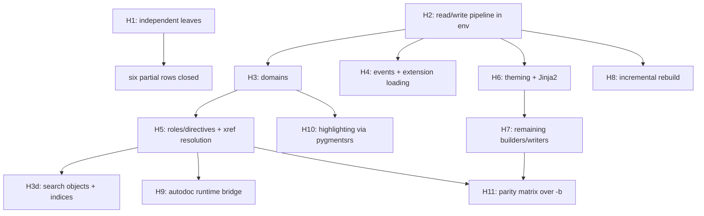

# sphinxdocrs port plan & inventory

Single source of truth for the Sphinx → Rust port (`src/sphinxdocrs`).
This document merges the former `docs/sphinx-port-inventory.md`
(*sphinx port inventory, Phase 4*) and `docs/sphinxdocrs-cli-port-plan.md`
(*sphinxdocrs CLI port & test plan*); both are superseded by this file.

Contents:

1. [Status legend & phases](#1-status-legend--phases)
2. [Porting principles](#2-porting-principles)
3. [Subsystem inventory](#3-subsystem-inventory)
4. [CLI binary status](#4-cli-binary-status)
5. [Crate module map](#5-crate-module-map)
6. [Upstream test triage](#6-upstream-test-triage)
7. [Rust-side test suites](#7-rust-side-test-suites)
8. [Completed milestones](#8-completed-milestones-c--g--p-phases)
9. [**H-phase: plan to close the remaining deferred work**](#9-h-phase--plan-to-close-the-remaining-deferred-work)

---

## 1. Status legend & phases

**Priority tiers** (assigned when a subsystem is first inventoried):

| tier | meaning |
| --- | --- |
| **P1** | small, pure Python, few deps — port immediately |
| **P2** | port after extension/event scaffolding exists |
| **P3** | depends on builder / environment / domain pipeline |
| **C*n*** | CLI entry-point milestone (`sphinx-quickstart`, `sphinx-build`, …) |
| **G*n*** | subsystem-unblocking milestone (config → env → builders) |
| **H*n*** | remaining-deferred milestone (§9 of this document) |

**Row status**:

| status | meaning |
| --- | --- |
| **done** | full upstream surface ported, parity-tested |
| **mirrored** | ported subset with a parity-checked Rust-side test |
| **partial** | usable subset landed; named gaps remain |
| **stub** | scaffolded without an implementation |
| **deferred** | still pure Python; revisit after its blocker lands |
| **keep-python** | intentionally not ported |

**Per-item tagging**: every ported function is tagged *exact parity*,
*accepted deviation*, or *pending*. Accepted deviations must be recorded
in the notes column of the relevant row.

---

## 2. Porting principles

- **Drop-in CLI contract first.** Argument grammar, exit codes,
  stdout/stderr text, and on-disk artifacts must match upstream
  byte-for-byte where observable. The argparse surface is the spec:
  mirror flag names, defaults, `dest`, and help strings.
- **Three-layer architecture per command**, so logic is unit-testable
  without a process boundary:
  1. **parse layer** — pure `argv: &[String] -> Result<Args, CliError>`;
     no I/O. Mirrors each `get_parser()` / `_parse_*` helper.
  2. **core layer** — pure-ish functions over injected filesystem, clock,
     and terminal traits; returns planned actions or rendered strings.
     Mirrors `generate()`, `ask_user()`, `build_main()` bodies.
  3. **shell layer** — `main()` wiring real stdio, real FS, real exit.
- **Dependency injection at boundaries only** (FS, time, terminal,
  subprocess). Everything else stays concrete — this is what keeps
  `mockall` + `rstest` fixtures cheap.
- **Reuse already-ported subsystems** (`config`, `util_console`,
  `util_matching`, `project`, `errors`, `events`, `extension`, and the
  sister crates `docutilsrs`, `pygmentsrs`, `jinja2rs`). Do not
  re-implement.
- **Templating** uses the vendored `minijinja` / `jinja2rs` crates rather
  than shelling to Python. Upstream template files are vendored as crate
  assets under `src/sphinxdocrs/assets/`.
- **Fallback ladder**: every command keeps a `--use-python-impl` escape
  hatch plus `SPHINXDOCRS_PY_FALLBACK=1`. A command defaults to the
  Python path until its native path passes the parity harness.
- **Test-near development**: port the upstream test → implement → gate on
  `pytest -q` *and* `cargo test` → flip the row status in this file.

### Rust test tooling

| need | tool | notes |
| --- | --- | --- |
| fixtures | `rstest` `#[fixture]` | `#[once]` for session-scoped setup |
| parametrization | `rstest` `#[case]` | one table per pure function |
| trait mocking | `mockall` `#[automock]` | inline `#[cfg(test)]` only — external test crates use the concrete `FixedClock` / `CapturingRunner` / `ScriptedTerminal` helpers instead |
| snapshots | `insta` | rendered strings + generated tree manifests |
| HTTP mock / replay | `wiremock`, `rvcr` | for `assets`, `intersphinx`, `linkcheck` |

---

## 3. Subsystem inventory

| subsystem (sphinx) | sphinxdocrs target | tier | status | notes |
| --- | --- | --- | --- | --- |
| `errors.py` | `errors` | P1 | **done** | exception hierarchy via `pyo3::create_exception!` |
| `events.py` | `events` | P1 | **done** | `EventManager`: connect/disconnect/emit/emit_firstresult, priority sort, `allowed_exceptions`, `pdb` re-raise, `ExtensionError` wrapping. **Gap:** not wired into `SphinxApp` (→ **H4**) |
| `project.py` | `project` | P1 | **mirrored** | `path2doc` / `doc2path` / `discover`; `discover()` uses `util_matching` for glob exclusion (`EXCLUDE_PATHS` parity) |
| `addnodes.py` | `addnodes` | P1 | **mirrored** | all 50+ node structs; `toctree` (Translatable), `desc*` family, 9 `desc_sig_*` leaves + `SIG_ELEMENTS`, `pending_xref`(`_condition`), `index`, `only`, `hlist`, `glossary`, `productionlist`, `number_reference`, `download_reference`, `manpage`, … |
| `extension.py` | `extension` | P2 | **mirrored** | `Extension` wrapper + `verify_needs_extensions`. **Gap:** `load_extension` (→ **H4**) |
| `registry.py` | `registry` | P2 | **done** | source-suffix/parser, transforms/post-transforms, CSS/JS/static assets, LaTeX packages, HTML themes, `add_builder`/`add_domain`/`add_translator`/`add_html_math_renderer` |
| `versioning.py` | `versioning` | P2 | **done** | `VERSIONING_RATIO`, `levenshtein_distance`, `get_ratio`, `add_uids`, `merge_doctrees`, `VersionableNode`, `apply_uid_transform`, `UID_TRANSFORM_PRIORITY = 880`. **Gap:** not invoked from a read phase yet — `docutilsrs::doctree::Node` has no `uid`/`VersionableNode` impl (→ **H8**) |
| `config.py` | `config` | P2 | **mirrored** | `SphinxConfig`, 50+ built-in option registry, `ConfigVal`, `RebuildKind`, `ConfigOpt`, `convert_overrides`, alias sync (`master_doc`↔`root_doc`, `copyright`↔`project_copyright`), typed accessors, `py_read_conf_py` |
| `util/*` | `util_*` | P2 | **mirrored** | `util_matching`, `util_console` (22 ANSI codes), `util_rst` (incl. `default_role`, **H1d**), `util_osutil`, `util_uri`, `util_lines`, `util_docstrings` |
| `locale.py` | `locale` | P2 | **done** | `PoCatalog` (incl. `#, fuzzy` handling and header capture), `Translator`, `TranslatorRegistry`, `init`, `init_chain`, `init_console`, `get_translation`, `tr`, `tr_console`, `tr!`/`tr_c!`, `admonition_labels`. **Extension:** `CATALOG_LOOKUP_ORDER = ["sphinxdocrs", "sphinx"]` — `tr`/`tr_console` walk the chain, first hit wins |
| `util/i18n.py` | `intl` | P2 | **done** | `CatalogInfo` (incl. `write_mo`), `CatalogRepository`, `docname_to_domain`, `DATE_FORMAT_MAPPINGS`, `split_date_format`, `ustrftime_to_babel`, `babel_format_date`, `format_date`, `encode_mo` / `decode_mo`. **Accepted deviations:** CLDR data limited to `en`/`de`/`ja` (others fall back to `en`, as upstream does for unknown locales); MO output is singular-only with an empty hash table; `.po` files are decoded as UTF-8 |
| `roles.py` | `roles` | P3 | **partial** | pure-algorithm subset: `GENERIC_DOCROLES`, `SPECIFIC_DOCROLES`, `is_builtin_role`, `format_rfc_target`, `parse_emphasized_literal`, `XRefRoleConfig`, `DefaultRoleConfig`. **Gap:** role `run()` execution (→ **H5b**) |
| `directives/` | — | P3 | **deferred** | no Rust module yet (→ **H5a**) |
| `domains/` | — | P3 | **deferred** | only `registry.add_domain` name-registration exists; `env.domaindata` is never populated (→ **H3**) |
| `environment/` | `environment` | P3 | **mirrored** ✅ | `BuildEnvironment`: `find_files` (**H2a**), doctree store `parse_doc`/`store_doctree`/`get_doctree`/`has_stored_doctree` (**H2b**), `read_all` read phase (**H2c**), `get_and_resolve_doctree` (**H2e**), `check_consistency` (**H2f**). **Gap:** `resolve_references`, `domains` (→ **H3**) |
| `builders/` | `builders` | P3 | **partial** | `Builder` trait + `HtmlBuilder`, `LatexBuilder`, `ManpageBuilder`, `LinkcheckBuilder`, `JsonBuilder`, all dispatched by `SphinxApp`. **Gap:** no dirhtml/singlehtml/text/xml/epub/texinfo/gettext (→ **H7**) |
| `application.py` | `application` | P3 | **partial** | `SphinxApp`: path validation, config, registry, env, `read()` (**H2**: `find_files` + `read_all`), `build()` (`&mut self`, two-phase). **Gaps:** events, extension loading, parallel build, incremental rebuild, i18n (→ **H4**, **H8**) |
| `theming.py` | `theme`, `theme_static` | P3 | **partial** | self-contained `sphinxdocrs_basic` theme (`LAYOUT_HTML`, `PAGE_HTML`, `THEME_CSS`) + `copy_theme_assets` / `render_templates`. **Gap:** theme inheritance, `theme.conf` / `theme.toml` resolution, third-party themes (→ **H6**) |
| `search/` | `search` | P3 | **partial** | `SearchIndex`, `split_words`, `feed`, `to_json`, Snowball stemming for all 15 `sphinx.search` languages (**H1f**, via `stemmer.rs`). **Accepted deviation:** `rust_stemmers`' Dutch algorithm is the legacy `dutch_porter` Snowball revision, not the one `snowballstemmer.stemmer('dutch')` resolves to — patched via built-in `ParityOverrides` for Sphinx's own Dutch stopword vocabulary; broader vocabularies may need project-supplied overrides. **Gap:** `objects`/`objtypes`/`objnames`/`indexentries` emitted empty (→ **H3d**) |
| `ext/autodoc/` | `autodoc` | P3 | **partial** | static extraction via `ruff_python_parser`: `document_module`, `render_function`, `render_class`. **Gaps:** runtime import, `:members:` filtering, inherited members, type hints, overloads, decorators, `__all__` ordering (→ **H9**) |
| `ext/intersphinx/` | `intersphinx` | P3 | **partial** | `fetch_inventories`, `InvCache`, `Inventory` / `InventoryItem` / `InventoryError` (v1 + v2 `loads`, `load_file`), `dumps`. **Gap:** xref fallback — the parsed inventories are not consulted during reference resolution (→ **H5c**) |
| `highlighting.py` | — | P3 | **deferred** | blocked on `pygmentsrs` lexer coverage (→ **H10**) |
| `pycode/` | — | P3 | **keep-python** | superseded by `autodoc.rs` + `ruff_python_ast` |
| `ext/*` (other) | — | P3 | **keep-python** | loaded through the `Extension` registry |
| *(new, no upstream analogue)* | `scan` | — | **done** | `scan_requirements`, `collect_packages`, stdlib detection — probes `conf.py` extension imports |
| *(new)* | `assets` | — | **done** | `SriAlgo`, SRI hashing, `fetch_and_cache`, `fetch_with_integrity` |

---

## 4. CLI binary status

| upstream script | Rust binary | upstream module | milestone | status |
| --- | --- | --- | --- | --- |
| `sphinx-quickstart` | `sphinx-quickstart-rs` | `sphinx.cmd.quickstart` | **C1** | **done** — fully native |
| `sphinx-build` | `sphinx-build-rs` | `sphinx.cmd.build` + `sphinx.cmd.make_mode` | **C2** | **partial** — `-M` make-mode native; `-b` native for `html`/`latex`/`man`/`linkcheck`; other builders delegate to Python |
| `sphinx-apidoc` | `sphinx-apidoc-rs` | `sphinx.ext.apidoc` | **C3** | **done** — module/package/TOC generation + `--full`; parity verified vs Python 9.1.0 |
| `sphinx-autogen` | `sphinx-autogen-rs` | `sphinx.ext.autosummary.generate` | **C4** | **done** — RST scan, arg-parse, native stub generation |

Every binary honours `--use-python-impl` and `SPHINXDOCRS_PY_FALLBACK=1`.

```rust
// src/sphinxdocrs/src/application.rs
pub const NATIVE_BUILDERS: &[&str] = &["html", "latex", "man", "linkcheck"];
```

### 4.1 `sphinx-quickstart` (C1) — surface

| upstream symbol | Rust target | notes |
| --- | --- | --- |
| validators (`is_path`, `nonempty`, `choice`, `boolean`, `suffix`, `ok`, `allow_empty`) | `quickstart::validate` | pure `fn(&str) -> Result<_, ValidationError>`; table-tested |
| `do_prompt` / `term_input` | `quickstart` over the `Terminal` trait | readline behaviour is out of scope |
| `ask_user(d)` | `quickstart::generate::ask_user` | imgmath+mathjax conflict rule and existing-`conf.py` / existing-master guards match upstream |
| `QuickstartRenderer` | `quickstart::templates` | `_has_custom_template` + `templatedir` override semantics |
| `generate(d, …)` | `quickstart::generate` | `sep`/`dot` layout, `exclude_patterns`, `copyright`, `now`, `project_underline` (column width), newline modes |
| `valid_dir(d)` | `quickstart::valid_dir` | reserved-name collision check |
| `get_parser()` / `main()` | `quickstart::parser` | flag parity incl. `--ext-*` append_const, `--no-sep`, `--no-makefile` |

Parity-critical details: `project_underline` uses `unicode-width`
(east-Asian width parity with docutils); `copyright` / `now` come from the
injected `Clock` (`FixedClock::snapshot()` for deterministic snapshots);
the `EXTENSIONS` table fixes extension ordering; `Makefile` is written LF
and `make.bat` CRLF; "Creating file %s." / "File %s already exists,
skipping." honour `quiet`; the `| repr` Jinja2 filter is registered
manually because minijinja lacks it.

### 4.2 `sphinx-build` (C2) — surface

| upstream symbol | Rust target | notes |
| --- | --- | --- |
| `get_parser()` | `build::parser` | full flag grammar (builder, jobs, `-a`/`-E`, path opts, `-D`/`-A`/`-t`/`-n`, console/warning opts) |
| `jobs_argument` | `build::args` | `'auto'` → cpu count; positive-int validation + error text |
| `_parse_confdir`, `_parse_doctreedir`, `_validate_filenames`, `_validate_colour_support`, `_parse_confoverrides` | `build::args` | pure; parametrized tests |
| `_parse_logging` | `build::logging` | colour disable via `util_console`. **Gap:** coloured status stream (→ **H8c**) |
| `make_mode.Make` | `build::make_mode` | `build_clean` (security-relevant safety checks — ported faithfully), `build_help`, `run_generic_build`, `BUILDERS` table, target dispatch; subprocesses go through the injected `Runner` |
| `build_main` → `Sphinx(...)` | `application::SphinxApp` + `build::native_runner` | native for `NATIVE_BUILDERS`; `NativeMakeRunner` falls back to Python otherwise |

### 4.3 `sphinx-apidoc` (C3) / `sphinx-autogen` (C4) — surface

| upstream symbol | Rust target | status |
| --- | --- | --- |
| `ApidocOptions` dataclass | `apidoc::settings` | all 20 fields; `effective_automodule_options()` |
| `_generate.py` helpers | `apidoc::generate` | `is_initpy`, `module_join`, `is_excluded`, `is_skipped_package/module`, `walk`, `recurse_tree`, `create_module_file`, `create_package_file`, `create_modules_toc_file`, `remove_old_files` |
| apidoc RST templates | `assets/apidoc/*.jinja` | 3 vendored; `heading(2)` patched to a `heading2` filter |
| `_cli.get_parser()` | `apidoc::parser` | full clap grammar, `--ext-*`, `SPHINX_APIDOC_OPTIONS` |
| `--full` mode | `run_full_quickstart` | wired to `quickstart::generate` |
| `find_autosummary_in_lines` / `_in_files` | `autogen::scan` | regex parser matching upstream |
| autosummary stub templates | `assets/autosummary/*.rst` | `base`, `class`, `module`; `underline` + `_` identity filters |
| `generate_autosummary_docs` (stub writing) | `autogen::generate` | `infer_obj_type` (CamelCase→class, else→module), `StubContext`, `generate_stub(s)`, `--remove-old`. **Accepted deviation:** member lists emitted empty; autodoc fills them at build time (→ **H9d**) |

---

## 5. Crate module map

| crate path | mirrors | notes |
| --- | --- | --- |
| `src/cli/io.rs` | — | `Terminal`, `Fs`, `Clock`, `Runner` traits + `Real*` impls; `FixedClock`, `CapturingRunner`, `ScriptedTerminal` test helpers; `py_fallback_requested`, `run_python_impl` |
| `src/quickstart/{validate,settings,templates,generate,parser}.rs` | `sphinx.cmd.quickstart` | see §4.1 |
| `src/build/{parser,args,logging,make_mode,native_runner}.rs` | `sphinx.cmd.build`, `sphinx.cmd.make_mode` | see §4.2 |
| `src/apidoc/{settings,templates,generate,parser}.rs` | `sphinx.ext.apidoc` | see §4.3 |
| `src/autogen/{scan,templates,parser,generate}.rs` | `sphinx.ext.autosummary.generate` | see §4.3 |
| `src/addnodes.rs` | `sphinx.addnodes` | all node structs; `Translatable`, `NotSmartquotable`, `SIG_ELEMENTS` |
| `src/application.rs` | `sphinx.application.Sphinx` | `SphinxApp`, `AppError`, `NATIVE_BUILDERS`, `is_native_builder` |
| `src/environment.rs` | `sphinx.environment.BuildEnvironment` | state skeleton (`all_docs`, `dependencies`, `included`, `reread_always`, `metadata`, `titles`/`longtitles`, `toc_num_entries`/`toc_secnumbers`, `toctree_includes`, `files_to_rebuild`, `glob_toctrees`, `numbered_toctrees`, `domaindata`, `temp_data`, `ref_context`, config-status constants) + `EnvProject` + `default_settings()` |
| `src/registry.rs` | `sphinx.registry.SphinxComponentRegistry` | full P2 + P3 registration surface; `RegistryError` |
| `src/config.rs` | `sphinx.config.Config` | `SphinxConfig`, `ConfigVal`, `MathRenderer`, `py_read_conf_py` |
| `src/versioning.rs` | `sphinx.versioning` | + `apply_uid_transform`, `UID_TRANSFORM_PRIORITY` |
| `src/roles.rs` | `sphinx.roles` | tables + pure helpers |
| `src/locale.rs` | `sphinx.locale` | `.po` parser, `TRANSLATORS` registry, `CATALOG_LOOKUP_ORDER` chain, `tr!` / `tr_c!`; `locale/` symlink → `../../sphinx/sphinx/locale` |
| `src/intl.rs` | `sphinx.util.i18n` | catalogs, `write_mo` / MO codec, `docname_to_domain`, strftime→babel mapping, `format_date` |
| `src/util_rst.rs` | `sphinx.util.rst` | `SECTIONING_CHARS`, `WIDECHARS_*`, `escape`, `textwidth`, `heading`, `prepend_prologue`, `append_epilogue` |
| `src/util_osutil.rs` | `sphinx.util.osutil` | `SEP`, `os_path`, `canon_path`, `path_stabilize`, `relative_uri`, `ensuredir`, `make_filename(_from_project)`, `FileAvoidWrite`, `copyfile`, `relpath`, `rmtree` |
| `src/util_uri.rs` | `sphinx.util._uri` | `is_url`, `encode_uri` (percent-encode path, decode-then-reencode query, IDNA netloc) |
| `src/util_lines.rs` | `sphinx.util._lines` | `parse_line_num_spec` with upstream error strings |
| `src/util_docstrings.rs` | `sphinx.util.docstrings` | `prepare_docstring`, `prepare_commentdoc`, `separate_metadata` |
| `src/util_matching.rs` | `sphinx.util.matching` | glob → regex |
| `src/util_console.rs` | `sphinx.util.console` + `sphinx._cli.util.colour` | 22 ANSI codes |
| `src/builders/mod.rs` | `sphinx.builders.Builder` | `Builder` trait (`name`, `format`, `out_suffix`, `get_target_uri`, `build_doc`, `build_all`), `BuildError`, `BuildResult` |
| `src/builders/html.rs` | `sphinx.builders.html` | `HtmlBuilder` |
| `src/builders/json.rs` | `sphinx.builders.html.JSONHTMLBuilder` | `JsonBuilder` → `.fjson` |
| `src/builders/latex.rs` | `sphinx.builders.latex` | `LatexBuilder` |
| `src/builders/manpage.rs` | `sphinx.builders.manpage` | `ManpageBuilder` |
| `src/builders/linkcheck.rs` | `sphinx.builders.linkcheck` | `LinkcheckBuilder` — `linkcheck_ignore` / `linkcheck_anchors` / `linkcheck_anchors_ignore` / `linkcheck_allowed_redirects` / `linkcheck_timeout` / `linkcheck_retries` / `linkcheck_rate_limit_timeout` config (`LinkcheckConfig`), anchor (`#fragment`) existence checking, redirect classification (`working`/`redirected`/`broken`/`ignored`), HTTP 429 rate-limit backoff honoring `Retry-After`, via the shared `crate::http_client` backend (curl by default, optional in-process `reqwest`) |
| `src/theme.rs` | `sphinx.theming` | `ThemeRenderer` + embedded `sphinxdocrs_basic` theme (`LAYOUT_HTML`, `PAGE_HTML`, `THEME_CSS`) |
| `src/theme_static.rs` | `sphinx.builders.html` asset copy | `copy_theme_assets`, `render_templates` |
| `src/search.rs` | `sphinx.search` | `SearchIndex`, `split_words`, `feed`, `to_json` |
| `src/autodoc.rs` | `sphinx.ext.autodoc` | static extraction over `ruff_python_ast`; `AutodocError` |
| `src/intersphinx.rs` | `sphinx.ext.intersphinx`, `sphinx.util.inventory` | `fetch_inventories`, `InvCache`, `Inventory::loads` / `load_file`, `dumps` |
| `src/scan.rs` | — | `scan_requirements`, `collect_packages` |
| `src/assets.rs` | — | SRI hashing + fetch/cache |
| `assets/quickstart/` | `sphinx/templates/quickstart/` | 4 vendored Jinja templates (`include_str!`) |
| `assets/apidoc/` | `sphinx/templates/apidoc/` | 3 vendored Jinja templates |
| `assets/autosummary/` | `sphinx/ext/autosummary/templates/autosummary/` | 3 vendored RST stub templates |

### Cargo features

| feature | purpose |
| --- | --- |
| `extension-module` | build as a PyO3 extension module (propagates to `docutilsrs`) |
| `syntax-highlighting` | syntax highlighting via `docutilsrs` (default) |
| `test-parity` | cross-language parity tests (requires Python + upstream sphinx) |
| `test-parity-jsonbuilder` | full `sphinx-build -b json` parity (memory-intensive) |
| `test-build-extdocs` | build real external documentation trees |

---

## 6. Upstream test triage

Tagged from `src/sphinx/tests/`.

| test file | subsystem | tier | status |
| --- | --- | --- | --- |
| `test_errors.py` | errors | P1 | **mirrored** — `tests/test_sphinxdocrs_errors.py` |
| `test_events.py` | events | P1 | **mirrored** — `tests/test_sphinxdocrs_events.py` |
| `test_project.py` | project | P1 | **mirrored** — `tests/test_sphinxdocrs_project{,_discover}.py` |
| `test_addnodes.py` | addnodes | P1 | **mirrored** — `tests/addnodes.rs` |
| *(no upstream file)* | extension | P2 | **mirrored** — `tests/test_sphinxdocrs_extension.py` |
| `test_config/` | config | P2 | **mirrored** — `tests/config.rs` |
| `test_extensions/` | registry | P2 | **done** — `tests/registry.rs`; `load_extension` deferred (→ **H4b**) |
| `test_versioning.py` | versioning | P2 | **done** — `tests/versioning.rs` |
| `test_util/` | util | P2 | **done** — `tests/util_rst_osutil.rs`, `tests/util_extra.rs`; `default_role` closed (**H1d**) |
| `test_intl/` | intl / locale | P3 | **mirrored** — `tests/locale.rs`, `tests/intl.rs`, plus `test_util_i18n.py`'s `test_catalog_write_mo` / `test_format_date` cases as `intl` unit tests |
| `test_quickstart.py` | quickstart | C1 | **mirrored** — `tests/quickstart.rs`, `tests/quickstart_cli.rs` |
| `test_ext_apidoc/` | apidoc | C3 | **mirrored** — `tests/apidoc.rs` |
| `test_ext_autosummary/` | autogen | C4 | **done** — `tests/autogen.rs` |
| `test_command_line.py`, `test__cli/` | cli | P3 | **partial** — arg layer native; full `Sphinx()` invocation deferred |
| `test_application.py` | application | P3 | **partial** — `tests/application.rs` |
| `test_builders/` | builders | P3 | **partial** — `tests/builders.rs` (now includes **H2d** two-phase parity tests), `tests/builders_json.rs` |
| `test_environment/` | environment | P3 | **mirrored** ✅ — `tests/environment.rs` gained the **H2** read-phase group (`find_files`, doctree store round trip, `read_all`, `check_consistency`) |
| `test_roles.py` | roles | P3 | **partial** — `tests/roles.rs`; role execution deferred (→ **H5b**) |
| `test_directives/` | directives | P3 | **deferred** (→ **H5a**) |
| `test_domains/` | domains | P3 | **deferred** (→ **H3**) |
| `test_transforms/` | transforms | P3 | **deferred** — per-transform port |
| `test_writers/` | writers | P3 | **deferred** — one writer at a time (→ **H7**) |
| `test_theming/` | theming | P3 | **deferred** (→ **H6**) |
| `test_search.py` | search | P3 | **partial** — `tests/stemmer_parity.rs` (**H1f** closed); objects/objtypes/indexentries still empty (→ **H3d**) |
| `test_highlighting.py` | highlighting | P3 | **deferred** — blocked on `pygmentsrs` (→ **H10**) |
| `test_markup/` | markup | P3 | **deferred** — depends on the docutils converter |
| `test_pycode/` | pycode | P3 | **keep-python** |
| `test_ext_autodoc/` | autodoc | P3 | **partial** (→ **H9**) |
| `test_ext_intersphinx/`, `test_util_inventory.py` | intersphinx | P3 | **partial** — `tests/intersphinx.rs` covers `InventoryFile` parsing with an upstream-generated fixture (exact parity); xref-resolution cases still pending (→ **H5c**) |
| `test_ext_imgconverter/`, `test_ext_napoleon/`, other `test_ext_*` | extensions | P3 | **keep-python** — run against vendored sphinx |
| `js/` | search JS | — | external |

---

## 7. Rust-side test suites

| suite | scope |
| --- | --- |
| lib (inline `#[cfg(test)]`) | ~41 source files carry inline unit tests (validators, arg parsing, generators, builders, registry, versioning, util modules) |
| `tests/quickstart.rs`, `tests/quickstart_cli.rs` | validators (`#[case]` tables), parser flags, `valid_dir`, tree-layout snapshots, `conf.py` snapshot, LF/CRLF assertions, scripted-terminal `ask_user`, help-text snapshot |
| `tests/build.rs` | `jobs_argument`, `parse_confdir`, `parse_doctreedir`, `validate_filenames`, `parse_confoverrides`, `parse_color`, `build_clean` safety, `run_generic_build`, dispatch, `BUILDERS` completeness, help snapshot |
| `tests/apidoc.rs` | parser flags, `is_initpy`, `module_join`, `is_excluded`, `recurse_tree` variants, module/TOC/help snapshots |
| `tests/autogen.rs` | parser flags, `find_autosummary_in_lines` / `_in_files`, `infer_obj_type`, `split_fqn`, `generate_stub(s)`, stub-content snapshots |
| `tests/registry.rs` | source suffix/parser, transforms, CSS/JS/static, LaTeX packages, HTML themes, builder/domain/translator/math-renderer registration |
| `tests/versioning.rs` | `levenshtein_distance`, `get_ratio`, `add_uids`, all 7 `merge_doctrees` upstream fixtures |
| `tests/config.rs` | defaults, raw + CLI overrides, `add`/`set`/`contains`/`iter`/`filter`, alias sync, coercion |
| `tests/addnodes.rs` | `SIG_ELEMENTS` exact set, `desc_sig_*` classes, `Translatable`, `astext` behaviours |
| `tests/environment.rs` | construction, `default_settings`, config-status labels, doc-read / title / dependency tracking |
| `tests/builders.rs`, `tests/builders_json.rs` | `Builder` trait contract, `get_target_uri`, `build_doc` HTML5 structure, `build_all` variants, `.fjson` output |
| `tests/application.rs` | `NATIVE_BUILDERS`, path validation, constructor fields, `build()` HTML output, config defaults/overrides |
| `tests/roles.rs` | docrole table completeness, `format_rfc_target`, `parse_emphasized_literal` |
| `tests/locale.rs`, `tests/intl.rs` | `.po` parsing, translator registry, catalog discovery, `docname_to_domain`, date-format mapping |
| `tests/util_rst_osutil.rs`, `tests/util_extra.rs` | full `sphinx.util` mirrors |
| `tests/assets.rs` | SRI hashing + fetch/cache |
| `tests/scan_requirements.rs` | `conf.py` extension → package scanning |
| `tests/snapshot.rs` | misc rendered-string snapshots |
| `tests/parity.rs` | cross-language harness, gated by `--features test-parity`; skips gracefully without Python |
| `tests/otherdocs.rs` | real external doc-tree builds, gated by `--features test-build-extdocs` |

Snapshot conventions: rendered strings (`conf_py_snapshot`,
`*_help_snapshot`) and generated trees
(`quickstart_tree_snapshot@<case>.snap`, via
`insta::with_settings!({snapshot_suffix => …})`). Tree manifests store
sorted relative paths, not hashes, to avoid template-timestamp churn;
newline correctness is asserted separately at byte level.

Run the parity suite with:

```
cargo test -p sphinxdocrs --features test-parity --test parity
```

---

## 8. Completed milestones (C / G / P phases)

| id | milestone | outcome |
| --- | --- | --- |
| **C1.0–C1.2** | quickstart | `cli::io` traits + vendored templates; validators, `do_prompt`, parser; `generate` / `ask_user` / `valid_dir`; native by default |
| **C2.1–C2.2** | build args + make mode | full parser, `_parse_*`, `jobs_argument`; `build_clean` / `build_help` / `run_generic_build` / `BUILDERS` via the injected `Runner` |
| **C2.3 / C3.3 / C4.3** | parity harness | `tests/parity.rs`; `quickstart_parity_flat` + `apidoc_parity_basic` green vs Python 9.1.0 |
| **C2c** | native `-b` | `SphinxApp` wires config + registry + env + builders; `html`, `latex`, `man`, `linkcheck` native |
| **C3.1–C3.2** | apidoc | settings / templates / generate / parser; `--full` → `quickstart::generate` |
| **C4.1–C4.2** | autogen | scan, templates, parser, native stub generation |
| **G1** | util leaf fns | `copyfile`, `relpath`, `rmtree`, `prepend_prologue`, `append_epilogue` |
| **G2** | addnodes | full Sphinx node set |
| **G3** | full `Config` | promoted from the math-options subset to the full option registry |
| **G4 / G4a / G4b** | env + registry + versioning | `BuildEnvironment` skeleton, P3 registry methods, `apply_uid_transform` |
| **G5** (partial) | roles | pure-algorithm subset |
| **G7 / G8 / G9** | builders + app | html builder, `SphinxApp`, latex + man builders |
| **P2.1–P2.4** | registry, versioning, util | see §5 |

---

## 9. H-phase — plan to close the remaining deferred work

Everything still marked **partial** or **deferred** in §3 and §6 is
sequenced here. Ordering is by *dependency depth*, not by table row.

### 9.1 What actually blocks what

The single structural blocker is that `BuildEnvironment` has **no doctree
store**. Today `HtmlBuilder::build_doc` parses RST and writes HTML in one
pass, so nothing can look across documents. Every cross-document feature
— toctrees, xrefs, domains, indices, search objects, incremental
rebuilds, `resolve_references` — needs a two-phase *read → write*
pipeline first. **H2 is therefore the gate for most of the remaining
work**, and **H1** collects everything that does *not* depend on it.



### Tier H1 — independent leaves (start immediately, parallelizable)

No new subsystem needed; each item closes a named gap on its own.

| id | task | files | closes | gate |
| --- | --- | --- | --- | --- |
| **H1a** | ✅ Parse `objects.inv` payloads: zlib-inflate the body, decode `name domain:role priority uri dispname` lines, expose an `Inventory` lookup type plus a `dumps` writer. (Cross-ref *resolution* is **H5c**; this landed the data structure + codec only.) | `intersphinx.rs` | `intersphinx` parsing → **mirrored** | `tests/intersphinx.rs`: v1/v2 payloads, malformed-header errors, `$`-anchor expansion, case-only `std:label` ambiguities, dump→load round trip, and a byte-identical parity check against `InventoryFile.loads` |
| **H1b** | ✅ Complete `LinkcheckBuilder`: `linkcheck_ignore` / `linkcheck_anchors` / `linkcheck_allowed_redirects` config, anchor (`#fragment`) checking, redirect classification (`working` / `redirected` / `broken` / `ignored`), rate-limit backoff, `output.json` + `output.txt` emission. Also introduced `crate::http_client`, a shared HTTP backend (curl by default; optional in-process `reqwest` behind the `http-reqwest` Cargo feature, selected at runtime via `SPHINXDOCRS_HTTP_CLIENT=reqwest`) used by both `linkcheck` and `intersphinx` | `builders/linkcheck.rs`, `http_client.rs`, `intersphinx.rs`, `config.rs` | linkcheck → **done** | `tests/linkcheck_wiremock.rs`: `wiremock`-backed case per status class (working/broken/redirected/ignored/anchor-found/anchor-missing/rate-limited), run against both backends |
| **H1c** | ✅ `write_mo` + `encode_mo` / `decode_mo` (GNU MO codec, empty hash table) and `babel_format_date` / `format_date` (CLDR subset over `DATE_FORMAT_MAPPINGS`, `SOURCE_DATE_EPOCH` aware); `tr` / `tr_console` now walk `CATALOG_LOOKUP_ORDER` | `intl.rs`, `locale.rs` | `intl` → **done** | round-trip `.po` → `.mo` → read-back; `today_fmt` cases from `test_util_i18n.py` |
| **H1d** | ✅ `util.rst.default_role` — RAII guard over the docutils role registry exposed by `docutilsrs` (`roles.rs`), wired into the parser's `default-role` directive | `util_rst.rs`, `docutilsrs/roles.rs`, `docutilsrs/parser.rs` | `test_util/` → **done** (last gap closed) | `tests/util_rst_osutil.rs` |
| **H1e** | ✅ Dispatch `JsonBuilder` from `SphinxApp`: `NATIVE_BUILDER_CLASSES` pair table + `build()` match arm | `application.rs` | builders json → **done** | extend `tests/application.rs` + `tests/builders_json.rs`; enable `test-parity-jsonbuilder` in CI |
| **H1f** | ✅ Snowball stemming for all 15 `sphinx.search` languages via the `rust_stemmers` crate behind a `search-stemming` feature (default-on), plus a `ParityOverrides` config mechanism (`search_stemming_overrides`) to pin any word where `rust_stemmers` and `snowballstemmer` diverge | `stemmer.rs`, `search.rs` | removes the search stemming gap | `tests/stemmer_parity.rs` (fixture + `test-parity`-gated live diff vs `snowballstemmer`) |

**Exit:** the `intl`, linkcheck, json and `util_*` rows in §3 flip to
**done**; `intersphinx` parsing becomes testable standalone.

### Tier H2 — read/write pipeline (the unblocking milestone) ✅

| id | task | detail |
| --- | --- | --- |
| **H2a** ✅ | `BuildEnvironment::find_files(config)` | folds `Project::discover` into `BuildEnvironment::find_files`; populates `project.docnames` + `project.docname_to_path`; honours `exclude_patterns` / `include_patterns` (new `SphinxConfig::include_patterns()` accessor, default `["**"]`) plus `PROJECT_EXCLUDE_PATHS` |
| **H2b** ✅ | Doctree store | `BuildEnvironment::parse_doc(docname) -> Doctree` via `docutilsrs::parse_rst_with_source`; `store_doctree` / `get_doctree` / `has_stored_doctree` persist to `doctreedir/<docname>.doctree` using a new `Doctree::to_bytes`/`from_bytes` serde-json codec (`docutilsrs::doctree`) |
| **H2c** ✅ | Read phase | `BuildEnvironment::read_all()`: for every discovered doc — parse, extract + record the promoted title, scan `.. toctree::` / `.. include::` directives and call `note_toctree` / `note_dependency`, `store_doctree`, `record_doc_read`. **Accepted deviation:** toctree/include scanning uses a text-level heuristic (`scan_toctree_entries` / `scan_include_entries`) since `docutilsrs`'s parser has no structural toctree node yet — real AST-based scanning deferred to **H3a** (domains). **Accepted deviation:** `apply_uid_transform` is not yet invoked here (`docutilsrs::doctree::Node` has no `uid` field / `VersionableNode` impl) — deferred to **H8** (incremental rebuild) to avoid a wide blast radius across `doctree.rs`/`parser.rs`/`html5.rs` |
| **H2d** ✅ | Write phase | `Builder` trait gained `write_doc(docname, doctree, outdir)` (default: not-implemented error); `HtmlBuilder` overrides it via `build_doc_themed_from_tree` and `build_all` now prefers `env.get_and_resolve_doctree(docname)` when available, falling back to parsing from source otherwise (byte-identical output either way, confirmed by `build_all_two_phase_matches_single_phase_output` and `build_all_prefers_stored_doctree_over_reparsing_source`). `SphinxApp::build` is now `&mut self` and calls a new `SphinxApp::read()` (→ `env.find_files()` + `env.read_all()`) at the top |
| **H2e** ✅ | `get_and_resolve_doctree` | currently delegates to `get_doctree` (no stored doctree is mutated). **Accepted deviation:** post-read transforms (references resolution, UID versioning) deferred to **H3**/**H5**/**H8** |
| **H2f** ✅ | `check_consistency` | returns `"{docname}: document isn't included in any toctree"` for every discovered doc outside `root_doc` and the union of `toctree_includes`, mirroring upstream message text |

**Gate:** ✅ met — `tests/environment.rs` grew a new H2 read-phase test
group (`find_files`, `doc2path`, doctree store round trip,
`get_and_resolve_doctree`, `read_all`, `note_toctree`/dependencies,
`check_consistency`); `tests/builders.rs` gained two-phase parity tests
that run `find_files()` + `read_all()` before `build_all()` and assert
**byte-identical HTML** vs. the legacy single-phase path, plus a test
proving `build_all` renders the stored doctree rather than re-parsing.
The full existing `sphinxdocrs`/`docutilsrs` suites (`cargo test`) and
`cargo clippy --all-targets -- -D warnings` are clean.

**Closes:** `environment/` → **mirrored** except `resolve_references` and
`domains`. **Unblocks:** H3, H4, H6, H7, H8.

### Tier H3 — domains


Port in payoff order. Each domain is a `Domain` impl plus its object
types, directives, roles, and index.

| id | domain | notes |
| --- | --- | --- |
| **H3a** | `std` | labels, `:ref:` / `:doc:` / `:option:` / `:term:`, glossary, productionlist, citations — required by nearly every doc set |
| **H3b** | `py` | `py:module` / `function` / `class` / `method` / `attribute` / `data`, signature parsing, python module index |
| **H3c** | `rst` | `rst:directive` / `rst:role` — small, and a good second validation of the trait shape |
| **H3d** | search objects | populate `objects` / `objtypes` / `objnames` / `indexentries` in `search.rs` from `env.domaindata` |
| **H3e** | `js` | mechanically similar to `py`, smaller surface |
| **H3f** | `c` / `cpp` | large declaration parsers; port last, or keep on the Python bridge indefinitely — record the decision in §3 before starting |

Design note: define
`trait Domain { fn name(); fn resolve_xref(..); fn get_objects(..); fn merge_domaindata(..); }`
in a new `src/domains/mod.rs`, hold instances on `BuildEnvironment`, and
back persistence with the existing `domaindata` map so incremental
rebuild (H8b) needs no second serialization path.

**Gate:** one `tests/domains_<name>.rs` per domain, mirroring the
corresponding `test_domain_<name>.py` cases.

### Tier H4 — events + extension loading

| id | task |
| --- | --- |
| **H4a** | Own an `EventManager` on `SphinxApp` and emit the core events in upstream order: `config-inited`, `builder-inited`, `env-get-outdated`, `env-before-read-docs`, `source-read`, `doctree-read`, `env-updated`, `env-check-consistency`, `doctree-resolved`, `html-page-context`, `build-finished` |
| **H4b** | `load_extension`: import a Python extension module through PyO3, call `setup(app)`, capture the returned metadata into `Extension`, honour `needs_extensions` |
| **H4c** | Expose an `app`-shaped PyO3 facade so existing Python extensions can call `app.add_directive` / `add_role` / `add_config_value` / `connect` against the Rust registry |

**Gate:** `tests/events_app.rs` asserting emission order, plus a Python
round-trip test that loads a trivial extension and observes its
`config-inited` callback firing.

**Closes:** `events` → **done**, `extension` → **done**, and the
`load_extension` gap in `test_extensions/`.

### Tier H5 — roles, directives, reference resolution

| id | task |
| --- | --- |
| **H5a** | Directive execution: port `sphinx/directives/{__init__,code,other,patches}.py` — `toctree`, `code-block`, `literalinclude`, `include`, `only`, `seealso`, `versionadded` / `changed` / `deprecated`, `index`, `tabularcolumns`, `highlight` — registered into the `docutilsrs` directive registry |
| **H5b** | Role execution: `XRefRole::run` producing `pending_xref`, plus `PEP` / `RFC` / `CVE` / `CWE` / `GUILabel` / `MenuSelection` / `EmphasizedLiteral` / `Abbreviation` layered on the existing pure helpers |
| **H5c** | `env.resolve_references(doctree, fromdoc)`: walk `pending_xref`, dispatch to the owning domain (H3), fall back to intersphinx inventories (H1a), emit `missing-reference` plus the standard unresolved-target warnings |
| **H5d** | Toctree resolution: `TocTree` adapter (`resolve`, `get_toc_for`, `get_toctree_for`, `global_toctree_for_doc`), `secnumbers` assignment, `numfig` numbering for `number_reference` |
| **H5e** | Index generation: `genindex` from `indexentries`, plus the per-domain indices registered in H3 |

**Gate:** `tests/directives.rs`, an execution group in `tests/roles.rs`,
and `tests/toctree.rs`; mirroring `test_directives/`, `test_roles.py`,
and `test_environment/test_environment_toctree.py`.

**Closes:** `roles.py` → **mirrored**, `directives/` → **mirrored**,
`environment/` → **done**.

### Tier H6 — theming

| id | task |
| --- | --- |
| **H6a** | Native theme resolution: read `theme.toml` / `theme.conf`, resolve `inherit` chains, discover themes from `html_theme_path` and installed distributions — removing the Python dependency in `theme_static.rs` |
| **H6b** | Port the upstream `basic` theme templates and render them through `jinja2rs`, so `alabaster` and third-party themes that inherit from `basic` work |
| **H6c** | Full page context: `pathto`, `hasdoc`, `toctree()`, relbar, sidebars, `html_context` / `html_theme_options` merging, and the `html-page-context` event (H4a) |

**Gate:** `tests/theming.rs` mirroring `test_theming/`, plus an insta
snapshot of a rendered `basic`-theme page.

**Closes:** `theming.py` → **mirrored**; unblocks the html-family builders.

### Tier H7 — remaining builders and writers

Ordered by dependency on `docutilsrs` writers that already exist.

| id | builders |
| --- | --- |
| **H7a** | `text`, `xml`, `pseudoxml` — thin wrappers over existing / near-existing `docutilsrs` writers |
| **H7b** | `dirhtml`, `singlehtml` — reuse `HtmlBuilder` + H6 templates |
| **H7c** | `gettext` — depends on H1c (`write_mo`) plus a message-catalog extraction pass |
| **H7d** | `epub` (uses the existing `zip_writer`), `texinfo`, `changes` |
| **H7e** | `doctest`, `coverage`, `qthelp` / `devhelp` / `htmlhelp` / `applehelp` — decide port vs keep-python and record the decision in §3 |

Each builder added here must also be appended to `NATIVE_BUILDERS` and to
the `SphinxApp::build()` dispatch, and gain a `tests/builders_<name>.rs`.

### Tier H8 — incremental rebuild & logging polish

| id | task |
| --- | --- |
| **H8a** | `env.get_outdated(added, changed, removed)`: mtime + dependency-graph comparison against `all_docs`, honouring `config_status` (`CONFIG_CHANGED`, `CONFIG_EXTENSIONS_CHANGED`) and `-E` / `-a` |
| **H8b** | Env persistence: serialize `BuildEnvironment` (including `domaindata`) to the `doctreedir`. A versioned serde format instead of Python pickle is an **accepted deviation** — record it in §3 |
| **H8c** | Native status / warning streams: coloured progress via `util_console`, `-q` / `-Q` / `-v`, `-w warnfile`, `-W` / `--keep-going` semantics, `TeeStripANSI` |
| **H8d** | Parallel read/write (`-j`), chunked to match upstream so warning ordering stays deterministic |

**Gate:** `tests/incremental.rs` — build twice, assert only changed docs
are re-read; plus a logging group in `tests/build.rs` with snapshot stderr.

### Tier H9 — autodoc completeness

| id | task |
| --- | --- |
| **H9a** | Runtime-import bridge: import the target module through PyO3 and introspect, keeping the `ruff_python_ast` static path as the fallback when import fails |
| **H9b** | Option handling: `:members:`, `:undoc-members:`, `:private-members:`, `:special-members:`, `:inherited-members:`, `:exclude-members:`, `:member-order:` |
| **H9c** | Signature fidelity: type hints (`autodoc_typehints` modes), overloads, decorators, properties, `__all__` ordering, `autodoc_mock_imports` |
| **H9d** | Feed real member lists back into `autogen::generate`, retiring the current empty-member accepted deviation |

**Gate:** mirror the `test_ext_autodoc/` cases that do not require the
full Python extension pipeline.

### Tier H10 — highlighting

Wire `sphinx.highlighting` to `pygmentsrs` once lexer coverage suffices
(see the `port-pygments-lexer` skill). Blocked on lexer breadth, not on
this crate. **Gate:** a `test_highlighting.py` mirror plus byte-parity on
highlighted `code-block` output for the top ~20 languages.

### Tier H11 — parity matrix

Expand `tests/parity.rs` from 2 scenarios to a matrix over
`{builder} × {fixture doc set}` for every builder in `NATIVE_BUILDERS`,
diffing Rust vs Python output trees through a normalizer for accepted
deviations (timestamps, generator comments). Add a `make parity` target
and run it in CI behind `--features test-parity`.

### 9.2 Suggested execution order

| step | items | rationale |
| --- | --- | --- |
| 1 | H1a–H1f | independent and parallelizable; closes six rows without touching the pipeline |
| 2 | **H2** | the one structural blocker; an output-neutral refactor with the existing suite as the safety net |
| 3 | H4 | events / extensions become cheap once the app owns read + write phases |
| 4 | H3a (`std`) | the first domain proves the `Domain` trait shape |
| 5 | H5a–H5c | directives + xref resolution; the largest user-visible correctness jump |
| 6 | H5d, H5e, H3d | toctrees, secnumbers, indices, search objects |
| 7 | H6 | theming — makes output comparable to real Sphinx sites |
| 8 | H3b, H3c, H3e | `py`, `rst`, `js` domains |
| 9 | H7a–H7d, H8 | remaining builders + incremental rebuild |
| 10 | H9, H10, H3f, H7e, H11 | autodoc depth, highlighting, `c`/`cpp`, long-tail builders, parity matrix |

### 9.3 Definition of done for the H phase

- `NATIVE_BUILDERS` covers every builder in `build::make_mode::BUILDERS`
  that this project intends to own; the rest are explicitly marked
  **keep-python** in §3.
- No row in §3 or §6 is **partial** or **deferred** without either a
  linked H-item or a recorded **keep-python** decision.
- `cargo test -p sphinxdocrs --features test-parity` is green and the H11
  matrix passes for every native builder.
- `sphinx-build-rs` builds this repository's own `docs/` tree natively,
  with output equivalent to Python Sphinx modulo recorded deviations.
- Every accepted deviation appears in the §3 notes with a rationale.

### 9.4 Per-item working checklist

For each H-item:

1. Locate the upstream test(s) in `src/sphinx/tests/`.
2. Port them into the crate's Rust test module — or a mirrored
   `tests/test_sphinxdocrs_*.py` when the surface is PyO3-facing.
3. Implement the minimal code to pass.
4. Add interop checks whenever the Python boundary is touched.
5. Tag each ported function *exact parity* / *accepted deviation* /
   *pending*.
6. Flip the affected row(s) in §3 and §6, and note the change here.
